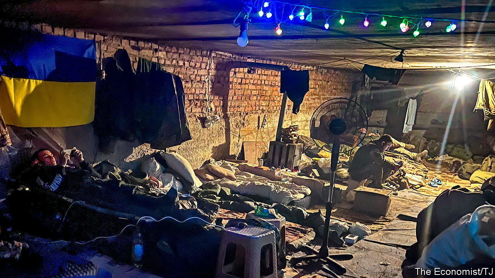
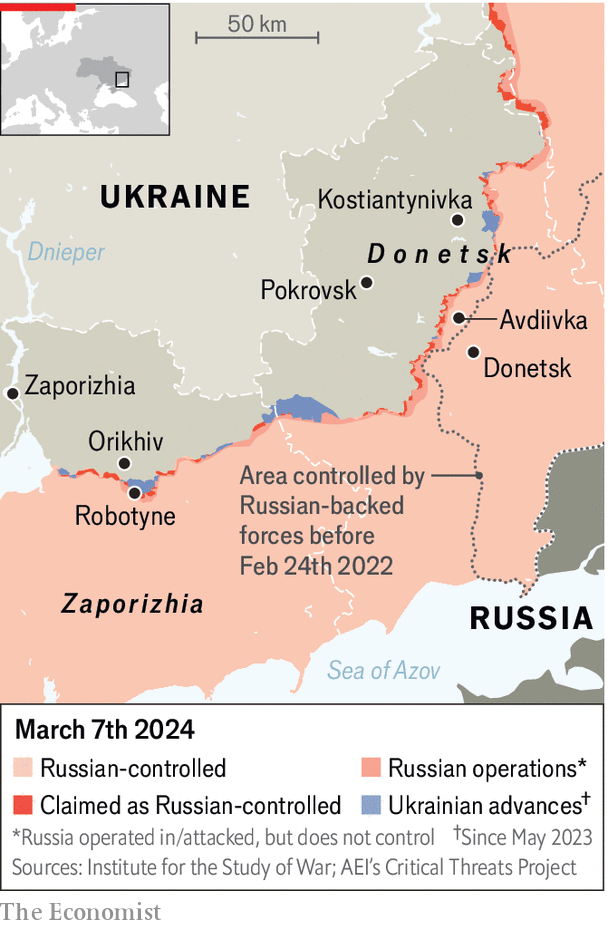

###### Not so quiet

# A grinding, difficult war on Ukraine’s southern front 

##### The Russians want to take Robotyne. But while the ammo lasts, Ukraine can hold them off 

 

> Mar 10th 2024 

A RUSSIAN SOLDIER pops up beside his infantry fighting vehicle which was hit, but not destroyed along with two others the day before. He makes a ten-second dash for one of the other ones and then appears to start digging beside it. He is 15km away, close to Robotyne, where there has been fierce fighting since the  on February 17th. The man’s every movement is being scrutinised on screens in the basement of a block in Orikhiv. Now an  moves over the soldier and, from its live feed, a shell can be watched plummeting straight down towards him. When the smoke clears there is no body. Maybe the soldier heard the drone and scrambled under the vehicle just in time to save his life. 

In the wake of the fall of Avdiivka Russian forces have captured outlying villages and attacked several other small eastern towns such as Kostiantynivka and Pokrovsk. To Avdiivka’s south the front line turns and then slopes gently towards the Dnieper river just below the industrial city of Zaporizhia. Last summer there were high hopes that Ukrainian troops would punch through the Russian lines here and drive on through to the Sea of Azov, some 100km further south as the drone flies. The counter-offensive failed, but not before the Ukrainians captured the villages of Robotyne and Pyatyhatky. Since the fall of Avdiivka Russian troops have launched several assaults to recapture Robotyne, whose fall would be symbolic because of its earlier liberation. 


In the Orikhiv basement bunker of the 3rd Brigade of the National Guard, men who have come back from the front are sleeping and scrolling on mattresses packed together in their dark, makeshift dormitory. Outside there are piles of empty artillery-shell cases and the constant sound of shelling from Robotyne to the south. 

 


Taking a break from his monitors the commander, who goes by the call sign Chief, says his men are desperately short of Soviet-calibre artillery shells, but that they still have a stock of NATO-standard ones and that the sound is of Ukrainian outgoing fire. Avdiivka fell not just because of a shell shortage, he says, but because of the sheer mass of men and munitions that the Russians threw at it. Despite his lack of shells, he does not expect the line to crumble here. Reports that Ukrainian forces have lost ground in this sector are not true, he says. But he concedes that, by sacrificing a lot of men, the Russians have, in places, narrowed the no-man’s land between them. 

Above ground Orikhiv is a ghost town. Every single building has been damaged or destroyed. Soldiers say there may be 1,000 civilians left out of a pre-invasion population of almost 14,000, but none of them seems to be outside. There is no gas, electricity or mains water. Air-launched glide bombs have left huge craters in the streets or collapsed whole sections of blocks of flats. Smoking stove pipes at the bottom of blocks are a giveaway that soldiers are billeted below them. Surprisingly, the main streets are neat and tidy. Rubbish is still collected and municipal gardeners have not stopped working. In a neatly weeded flower bed in the street in front of a bombed-out pharmacy, orange crocuses are making a defiant appearance. 

In a secret location elsewhere in the southern sector, Cartel, the call sign of the artillery commander of the 128th Mountain Assault Brigade, sits in front of three large screens, one of them showing nine live drone surveillance feeds, as well as two laptops and a tablet. At only 24 years old he is one of the youngest commanders in the Ukrainian army. His men have 12 howitzers, all of which use Soviet-calibre shells. He says he would feel “comfortable” if he had 150 shells a day at his disposal but often he now has only 20 or 30.

Cartel says that it is his impression that his Russian opposite numbers have also had fewer shells to fire recently, perhaps because they expended so many in their long battle to capture Avdiivka; but they still have more than he does. It is often hard to know why the Russians are doing things, he says. Soon after the fall of Avdiivka they packed large numbers of men into infantry fighting vehicles and charged at Robotyne, which is part of his patch. “They were destroyed immediately.” 

In the last few days, he says, the Russians sprayed 40 shells randomly at the Dnieper river end of the front. One civilian repairing a roof was killed on March 1st and a soldier lost his right hand. But Cartel received a delivery of shells on March 3rd and used ten of them to take out two Russian artillery positions close to Robotyne. Like Chief he is seemingly unruffled by the fall of Avdiivka. But asked what will happen if the  continues indefinitely, he says calmly: “We will die and, after that, Europeans will die.” For now though, he sums up the situation on the southern front. “Tense but stable.” ■


