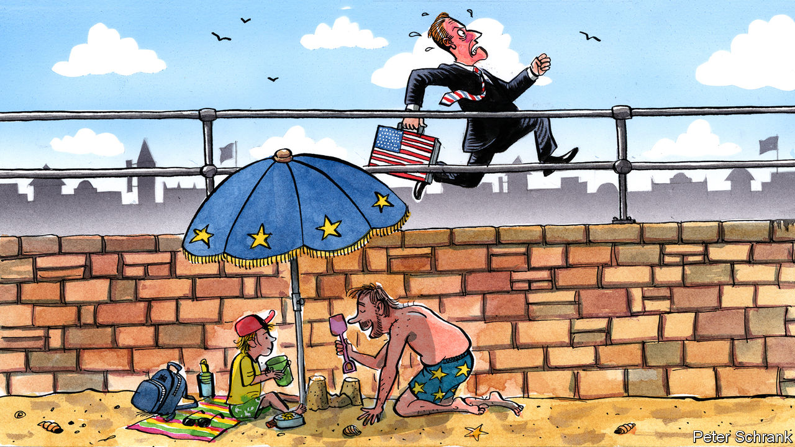

###### Charlemagne

# Europe’s economy is a cause for concern, not panic 

##### Quick, call another Italian former prime minister to the rescue! 

 

> Mar 14th 2024 

As Europe debated a single currency three decades ago, its politicians hoped to reverse a worrying trend: America’s economy was growing faster, poised to leave Europe in its wake. In 1994 the 27 countries now in the EU had a combined GDP just shy of their transatlantic rival’s, adjusted for purchasing parity. Two spurts of frothy growth in America followed by one spectacular bust in 2008 conveniently left the European economy back where it began—at around 97% of America’s size. More surprisingly, the protracted euro crisis culminating in the early 2010s, which hobbled Europe just as America discovered how to frack vast oil deposits, also did little to change the situation: by 2016 the ratio was still 97%. Surely the America-first bombast of Donald Trump, covid-era turmoil, the emergence of trillion-dollar tech firms in America and the return of war on the European continent (with an energy crisis to boot) would consign the near-parity to the annals of economic history? Not so. The EU finished 2022 with annual output a little over 96% of America’s. It is at the same level in the age of ChatGPT as it was at the time of cassette tapes.

The comparison is both worse and better than it looks for Europe. Its overall economic growth has been juiced by poor ex-communist countries such as Poland and Romania as they caught up with the rich world, while western European ones including France and especially Italy have flagged. The EU is home to many more people than America, so its citizens are on average about 30% worse off than New Yorkers or Texans. But as America’s population has risen by a quarter since 1994, while ageing Europe’s has grown far less, the two economies are in fact somewhat closer in terms of income per person than they were at the time of Bill Clinton and Jacques Delors. Factoring in working hours, which are both shorter and on a steady decline in the EU, leaves European workers with even less to blush about. Put very simply, the French and their neighbours toil a third less than Americans, earn a third less, and are a lot more tanned by the end of August.

In the absence of creating tech giants, one booming industry in Europe is that of fretting that the continent is falling behind. The naysayers think this time the old continent’s economic goose really is cooked. One culprit is the strong dollar, which leaves Europe looking beleaguered when its economic output is compared with America’s using market exchange rates. This is largely irrelevant: GDP per head in euros looks smaller in dollars when the greenback is strong, but the baguette bought with that euro is also worth fewer dollars, leaving Europeans no worse off. Even on a like-for-like basis, however, some Euro-gloom may be warranted. America’s economy has been on a tear of late, while every EU data release is an exercise in figuring out which bits are in recession. 

Europe is in the midst of a “competitiveness crisis”, in the words of Isabel Schnabel, a grandee at the European Central Bank (ECB). As if to underline the seriousness of the situation, the EU has appointed not one but two former Italian prime ministers to opine on the future of its economy. Enrico Letta will soon release a report on the single market. Mario Draghi, also a former ECB boss, will follow with an opus on “the future of European competitiveness” due in June. Many of their recommendations will be copy-pasted from a report written by Mario Monti, yet another Italian former prime minister (how the slowest-growing big country in Europe cornered the market in economic advice is anyone’s guess), which the EU published in 2010. Then as now, Europe often knows what it needs to do—deepen the single market, make cross-border financing easier and so on—yet not how to do it.

But getting the diagnosis right is the first step. For are things really so grim? Europe is back to having a trade surplus and a fiscal deficit that looks a lot better than America’s these days, points out Sander Tordoir of the Centre for European Reform, a think-tank. What growth it can eke out is more equally spread, resulting in more social mobility. Carbon emissions are falling faster than in America. Unemployment is pretty low just about across Europe these days; an ageing society means concerns will soon turn to a shortage of workers, not jobs.

“Competitiveness” is a nebulous term used by lobbyists to push their favoured policies. Often the suggested cure is worse than the supposed disease. Europe could jack up its growth rate by borrowing money and showering subsidies on firms, as America is doing, but has mostly avoided it, sensibly. European industry could become more competitive by slashing wages, or firing lots of workers: this is not the outcome policymakers will hope for. Corporate chieftains think Europe could boost this elusive competitiveness by easing green rules, another dead end. Importing lots of migrants would boost GDP but has political implications.

Economy class

There is much for Europe to fret about, of course. The continent has few corporate giants, and many old firms with little to fear from new entrants and so little incentive to innovate. A strengthened single market, which would provide cheaper capital and lots of customers, would help. Europe seems to be investing less in building productivity-enhancing AI models but also in deploying them, says Guntram Wolff of Bruegel, another think-tank. The continent is the world’s most open big economy in a time of geopolitical tension. If cheap Russian gas remains offline for years, some energy-intensive European industries may never recover. 

Economists speak of societies having to pick between making guns or butter—a question that has resurfaced as the need for defence spending has become apparent. Europeans have long forsaken both to spend time at the beach instead. Some have argued this was foolish, that social goodies like heavily subsidised health care or retiring early would not be possible for long without more economic growth. Perhaps now they are right. But it would not be the first time Europe’s resilience had been underestimated. ■


