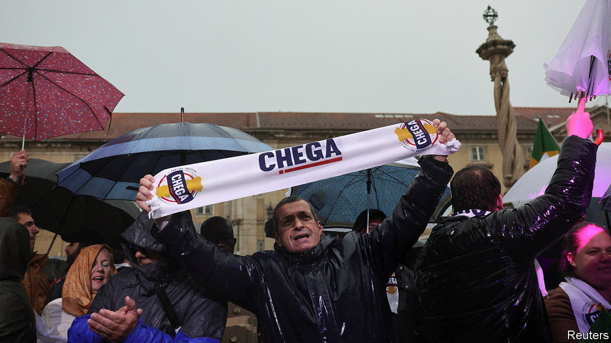

###### Ventura’s gain

# Portugal’s hard right gets a big election boost 

##### A once-boring democracy receives a jolt 

 

> Mar 11th 2024 

NEXT MONTH the Portuguese will celebrate 50 years since their “Carnation Revolution” overthrew the right-wing dictatorship that had run the country for decades. It will be a reflective moment for many reasons. Portugal has mostly been a model of democratic transition and stability since 1974. Now it is facing a period of political turmoil, after an election on Sunday left no party a clear path to govern.

The elections came early. Portugal had voted just two years ago. Then, bucking a European trend, voters gave a solid majority to one of their traditional centrist parties, the centre-left Socialists. António Costa, in office since 2015, returned as a strengthened prime minister. 

That was until prosecutors  by arresting an aide in an influence-peddling case. Although Mr Costa was not directly accused—and has denied any wrongdoing—he stepped back to fight the allegations. And the president, Marcelo Rebelo da Sousa, called an election, rather than allow a successor to Mr Costa to run the Socialist government. He may now wish he hadn’t.

The centre-right Democratic Alliance, led by the conservative (and confusingly named) Social Democratic Party, came a narrow first, putting its leader, Luís Montenegro, in position to take the first shot at forming a government. The Socialists lost seats and their leader, Pedro Nuno Santos, said they would not try to reconstitute a rickety multi-party coalition of the kind the party led after 2015. 

But the big news was the breakout of Chega, a populist right-wing party of the kind well-known across Europe. In 2022 Chega went from 1% of the vote to 7%; this time it took 18%, and will have at least 48 deputies in the 230-seat National Assembly. With the Social Democrats and Socialists at just 79 and 77 respectively, neither can reach a governing majority even with their respective small-fry ideological kindred. But both have refused to negotiate with Chega. “No is no,” repeated Mr Montenegro in his post-election speech on Sunday night.

Chega, led by André Ventura, started as an undisciplined right-wing splinter from the centre-right. It began by bashing gypsies and crime, but over time began to focus on immigration and corruption. Its slogan, “Portugal needs a cleaning”, could refer to all of the above. “This is the night that the two-party system in Portugal ended,” said Mr Ventura on Sunday to cheers. He also referred to Chega as the “central piece” of the legislature, implying that he wanted Mr Montenegro to call upon him for support. In other words he seems to want power, not to make a racket in opposition. The president said he would do all he could to keep Chega from being in government. But there may be no way to stop it from having a sizeable influence on legislation. Mr Montenegro will now take office unless a “rejection motion” (which the Socialists almost certainly would not vote for) wins a majority in parliament. But after that, he will have to fight for every bill, with the first big test being the budget for 2025. 

Portugal can congratulate itself on its past half-century. Unlike next-door Spain, whose dictator died in his bed, it overthrew its dictatorship and dealt more straightforwardly with its legacy. Perhaps partly for this reason, the two centrist parties are closer to each other in policy and in temperament; they lack the operatic fight-to-the-death spirit that prevails between their Spanish equivalents. Politics has been reassuringly boring much of the time.

Portugal has also had one of Europe’s strongest economies of late, which may make the rise of Chega surprising. But it seems to indicate that voters do not mark their ballots with mere GDP growth in mind. Portugal is changing quickly, becoming more socially liberal as well as welcoming large numbers of immigrants, many from its former colonies. Still, its rate of “catch-up” with the EU’s wealthier members has slackened, and corruption scandals still occasionally sour voters on their politicians.

And so one of the few countries in western Europe that appeared to have held off the hard right now has such a party with a strong presence in parliament, and all the attendant problems of governability. Whether the centrist Portuguese spirit that has kept extremism at bay for decades can continue to ensure stability remains to be seen.■


