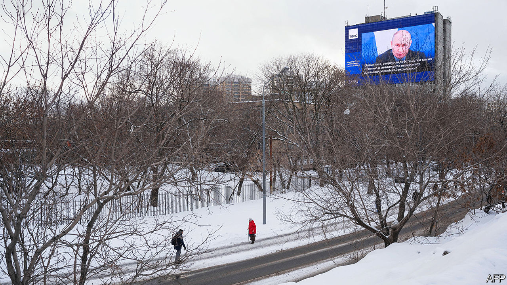

###### A plebiscite and a funeral

# Russians go to the polls in a sham election for their president 

##### The charade takes place amid murder and repression 

 

> Mar 12th 2024 

AT THE END of this week millions of Russians will take part in the re-election of President , the country’s longest-serving dictator since Stalin. In a land where opposition politicians are dead, in prison or in exile, where speaking truth to power is a criminal offence and where a paranoid autocrat is happy to kill hundreds of thousands of his own people and his neighbours in order to assert and maintain his power, an election seems entirely unnecessary, a strange charade or a quaint anachronism. 

The three-day voting exercise that will begin on March 15th is not an election in the way most people in the Western world understand one. Had Russia been a democracy, Mr Putin would have left power in 2008, when his second and constitutionally last term in office expired. But where war is peace, ignorance is strength and freedom is slavery, the essence of this election is the absence of choice. 

With no viable alternative or proper scrutiny, Mr Putin is certain to get the result he wants. Russia’s only independent election-monitoring organisation, Golos, has been designated a “foreign agent” and its co-founder is in jail. Yet the inevitability of the result will not make the ritual of voting for Mr Putin redundant. For his regime it is crucially important.

The Soviet leaders who also held fake elections, sometimes with only one candidate on the ballot, could still rely on the legacy of the Bolshevik revolution and victory in the second world war. Mr Putin’s tyranny is both more personal and less ideological. It derives its legitimacy from its use of violence and the carefully maintained appearance of popular support. The spectres of external enemies—the West and Ukraine—and internal ones (foreign agents) are invoked to buttress it.

In essence, says Greg Yudin, a Russian political philosopher and research fellow at Princeton University, Mr Putin’s presidential election is a form of acclamation—a ritual public expression of approval towards imperial officials that goes back to the time of ancient Rome. (Moscow, it should be recalled, once saw itself as the “Third Rome”.) Its role is not to change who is in power, but to give an injection of legitimacy to an ageing dictator. “The decisions are already made by the leader; the role of the people is to say yes—to acclaim,” says Mr Yudin.

A murderous tsar

Ever since Mr Putin came to power in 2000, his regime has cultivated passivity, turning people off from active politics and calling on them only for the purpose of such public acclamations. As Alexander Selikhov, a celebrated Russian footballer, said after casting his first-ever ballot paper in the 2018 presidential elections, “I’ve voted for the tsar.” Just such a ritual is depicted in “Boris Godunov”, the great tragedy by Alexander Pushkin. Godunov, a late 16th-century courtier who was elected tsar by an assembly of servicemen and clergy, is greeted by the people, who are gathered in front of the Kremlin. They duly display their approval, while privately discussing rumours that Godunov had murdered the legitimate heir to the throne. 

One person who understood the essence of this ritual acclamation, and who tried to reclaim elections as true political expressions, was , Russia’s recently slain opposition leader. Though he knew that power in Russia could not be changed through the ballot box, he saw elections as a way of registering dissent. His call in 2011 to vote for any other party than Mr Putin’s United Russia mobilised both voters and observers, forcing the Kremlin to rig that year’s parliamentary vote so blatantly that it prompted the largest protests in Russia’s post-Soviet history. 

Voice from the grave

Though Navalny was incarcerated in one of the harshest penal colonies in the Arctic and charged with extremism, while his organisation was outlawed and some of his allies flung in jail, he continued to challenge Mr Putin and mobilise people. Rather than telling his followers to ignore the fake election, he urged them to turn it into an event where people could manifest their agency, even though they did not have their own candidate. Two weeks before his death, he called on millions to turn up at midday on March 17th—the last day of the three-day voting period—to vote for anyone but Mr Putin, to spoil their ballot papers, or simply just to gather and talk. 

“If they decide to kill me, it means that we are incredibly strong,” Navalny said shortly before returning to Russia in 2021 and being arrested the moment he landed. But even in harsh solitary confinement he continued, in court appearances and letters, to support people who believed that his version of Russia as a modern European nation was still possible. 

By murdering Navalny a month before his “election”, Mr Putin wanted to show that there was no alternative to himself and his older, imperialist version of Russia. Unable to contest them at the ballot box, Navalny continues to do so from his grave. His funeral on March 1st became a visible act of defiance. 

Despite threats and intimidation, tens of thousands of people in Moscow and across the country have come together to grieve and pay tribute to him. According to Moscow public transport data, between March 1st—the day of the funeral—and March 3rd 27,000 more people than usual used the metro station nearest to the cemetery. Many more people came on foot or by car. They queued for hours, holding candles and photographs of Navalny, singing psalms and chanting “Navalny”, “No to war” and, with remarkable bravery, “Putin is a murderer”. 

They covered his grave with a mound of flowers. Young and old, well-heeled and poor, they did not hide their faces from the pervasive surveillance cameras and the many masked policemen. The soundtrack from “Terminator 2”, one of Navalny’s favourite films, and Frank Sinatra’s “My Way”, which were played at his funeral, have now become tunes of resistance.

Those who attended the funeral were struck by the atmosphere not only of personal grief but also of solidarity. People shared food and tea, and embraced each other, well aware that this might be the last time they could protest in such large numbers. And not just in Moscow. Over the past two weeks spontaneous “flower memorials” and shrines to Navalny have sprung up in more than 230 Russian cities, where people have laid flowers and lit candles at monuments to victims of past political repression, in courtyards and entrances to buildings. “Funeral tradition [has] merged with political protest,” wrote Alexandra Arkhipova, a social anthropologist. 

Yulia Navalnaya, the widow who has stepped up to carry on her husband’s legacy, has called on his supporters to maintain this protest and “to use election day to show that we are there and we are many, we are real living people and we are against Putin.” Mr Putin plainly fears her. On March 12th Leonid Volkov, Navalny’s chief of staff before his death, was attacked outside his home in Lithuania and beaten with a hammer. It bore all the hallmarks of a Putin-ordered attempt at intimidation.

Turning up at midday on March 17th will not lead to a change of power in Russia. But in a country where symbols and gestures carry more weight than statements, Navalny’s funeral protest has already cast a shadow over Mr Putin’s acclamation. As the holy fool in “Boris Godunov” says when urged to pray for Godunov by the Kremlin churches, “No prayer for the Herod-Tsar…Our Lady won’t allow it.” ■


