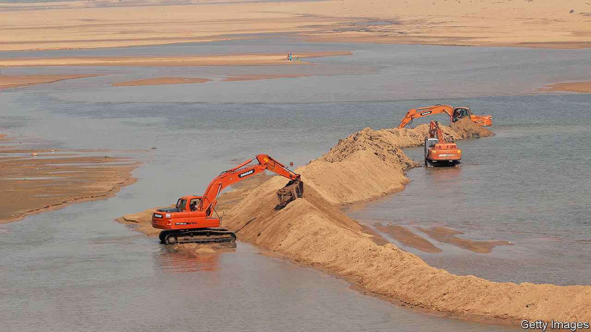

###### Life’s a beach

# China is churning out solar panels—and upsetting sand markets 

##### The hunt for grains with a silica concentration of more than 99.9% 

 

> Mar 14th 2024 

Sand is everywhere. Yet only a certain sort can be used to make the ultra-clear glass required for smartphones and solar panels. It must have a silica concentration of more than 99.9%, against less than 80% for construction material. This high-quality sand is scarce: of the 50bn or so tonnes extracted each year, less than 1% can be used to produce regular glass. A tiny fraction of that is pure enough for solar panels.

As China’s leaders seek to revive the country’s economy, and to rebalance it away from property, they are throwing cash at manufacturing firms. The result is likely to be a surge in production, especially in sectors that Xi Jinping sees as important to China’s future, such as lithium-ion batteries, electric cars and solar panels, many of which require vast amounts of sand. As a result, demand will probably rise higher still. Prices are already hovering near record highs; last year they came to around $55 a tonne.

The market is opaque and fragmented. But Crux Investor, a data firm, notes that the price of high-quality sand has risen twice as much as that of lower-quality stuff over the past five years, owing to the expansion of green manufacturing and the growing popularity of smartphones. Prices are buoyed by the fact that most Asian countries control exports so as to prevent environmental degradation. In America, where fine sand is mostly found in freshwater rivers, tough regulation makes extraction hard.

Some manufacturers are now looking for alternatives. One option is to refine sand used for regular glass, which tends to be 99.5% silica. The problem is that doing so is itself expensive.

Miners, both legitimate and otherwise, therefore spy an opportunity. The black market, estimated to be worth hundreds of billions of dollars a year, is likely to grow. Australia and Brazil are perhaps best placed to profit from the legal boom, according to Brian Leeners of Homerun Resources, a miner. Although these countries are best known for their sparkling white beaches, they also have significant reserves of industrial sand. These reserves are often farther from human settlements than those elsewhere, making extraction simpler. Mining companies report that until recently the price of sand was not high enough to cover shipping costs. Soaring prices have changed the equation.

Neither country is in China’s sphere of influence. As such, they may help make Western supply chains more resilient. Mr Leeners points out that Brazil’s shipping lanes are also less prone to disruption, since they avoid the drought-hit Panama Canal and the Red Sea, which is under bombardment by Houthi rebels. Other commodities essential for the green transition, including cobalt, nickel and lithium, have seen prices jump, only to fall subsequently when new supplies or cheaper alternatives are discovered. Once permits have been acquired for extraction, high-quality sand could be the next to follow this path. The wait will, however, be an uncomfortable one for many manufacturers.■


