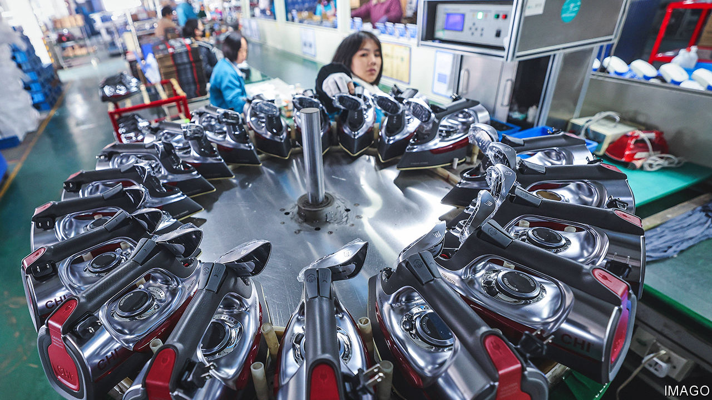

###### Global trade

# China’s economic bright spots provide a warning 

##### What a visit to an optimistic port reveals 

 

> Mar 14th 2024 

If America’s economy begins to deteriorate, people in Ningbo will be among the first to know. The eastern Chinese port, home to 9.6m residents, contains a sprawling industrial district. Its goods are prepared for export, and are shipped abroad via a deepwater harbour, which is one of the world’s busiest. The coast of Zhejiang province is dotted with similar entrepôts, where thousands of mostly family-owned firms have built up a diverse manufacturing base over the past 40 years. They make everything from textiles and car parts to electronics and machine components.

Ningbo is also a city of political importance. Although private industry, rather than state-backed enterprise, has thrived in the region, it has nevertheless been held up as a model of “common prosperity”—Xi Jinping’s way of dealing with wealth inequality. And amid a gloomy overall outlook, with much of the country mired in a property crisis and suffering from weak consumer demand, surprisingly strong exports and fading fears of a recession in America have combined to make Ningbo one of China’s most optimistic cities. 

Official data released on March 7th showed that China’s exports surged by 7.1% year on year in the first two months of 2024. This is especially impressive given that some analysts had expected growth of less than 1%. Even exports to America climbed 5% year on year, after having tumbled by nearly 7% in December. The figures were sufficiently encouraging that policymakers at China’s annual congress in Beijing disclosed a version of them a day ahead of the expected release date.

Little surprise, then, that the atmosphere in Ningbo is more cheerful than in other Chinese cities. Part of this, locals say, can be attributed to its relatively easy covid-19 years. In 2022 many large Chinese cities were locked down for months on end. Ningbo, perhaps by dint of luck, avoided a full-city lockdown and closed few factories. When Shanghai was shut down in April and May that year, halting lorries bound for its port, some traffic was rerouted to Ningbo’s busy harbour. 

The good cheer has limits, though, which suggests that cities such as Ningbo may not drive China’s recovery. A downturn in foreign demand would be devastating for the region. Local factories experienced a brief taste of this as China reopened in early 2023. Empty containers began stacking up in Ningbo’s port, indicating a lack of overseas purchases. An official who visited the city last March says he anticipated a disaster for the city and other export hubs. Fortunately, part of the phenomenon was explained by excess shipping containers returning to China for the first time since the start of the pandemic. The drop in demand was a blip.

Ningbonese factory bosses have other concerns. The family-controlled nature of their firms makes financing from banks more difficult to secure. As larger manufacturers in southern cities such as Shenzhen enjoy government support for technology upgrades—involving robotics and the internet of things—local companies are finding it tough to keep pace.

And although the most recent export data beat expectations across the board, things improved from a very low base. Analysts at HSBC, a bank, expect trade uncertainty to persist. Meanwhile, demand is shifting: that from poorer markets, such as Africa and South America, is surging, according to the most recent data; that from America remains strong; but that from Australia, the EU and Japan is falling. 

How well will Ningbo adapt? Many manufacturers got their start supplying foreign brands. More recently, they have begun selling directly to customers in the rich world through Amazon, an online marketplace, and Temu and Shein, two Chinese e-commerce sites, notes Hing Kai Chan of the University of Nottingham Ningbo China. They are unlikely to have developed similar channels in the markets now growing strongly. If rich-world demand fizzles out, Ningbo’s happy days could come to an end. Instead of developing a new path to prosperity, China’s optimistic city is riding on the coat-tails of the country’s geopolitical rivals. ■


