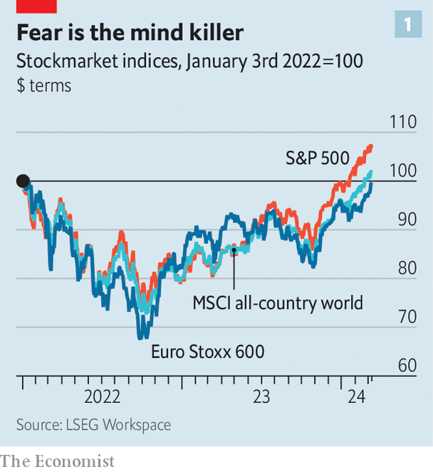
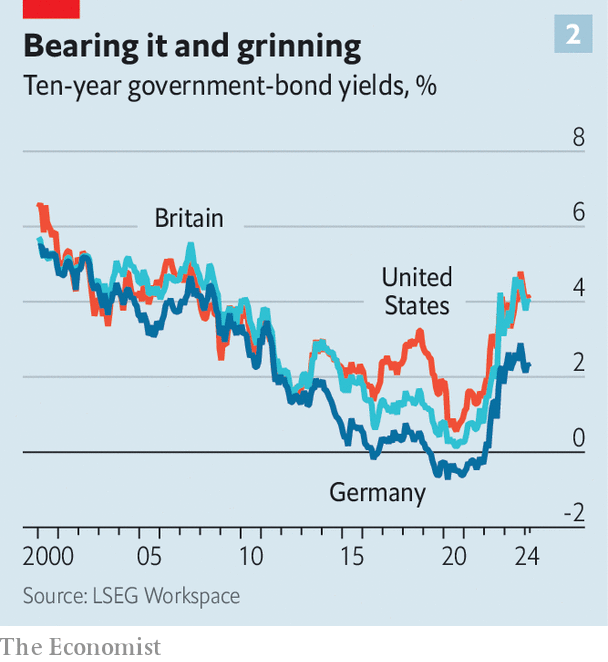
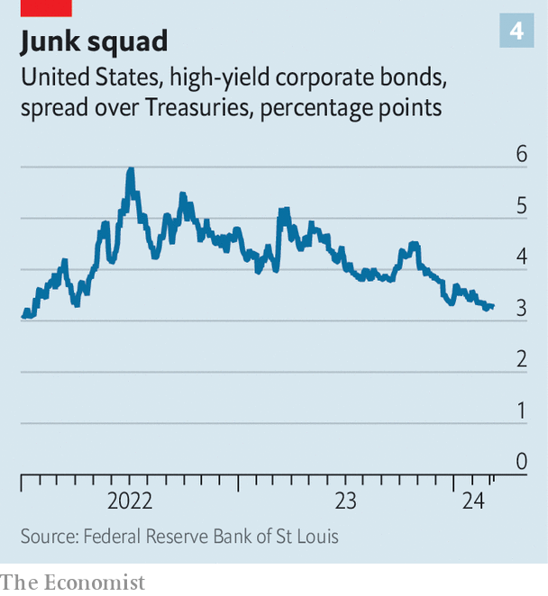

###### Plentiful helium

# Is the bull market about to turn into a bubble? 

##### Share prices are surging. Investors are delighted—but also nervous 

 

> Mar 11th 2024 

Two years ago, pretty much everyone agreed that one of the great bubbles was bursting. An era of rock-bottom interest rates was coming to a close, shaking the foundations of just about every asset class. Share prices were plunging, government bonds were being hammered, crypto markets were in freefall. Wall Street’s prophets of doom were crowing with delight. The consensus of the previous decade—that inflation was dead and cheap money here to stay—looked as ludicrous as the groupthink of any previous financial mania. Thus the pendulum was about to swing: from exuberance to scepticism, risk-taking to cash-hoarding and greed to fear. It would take a long time to swing back.

 


Or not. The trough in American stocks came in October 2022. Less than 18 months later stockmarkets around the world are back at  (see chart 1). America’s in particular is on an , with the S&amp;P 500 index of large firms having risen in 16 of the past 19 weeks. The value of Nvidia, a maker of microprocessors essential for artificial intelligence (AI), has risen by more than $1trn in the space of a few months. Bitcoin hit another record on March 14th. Disorientingly for those who blamed the previous mania on near-zero interest rates, this comes after a brutal campaign by central bankers to yank them back to more normal levels (see chart 2). Once again, every conversation about markets veers unerringly back to the same question: is this a bubble?

For many, the parallel that springs to mind is not the most recent bull market but that of the late 1990s, when the dotcom bubble inflated. Then, as now, new technology promised to send productivity and profits to the moon, the innovation in question being the internet rather than artificial intelligence. Bulls in the 1990s were right that advances in telecommunication would transform the world and spawn new corporate giants. Yet plenty still ended up losing their shirts—even by betting on firms that went on to be wildly successful. The canonical example is Cisco, which, like Nvidia, made hardware crucial for the new age. Although in the most recent fiscal year its net profit was $12.8bn, up from $4.4bn in 2000 (both in today’s money), those who bought shares at their peak in March 2000 and are still holding today have taken a real-terms loss of nearly 66%.

 


Cisco therefore illustrates the defining feature of bubbles. They inflate when investors buy assets at prices that are entirely unmoored from economic fundamentals such as supply and demand or future cash flows. The question of what the asset is “worth” goes out of the window; all that matters is whether it can later be sold for more. That in turn depends on how many people the speculative frenzy can pull in and how long it can last—in other words, how mad the crowd becomes. Once buyers run out, the craze dissipates and there is nothing holding prices up. Predicting the size of the subsequent fall is as much of a fool’s game as trying to time the top.

The good news is that this sort of mania is some way off. Researchers at Goldman Sachs, a bank, have analysed the valuations of the ten biggest stocks in America’s S&amp;P 500 index, around which much of the AI hype has revolved. With prices at an average of 25 times their expected earnings for the coming year, they are on the expensive side. But they are cheaper than they were last year, and a bargain compared with the peak of the dotcom bubble, when prices were 43 times earnings. 

There are other tell-tale signs that, in spite of soaring share prices, euphoria is absent. Bank of America’s latest monthly survey of fund managers finds them more bullish than they have been for around two years, but not particularly so by long-term standards. Their average cash holdings are low, but not extremely so, meaning that they have not piled into the market with everything they have (and are also not hoarding cash in anticipation of a plunge, which they were in the late 1990s). Among retail investors, the crowd that typically sustains the final and most dangerous stage of a bubble, there has been no repeat of the stampede into tech funds and meme stocks witnessed in 2021.

Manic episodes

What, then, would it look like if things were to take a euphoric turn? A strong signal would be for gains that have so far been concentrated in a few mega-cap stocks to spread through the market more broadly. The winning streak of the past few months has been dominated not by America’s “magnificent seven” tech giants, but by just four of them. Amazon, Meta, Microsoft and Nvidia have left the other 496 stocks in the S&amp;P 500 in the dust. Those others, in turn, have recovered from the shellacking of 2022 far better than the smaller firms represented in the Russell 2000 index (see chart 3). If investors really do start throwing caution to the winds, expect them to start betting on riskier corporate minnows as well as on giants—especially those that manage to shoehorn the letters “AI” into their annual reports.

 


A corollary is that the pipeline of initial public offerings (IPOs) ought at last to start gushing. In both 1999 and 2021 it got going, with rising share prices and ebullient investors proving irresistible to bosses searching for capital. A puzzling feature of the current bull market is that it has taken place amid an ipo drought. EY, a consultancy, estimates that firms going public in America raised just $23bn in 2023, compared with $156bn in 2021. It might be that bosses are simply more worried about economic headwinds than investors are. In a euphoric market such level-headedness becomes impossible to maintain.

Similar dangers stalk professional money-managers, whose job is to beat the market whether or not they think it is moving rationally. When pockets look dangerously overvalued, it makes sense to avoid them. But in a bubble, avoiding overvalued stocks—which, after all, are the ones rising the most—starts to look suspiciously like routine mediocrity. As the dotcom frenzy reached its peak, Julian Robertson, one of the 20th century’s most revered hedge-fund managers, stalwartly refused to buy tech stocks. His investors eventually revolted and withdrew their money, forcing his fund to close right as the crash was about to start. Hence another sign that a bubble is about to pop: some of the market’s gloomier voices are fired.

 


Investors do not yet seem excitable enough for any of this to take place. But as in 2021, cheaper debt could help get them in the mood. Lenders are shovelling money in the direction of risky high-yield (or “junk”) corporate borrowers, narrowing the spread they pay above the yield on government debt (see chart 4). When the Federal Reserve’s officials meet on March 20th, any hint that rate cuts are imminent could be exactly the sort of high for which investors are looking. Just have some paracetamol on hand for the comedown. ■


