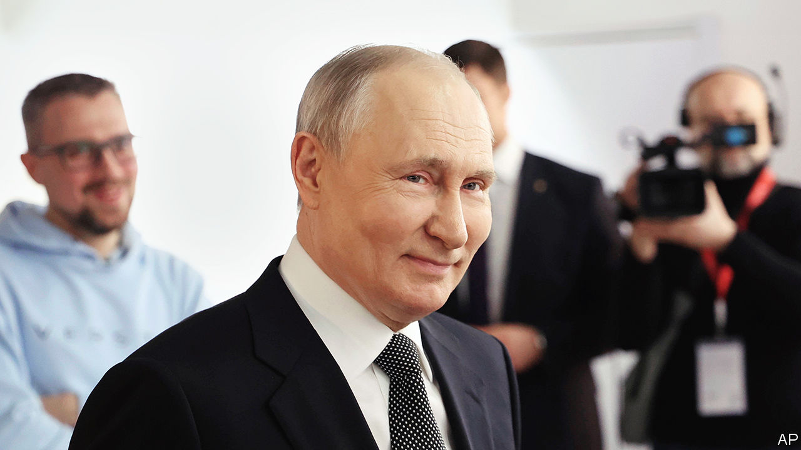
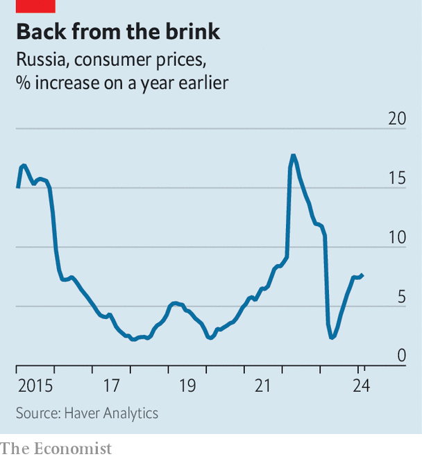
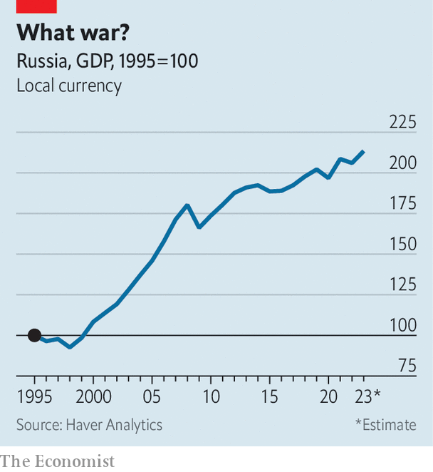

###### Bullet dodged

# Russia’s economy once again defies the doomsayers 

##### As an election nears, Vladimir Putin now looks to have inflation under control 

 

> Mar 10th 2024 

In the two years following Vladimir Putin’s , Russia’s economy has repeatedly defied the doomsayers. A financial collapse, widely predicted in the spring of 2022, never came to pass. The economy fell into recession, but it was less severe than expected and passed quickly. Inflation was the . Last year prices accelerated rapidly; economists believed they could spiral out of control. Even Mr Putin was worried. In February he urged officials to give “special consideration” to rising prices.

Once again, however, the Russian economy seems to be proving the pessimists wrong. Data released on March 13th showed that prices rose by 0.7% month-on-month in February, down from 1.1% at the end of last year. The annual rate of inflation is stabilising at around 7.5% (see chart). Forecasters expect it to fall to just 4% before long; household expectations of future inflation have flattened. Russia’s presidential election was due to begin on March 15th, after we went to press. The result is a foregone conclusion. If it was competitive, these figures would do Mr Putin no harm.

 


Russian inflation surged last year owing to a fiscal splurge larger than the one implemented during the covid-19 pandemic. As Mr Putin doubled down on his invasion of Ukraine, he increased spending on everything from transportation equipment and weapons to soldiers’ salaries. Total government outlays rose by 8% in real terms. Demand for goods and services soared beyond the economy’s capacity to provide them, prompting sellers to raise their prices. Workers became particularly difficult to find, not least because hundreds of thousands were called up and tens of thousands . By October last year nominal wages were growing at an annual pace of 18%, up from 11% at the start of the year. This provoked price inflation in labour-intensive services such as health care and hospitality.

Who deserves credit for the turnaround? The finance ministry is advancing its claim. Last year its officials successfully lobbied for exchange-rate controls, which compel exporters to deposit foreign currency in the Russian financial system. The wheeze has probably supported the rouble, which has appreciated in recent months, reducing the price of imports. 

Central-bank officials think that their peers in the finance ministry are economic know-nothings who mess with markets at their peril. They believe their policy—of more than doubling interest rates since July 2023—should take the credit for the inflation slowdown, and they are probably right. Higher rates have encouraged Russians to put money in savings accounts rather than spending it. Tighter monetary policy has also curbed lending. In December retail lending grew by 0.6% month on month, down from 2% for most of 2023. 

 


Few other central banks have been quite as tough. Yet Russia still seems to be heading for a “soft landing”, in which inflation slows without crushing the economy. The performance of the economy is now in line with its pre-invasion trend; gdp grew in real terms by more than 3% last year (see chart). Unemployment remains at a record low and there is little evidence of corporate distress. Indeed, the rate of business closures recently fell to its lowest in eight years. Meanwhile, the Moscow Exchange is hoping to see more than 20 initial public offerings this year, up from nine last year. And the latest “real-time” data on economic activity are reasonably strong. Consensus forecasts for GDP growth this year of 1.7% therefore look too pessimistic. 

Russia’s economic resilience is in part the consequence of past stimulus. In recent years corporations and households have built up large cash balances, allowing them to continue spending even in the face of high inflation, and avoid default in the face of high borrowing costs. As in other parts of the world, falling demand for labour has mostly resulted in a decline in unfilled vacancies rather than in a lower number of people in employment. Figures from HeadHunter, a recruitment site, suggest that the ratio of open positions to jobseekers has stopped rising. Having struggled to find workers in recent months, bosses are reluctant to let people go unless they absolutely must. 

 has also juiced the economy. Russian production facilities formerly owned by Westerners have reopened under new management, as the central bank points out in a recent report. At the start of the war, sanctions made it hard for Russian firms to source inputs, delaying production. Now, though, companies have set up durable supply chains with “friendly” countries. Well over half of goods imports come from China, twice the share from before the invasion. 

As new trading relationships have bedded in, Russian exporters have dared to raise prices, supporting revenues and profits. The discount on oil Russia offers to Chinese customers, for instance, has fallen from more than 10% in early 2022 to about 5% today. And it is not just oil. Mr Putin boasts about soaring ice-cream exports to China, noting last week that he “treated my friend, President Xi Jinping”, to a lick. 

As every Russian knows, inflation is never truly defeated. Central-bank officials continue to fret that inflation expectations remain too high. The biggest worry is that the rouble may depreciate, either because of lower oil prices, another round of serious sanctions or if China loses interest in supporting Mr Putin. These are serious concerns. Nevertheless, the pariah economy is once again back on track. ■


