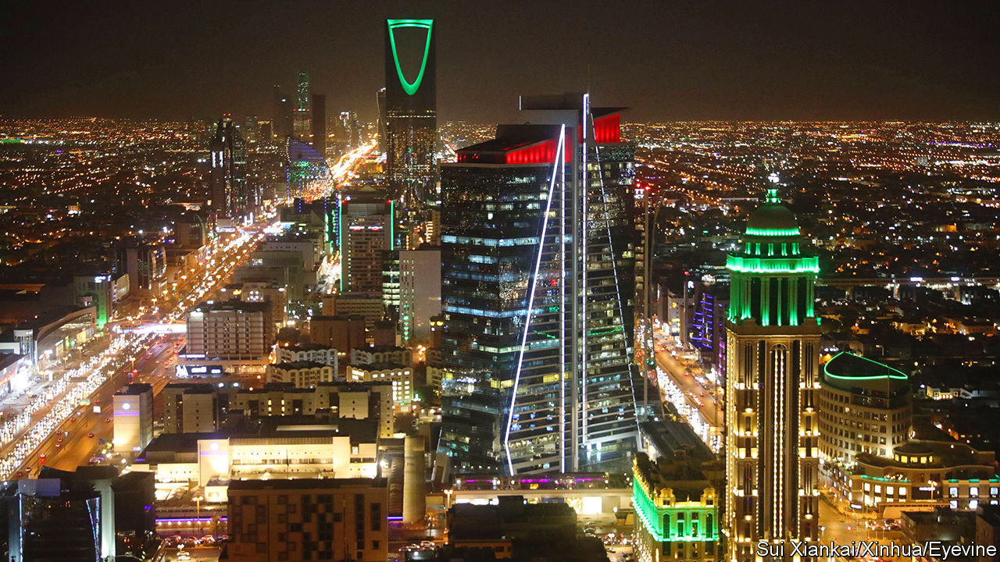
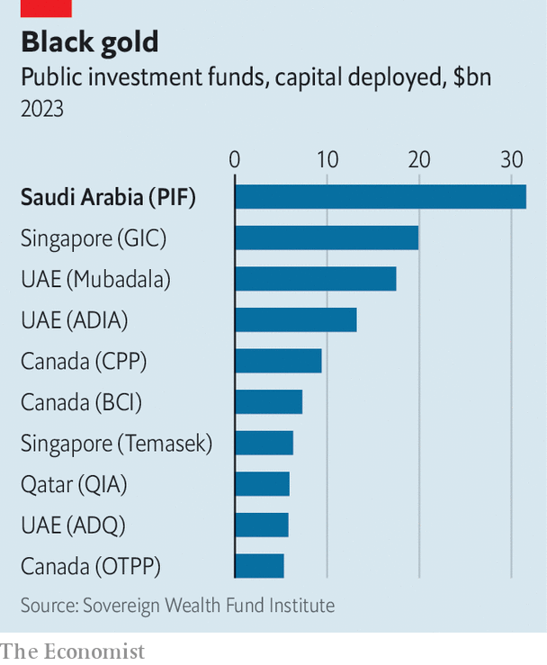

###### Princely demands

# Saudi Arabia’s investment fund has been set an impossible task 

##### It must earn eye-watering returns while speeding the shift to a post-oil economy 

 

> Mar 14th 2024 

About a decade ago, a flashy, deep-pocketed investor made an appearance. Saudi Arabia’s Public Investment Fund (PIF) had a mandate to go big, and was ready to: it picked up a $3.5bn stake in Uber, placed $45bn in the world’s largest technology-investment fund, SoftBank’s Vision Fund, and provided half the capital for a $40bn infrastructure fund run by Blackstone, a private-equity giant. It has since bought stakes in everything from Heathrow Airport and Nintendo to Hollywood studios and French hotels. Last year it deployed more than $30bn of fresh capital, making it the highest-spending wealth fund in the world (see chart). 

 


Yet even as the PIF splurges abroad, its mandate at home is becoming more important. That is because of crown prince Muhammad bin Salman’s plan to transform Saudi Arabia’s economy, known as “Vision 2030”, in which the PIF is expected to play a vital role. It has been instructed to invest at least 150bn riyals ($40bn) at home each year. The intention is also to raise its holdings from 3.5trn riyals to 7.5trn riyals by the end of the decade, with luck creating millions of jobs as the economy moves away from oil. After a strong 2022, the kingdom’s gdp fell by 0.9% last year—its worst performance since 2002, aside from years of pandemic or financial crisis—making the task more urgent.

The PIF’s role as a fulcrum of the Saudi economy means it is unlike any other sovereign-wealth or public-pension fund. Norges Bank Investment Management, Norway’s sovereign-wealth fund, has tasks and governance that are distinct from the country’s pension fund and finance ministry. Singapore’s GIC has to replenish its government’s budget, but its investments are focused on profits. In Qatar the state fund mainly invests abroad. As the PIF attempts to meet the ambitions of its political masters, it faces three challenges.

The first concerns funding. The PIF currently receives most of its capital through asset transfers and capital injections from the government. On March 7th the Saudi government revealed that 8% of Saudi Aramco’s equity, worth about $164bn, had been transferred to the fund, doubling its stake in the state oil giant. The fund also receives dividends from investments and holdings, and can tap debt markets. It raised $11bn by issuing bonds on international capital markets last year, and has already raised another $5bn this year. On top of this, the fund borrowed at least $12bn in long-term loans last year. In the past, the central bank’s foreign-currency reserves have been transferred to it, too. 

Many of these sources will come under pressure. Not only is the fund expected to keep spending more, but as demand for oil slows the Saudi government will become less munificent. By 2030 millions more Saudis will have entered the workforce. The state employs many locals on higher wages than the private sector, with salaries counting for 40% of its total spending, meaning this will strain its budget. Bosses at domestic firms, many part-owned by the PIF, now talk of cost-cutting. And since the fund has eagerly tapped debt markets, interest payments are growing. Its cash dropped to $15bn at the end of September, from around $50bn at the end of 2022.

The PIF’s desire to boost growth across the Saudi economy also means it invests in firms at various stages of evolution, complicating efforts to sustain consistent returns. Over the past five years the fund has established 93 companies. Over the 13 “strategic” sectors that the PIF has been tasked with developing, from health to sports and tourism, returns vary widely. Portfolio companies range from ROSHN, a property developer, to NEOM, a vast smart-city under construction, and Riyadh Air, an airline yet to become operational. 

All of this leads to the PIF’s second challenge: boosting returns. Since 2017, when the fund was tasked with implementing Vision 2030, its investments have returned about 8% a year. This is just above its minimum target of 7%, but far below the private-equity-style returns it really aims to achieve, admits one executive. Such ambitions are loftier than those pursued by most sovereign-wealth funds, which are more reserved owing to the difficulties of making big returns with diversified holdings and such large pools of money. So far the PIF has been able to pick assets that promise both economic development and strong returns, while tapping dividends from these holdings. As its role expands, that will become increasingly difficult.

Moreover, private-equity-style valuation methods, which depend on past performance and projections of future cash flows, are tough to apply to many of the companies and projects in which the PIF is now investing. NEOM, for instance, is expected to cost around $500bn. But how and when it will begin to offer consistent cash flow is up for debate, making the investment more akin to a venture-capital one. In other areas, such as health and infrastructure, the fund’s role has the air of impact investing, where the goal is to achieve certain social ends as well as secure profits. This sort of investment is normally characterised by returns that deteriorate with scale and perform better when held for a long time, according to researchers from Harvard Business School and the International Finance Corporation, part of the World Bank. As the PIF expands, another problem is emerging: portfolio firms often overlap and compete with one another, cannibalising returns. In effect, this means taking money from your left pocket to put in your right, the executive sighs.

The final challenge is attracting foreign investment into Saudi Arabia. As the fund grows bigger, foreign money would assist its ambitions. It would also enable domestic firms to expand their horizons and access new markets, thereby reducing the chances of ending up in competition with one another. And it would allow the PIF to exit some of its investments, which would push the private sector to fend for itself. 

But last year, after an IMF-approved data revision, Saudi Arabia attracted just 53bn riyals in foreign direct investment in the first three quarters, an amount equivalent to 2% of GDP. The aim is to entice over double that by 2030. “We can wait for investors but it will take time, so let’s go and do it [ourselves],” says a Saudi minister, “while being inviting to others.” It could be a very long wait. So far, global investors seem happier to take Saudi Arabia’s money than to put their own money into the country. ■


