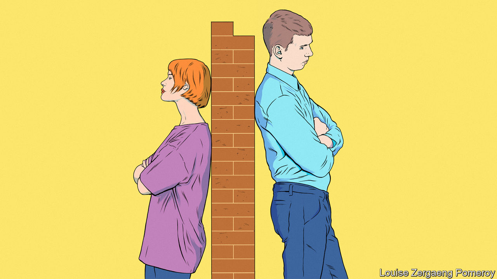
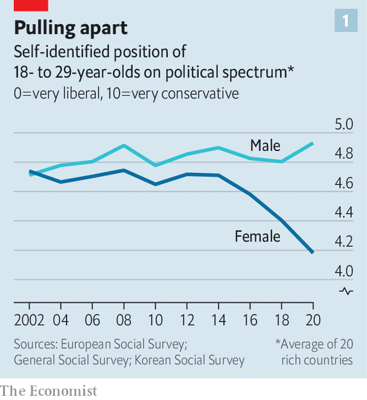
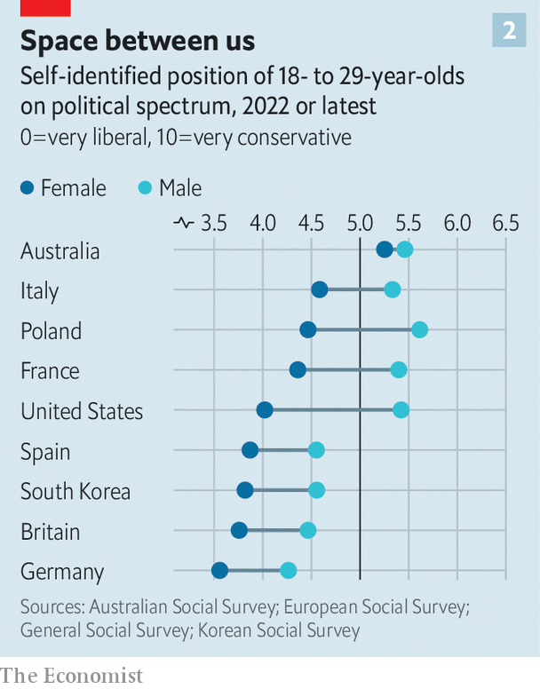
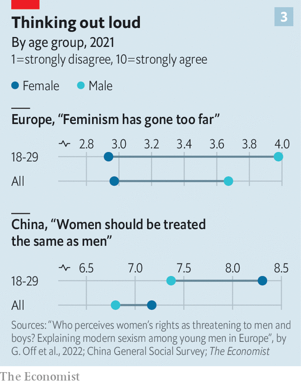
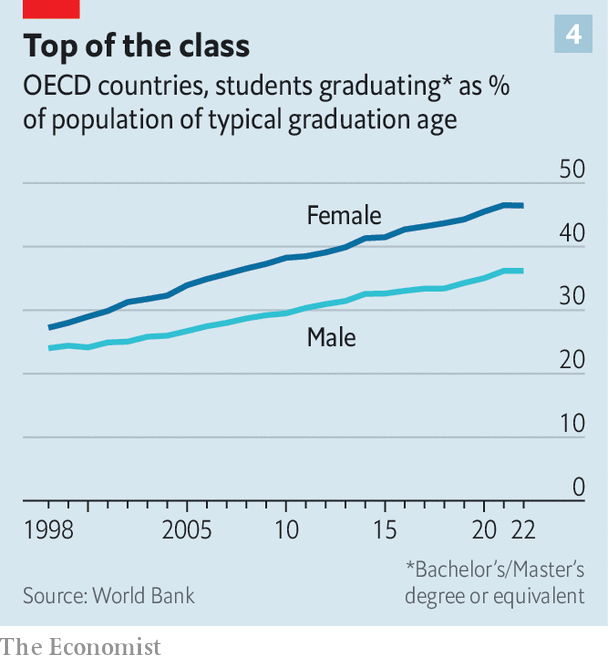

###### Of Mars and Venus

# Why young men and women are drifting apart 

##### Diverging worldviews could affect politics, families and more 

 

> Mar 13th 2024 

In a trendy food market in Warsaw, Poland’s capital, two female engineers are discussing how hard it is to meet a nice, enlightened man. Paulina Nasilowska got a big pay rise a few years ago. Her boyfriend asked: “Did you have an affair with your boss?” He is now an ex-boyfriend.

Ms Nasilowska’s friend, Joanna Walczak, recalls a man she met on Tinder who revealed that he was a “red-pill” guy (a reference to “The Matrix”, a film, meaning someone who sees reality clearly. In the “manosphere”, a global online community of angry men, it means realising that men are oppressed.) He thought household chores and child care were women’s work, and that women could not be leaders. They didn’t have a second date. 

Typically for young Polish women, Ms Nasilowska and Ms Walczak support parties of the liberal left, which take women’s issues seriously and promise to legalise abortion. Young Polish men, they complain, hew more to the right, or even to the far right. Consider last year’s election. Then the top choice for 18- to 29-year-old men was Confederation, a party that touts free-market economics and traditional social values. (“Against feminists. In defence of real women” is one of its slogans.) Some 26% of young men backed it; only 6% of their female peers did. 

Young Polish men have their own set of complaints. Feminism has gone too far, say two firemen in their 20s in a small town. Lukasz says he used to be able to go to a village dance party and “the women there were wife material.” Nowadays “they’re all posting shameless pictures of themselves on social media,” he laments. The media are “all biased and pushing the culture to the left”, complains Mateusz (neither man would give a surname). People no longer admit that men and women often want to do different kinds of work. 

In much of the developed world, the attitudes of young men and women are polarising.  analysed polling data from 20 rich countries, using the European Social Survey, America’s General Social Survey and the Korean Social Survey. Two decades ago there was little difference between men and women aged 18-29 on a self-reported scale of 1-10 from very liberal to very conservative. But our analysis found that by 2020 the gap was 0.75 (see chart 1 ). For context, this is roughly twice the size of the gap in opinion between people with and without a degree in the same year. 

 


Put another way, in 2020 young men were only slightly more likely to describe themselves as liberal than conservative, with a gap of just two percentage points. Young women, however, were much more likely to lean to the left than the right, with a gap of a massive 27 percentage points. 

In all the large countries we examined, young men were more conservative than young women (see chart 2). In Poland the gap was 1.1 points on a scale of 1-10. It was a hefty 1.4 in America, 1 in France, 0.75 in Italy, 0.71 in Britain and 0.74 in South Korea. Men and women have always seen the world differently. What is striking, though, is that a gulf in political opinions has opened up, as younger women are becoming sharply more liberal while their male peers are not. 

For young women, the triumphs of previous generations of feminists, in vastly increasing women’s opportunities in the workplace and public life, are in the past. They are concerned with continuing injustices, from male violence to draconian abortion laws (in some countries) and gaps in pay to women shouldering a disproportionate share of housework and child care. Plenty of men are broadly in their corner. But a substantial portion are vocally not. Young women’s avid liberalism may spring from a feeling that there is much work still to be done, and that opposition to doing it will be stiff. 

 


The gap does not translate straightforwardly into voting patterns, but it is visible. One poll found that 72% of young American women who voted in House elections in 2022 backed the Democratic candidate; some 54% of young men did. In 2008 there was barely any gap. In Europe, where many elections offer a wide array of parties, young women are more likely to support the most left-wing ones, whereas young men are more likely to favour the right or even the radical right.

In France in 2022 young men were much keener than young women on Eric Zemmour, a presidential candidate who wrote a book rebutting Simone de Beauvoir, France’s best-known feminist. Germany’s election in 2021 saw the largest ever left-right gap between the votes of young women and men, according to Ansgar Hudde of the University of Cologne. In Portugal, where the far-right Chega party surged in an election on March 10th, support for it is concentrated among voters who are young, male and less educated. And South Korea in 2022 elected an overtly anti-feminist president; more than 58% of men in their 20s voted for him. Some 58% of women in their 20s backed his rival. 

Young and cranky

The attitude gap between the sexes is also visible in how they view each other. People in 27 European countries were asked whether they agreed that “advancing women’s and girls’ rights has gone too far because it threatens men’s and boys’ opportunities.” Unsurprisingly, men were more likely to concur than women. Notably, though, young men were more anti-feminist than older men, contradicting the popular notion that each generation is more liberal than the previous one. Gefjon Off, Nicholas Charron and Amy Alexander of Gothenburg University use a Dutch analogy to illustrate the difference between young (18-29) and old (65+) European men. It is as great, on this question, as the gap between the average supporter of Geert Wilders’s radical-right Party for Freedom and the Liberal Democrats. 

A similar pattern holds in other advanced countries. Although a higher share of young British men think it is harder to be a woman than a man than think the opposite (35% to 26%), they are likelier than old British men to say it is harder to be a man than a woman. Young British women are more likely than their mothers to believe the opposite. Nearly 80% of South Korean men in their 20s say that men are discriminated against. Barely 30% of men over 60 agree, making their views indistinguishable from those of women in their 20s or 60s. 

 


In China pollsters do not ask about voting intentions, but they find a similar divergence between young men and women when it comes to gender roles (see chart 3). Yue Qian of the University of British Columbia and Jiaxing Li of the Shanghai University of Medicine and Health Sciences looked at survey data for 35,000 Chinese people. In their analysis they found that young men were much more likely than young women to agree with statements such as “men should put career first, whereas women should put family first” and “when the economy is bad, female employees should be fired first.” 

Young Chinese men’s views were not much different from those of older men, whereas young women’s views were far more egalitarian than their mothers’. Claire, a market researcher in Beijing (who uses an English name to preserve her anonymity), says she wants a partner who will treat her as an equal and share the housework. “I think most Chinese men would fail that test,” she sighs. Dr Qian notes that when Chinese parents go to “matchmaking corners” in parks, they brag about their sons’ jobs and degrees, but hide their daughters’ achievements, fearing they will put off potential suitors. 

What is going on? The most likely causes of this growing division are education (young men are getting less of it than young women), experience (advanced countries have become less sexist, and men and women experience this differently) and echo chambers (social media aggravate polarisation). Also, in democracies, many politicians on the right are deftly stoking young male grievances, while many on the left barely acknowledge that young men have real problems. 

But they do, starting with education. Although the men at the top are doing fine, many of the rest are struggling. In rich countries, 28% of boys but only 18% of girls fail to reach the minimum level of reading proficiency as defined by PISA, which tests high-school students. And women have overtaken men at university (see chart 4). In the EU, the share of men aged 25 to 34 with tertiary degrees rose from 21% to 35% between 2002 and 2020. For women it rose faster, from 25% to 46%. In America, the gap is about the same: ten percentage points more young women than men earn a bachelor’s degree. 

 


Differences in education lead to differences in attitude: people who attend college are more likely to absorb a liberal, egalitarian outlook. The education gap also leads to differences in how men and women experience life, work and romance. To simplify: when a woman leaves university in a rich country, she is likely to find a white-collar job and be able to support herself. But when she enters the dating market (assuming she is heterosexual), she finds that, because there are many more female graduates than male ones, the supply of liberal, educated men does not match demand. Charelle Lewis, a 26-year-old health-care worker in Washington, DC, complains that men her age have “a little-boy mindset”. 

The dating scene can also be bleak for men who did not go to university. Upwardly mobile women reject them. Michal Pazura, a young Polish dairy farmer, takes a break from inflating tractor tyres and recalls a girlfriend who “didn’t like the smell” of the farm and left him to live in a town. “I wanted a traditional, stable lifestyle. She wanted fun.” Male farmers have such a hard time finding spouses that a reality show called “Farmer Wants a Wife” is one of the most popular on Polish television. “It’s hard to say what young women want in a man these days,” says Lukasz, the Polish fireman. Previously, they just wanted a man with “a stable income, who could fix things in the house…and who had a driving licence”, he recalls.

Will the gulf in attitudes affect how many of today’s young people eventually couple up and have kids? It is too soon to know. But for those who think the rich world’s tumbling birth rates are a problem, the early signs are discouraging. In America, Daniel Cox, Kelsey Hammond and Kyle Gray of the Survey Centre on American Life find that Generation Z (typically defined as those born between the late 1990s and early 2000s) have their first romantic relationship years later than did Millennials (born between 1980 and the late 1990s) or Generation X (born in the decade or so to 1980), and are more likely to feel lonely. Also, Gen Z women, unlike older women, are dramatically more likely than their male peers to describe themselves as LGBT (31% to 16%). It remains to be seen whether this mismatch will last, and if so, how it will affect the formation of families in the future. 

The backlash against feminism may be especially strong among young men because they are the ones who feel most threatened by women’s progress. Better jobs for women need not mean worse ones for men—but many men think it does. Older men are less bothered, since they are more likely to be established in their careers or retired. Younger men, by contrast, are just starting out, so they “are most likely to perceive women’s competition as a potential threat to their future life course”, argue Dr Off, Dr Charron and Dr Alexander. In a recent study, they found that young European men are especially likely to resent women (and feel that feminism has gone too far) if unemployment has recently risen in their area, and if they perceive their society’s institutions to be unfair. Anti-feminist views, they add, are a fair predictor of right-wing authoritarian ones.

Not all male grumbles are groundless. In some countries, divorce courts tend to favour the mother in child-custody disputes. In others, pension rules are skewed. Men enter the labour market earlier and die younger, but the retirement age for women in rich countries is on average slightly lower. In Poland it is five years lower, so a Polish man can expect to work three times longer than he will live post-retirement, while for a Polish woman the ratio is 1.4, notes Michał Gulczyński of Bocconi University. This strikes many men as unfair. Mateusz, the Polish fireman, recalls when a left-wing lawmaker was asked, if she was so keen on equal rights, what about equalising the pension age? “She changed the subject,” he scoffs.

Another factor that particularly affects young men is conscription. They are the first to be called up; women are often exempt. In South Korea, where military service is universal for men and notoriously gruelling, it fuels male resentment. In Europe conscription is no longer common, but Russia’s invasion of Ukraine has made young men in neighbouring countries, such as Poland, more scared they may be drafted, says Mr Gulczyński. 

Social media, the lens through which young people increasingly view the world, may have aggravated polarisation. First, they let people form echo chambers. When homogenous groups of like-minded people discuss an issue, they tend to become more extreme, as individuals vie for affirmation by restating the in-group’s core position in ever-stronger terms, and denouncing those who dispute it. 

When groups of frustrated young men link up online, the conversation often descends into misogyny. In male-dominated Chinese chatrooms the phrase “feminist whore” is common, along with a pun that inserts the character for “fist” into “feminist” to make it sound more aggressive. 

Once a man joins an angry online group, the pressure to remain in it is strong. Benjamin, a student in Washington, DC, says he used to be a “red-pill guy …working as a janitor, eating McDonalds and wallowing in self-pity”. He’d watch classes online about how to boost his self-confidence and pick up women. When he quit the manosphere, his friends taunted him as a “blue-pill” (someone fooled by the establishment) or a “cuck” (a weak man). 

Second, algorithms hook users with content that terrifies or infuriates, making the world seem both more frightening and more unjust than it is. Women who click on #MeToo stories will see more of them; ditto for men who click on stories of men being falsely accused of rape. Each may gain an exaggerated idea of the risks that they personally face. 

“When you go into a gym to work out and a woman’s in your line of vision, you look at her and all of a sudden you’re famous on TikTok for being a sexual harasser or something,” says Kahlil Rose, a 28-year-old conservative man in Atlanta. This has not happened to anyone he knows. But he has seen it on his phone, so it looms large in his consciousness. Benjamin, the student in Washington, offers a similarly gloomy perspective: “Men my age are afraid to get married because they hear a cautionary tale: woman cheats, files for divorce and takes everything he worked for.”

Women see a different world online. Julia Kozik, a student in Warsaw, follows a tip she saw on TikTok. When she rides in a cab, she tears out a strand of hair and puts it under the seat in case she is abducted and the police need DNA evidence. “I avoid men at all costs, mostly,” she says. 

The political left has done a fair job of persuading women that it cares about their problems. But it has not figured out how to talk to men, argues Richard Reeves, a liberal scholar, in “Of Boys and Men”. Progressives often assume “that gender inequality can only run one way, that is, to the disadvantage of women”. And they apply labels like “toxic masculinity” so indiscriminately as to suggest that there is something intrinsically wrong with being male. Rather than drawing immature boys and men into a dialogue about their behaviour, this “is much more likely to send them to the online manosphere, where they will be reassured they did nothing wrong and that liberals are out to get them”.

Making America virile again

Some politicians on the right, by contrast, have found ways to connect with disgruntled males. Donald Trump is an obvious example. He cultivates “an image of virility and manliness”, argues Mr Cox of the Survey Centre on American Life. He appealed to young men who don’t follow the news by showing up at an Ultimate Fighting Championship event. He also tends “to side with men in cultural conflicts”. In 2018 he decried what he said was a shift in the burden of proof in cases of rape and sexual assault: “It’s a very scary time for young men in America when you can be guilty of something you may not be guilty of...That’s one of the very, very bad things that’s taking place right now.” Progressives may dismiss this as the self-interested griping of a serial abuser. But there’s reason to believe that Mr Trump’s macho behaviour “resonates with young men”, says Mr Cox. 

What neither side has done well is to tackle the underlying problems that are driving young men and women apart. Most important, policymakers could think harder about making schools work for underperforming boys. Mr Reeves suggests hiring more male teachers, and having boys start school a year later, by default, since they mature more slowly than girls do. Also, since “the desegregation of the labour market has been almost entirely one-way”, the state could beef up vocational training to prepare young men for occupations they currently shun, such as those involving health, education or administrative tasks. If such reforms help more boys and men adjust to a changing world, that would benefit both men and women. ■

