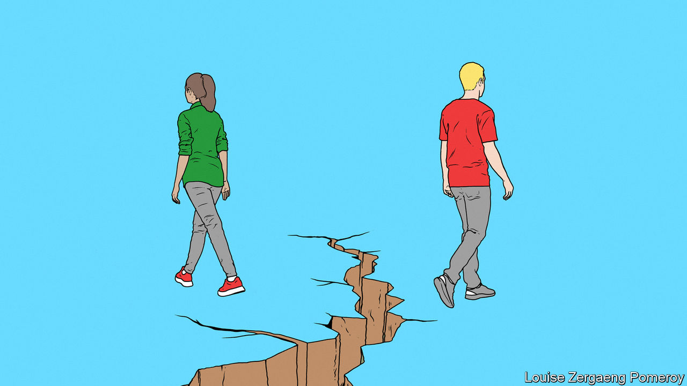

###### Angry young men

# Making sense of the gulf between young men and women 

##### It’s complicated. But better schooling for boys might help 

 

> Mar 14th 2024 

Men and women have different experiences, so you would expect them to have different worldviews. Nonetheless, the growing gulf between young men and women in developed countries is striking. Polling data from 20 such countries shows that, whereas two decades ago there was little difference between the share of men and women aged 18-29 who described themselves as liberal rather than conservative, the gap has grown to 25 percentage points. Young men also seem more anti-feminist than older men, bucking the trend for each generation to be more liberal than its predecessor. Polls from 27 European countries found that men under 30 were more likely than those over 65 to agree that “advancing women’s and girls’ rights has gone too far because it threatens men’s and boys’ opportunities”. Similar results can be found in Britain,  and China. Young women were likely to believe the opposite.

Unpicking what is going on is . A good place to start is to note that young women are soaring ahead of their male peers academically. In the European Union fully 46% of them earn degrees, versus 35% of young men, a gap that has doubled since 2002. One consequence is that young women are more likely than men to spend their early adulthood in a cocoon of campus liberalism. Meanwhile, boys outnumber girls at the bottom end of the scholastic scale. Across rich countries, 28% of them fail to learn to read to a basic level. That is true of only 18% of girls. 

Another big change is that, to varying degrees across the developed world, immense progress has been made in reducing the barriers to women having successful careers. College-educated men are still thriving, too—often as one half of a double-high-income heterosexual couple. Many men welcome these advances and argue for more. However, those among their less-educated brothers who are struggling in the workplace and the dating market are more likely to be resentful, and to blame women for their loss of relative status. And young women, by and large, are glad of past progress but are keenly aware that real threats and unfairness remain, from male violence to the difficulty of juggling careers and children. In short, most young women and worryingly large numbers of young men complain that society is biased against their own sex. 

Young women tend to vote for parties of the liberal left. Angry young men, sometimes dismissed as toxically masculine by those parties, are being shrewdly wooed by . In South Korea their support helped an overtly anti-feminist president win power. In America polls are muddy but some pollsters think young men are souring on the Democrats. In Europe, where many countries offer a kaleidoscope of political choices, young male votes have helped fuel the rise of reactionary outfits such as the AfD in Germany, Confederation in Poland and Chega, which surged at Portugal’s election on March 10th. 

There is no easy solution to any of this. But clearly, more should be done to help boys lagging behind at school to do better. Some policies that might work without harming their female classmates include hiring more male teachers (who are exceptionally scarce at primary schools in rich countries), and allowing boys to start school a year later than girls, to reflect the fact that they mature later. Better vocational training could encourage young men to consider jobs they have traditionally shunned, from nursing to administration. Schooling boys better would not only help boys. Increasing the supply of educated and (one hopes) less angry men would be good for the women who must share the same world. ■

