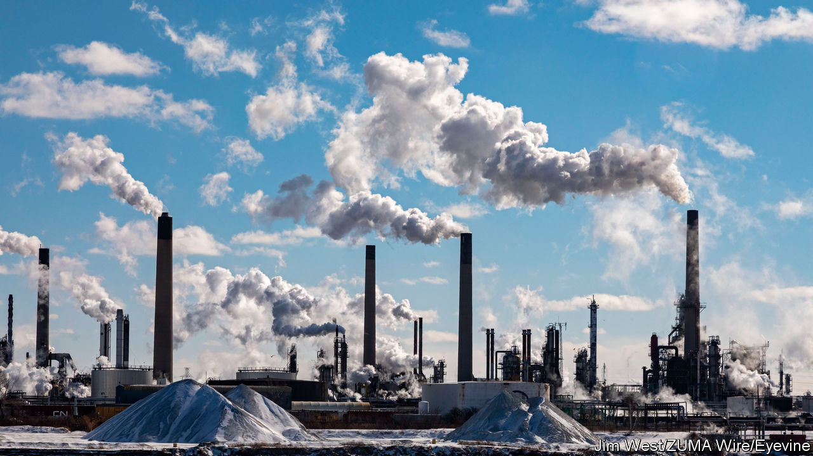

###### Crude awakenings

# Oil’s endgame could be highly disruptive 

##### The oil shocks of the future will be driven by demand, not supply 

 

> Mar 14th 2024 

For decades, the biggest fears about oil centred on its supply. The lesson was first learnt half a century ago, when the Arab members of opec banned exports to America and other supporters of Israel in the Arab-Israeli war. Today you might think that the link between energy and geopolitics has been mercifully severed. Even as war has returned to the Middle East and Russia’s invasion of Ukraine has made it a pariah to the West,  have been largely quiescent. In fact, however, a new phase is beginning—one in which oil demand, not supply, will be the primary influence on energy markets. This shift will bring with it profound geopolitical consequences. 

Governments everywhere are designing policies to reduce the demand for oil and boost alternative sources of energy, as they seek to fight climate change. Technologies such as those behind  are only becoming cheaper and more advanced. As our  argues this week, the coming peak and subsequent decline of global demand for oil will determine prices and production over the decades to come. 

Perversely, this shift will grant some producers more market power. The biggest, least carbon-intensive and cheapest reserves of petroleum by far are found in Saudi Arabia and its immediate OPEC neighbours in the Persian Gulf. As the market for oil shrinks, their share of production will soar. Depending on the pace of the energy transition, this cabal could command a market share of half or even two-thirds of global output by 2050, according to Bp, an oil firm, compared with less than 40% today. Already places such as Kuwait, Saudi Arabia and the United Arab Emirates are home to some of the world’s largest sovereign wealth funds and are busily  in their neighbourhood and beyond. Their piles of capital, and their desire to project their strength abroad, will only intensify. 

Meanwhile, other oil powers will be left behind. Today national oil firms in several dozen countries in Africa, Latin America and Asia are pumping oil that is higher-cost and more carbon-intensive than the oil in the Gulf. By one measure, some $1.2trn of the $1.8trn in investments planned for the next decade by national oil companies could turn out to be unprofitable if countries make good on their official pledges to achieve net-zero emissions by 2050. Nigeria’s Nnpc, Mexico’s Pemex and Indonesia’s Pertamina are among those most at risk of being stuck with stranded assets. Because governments in many producing countries are often unduly reliant on commodity revenues, the failure of some national oil firms could lead to debt crises, bankruptcies and a decade of lost development. This would be a mirror-image of the debt crises that engulfed Latin America in the 1980s, after rising oil prices widened importing countries’ trade deficits and crippled their ability to repay their debts.

How to manage this disruption? Speeding up the energy transition is necessary to tackle climate change, but the faster the transition, the worse the concentration of market power, and the greater the shock to high-cost producers. In the meantime coping mechanisms such as governments’ strategic petroleum reserves could help to reduce volatility for oil consumers. These should be expanded to include the big developing countries in Asia and Africa, which will soon surpass China to become the biggest contributors to oil demand growth. The International Energy Agency, an official body created in the wake of the first oil shock, already co-ordinates strategic stocks kept by advanced economies. Its new negotiations with India should be expanded to include other big emerging economies, too.

Crude awakenings

For the unlucky producers, meanwhile, the priority must be to diversify while oil prices are relatively high and demand still strong. A few, ranging from Colombia’s Ecopetrol to Malaysia’s Petronas, are already spending a hefty share of their capital budgets on low-carbon technologies including renewables, hydrogen and carbon capture that could provide a hedge against an oil collapse. On average, however, national oil firms allocate barely 5% of their capital spending towards diversification; the West’s oil majors, by contrast, spend 15%. Governments, too, must seek to ensure that economies can diversify away from oil, by setting business-friendly rules and spending on things like infrastructure and education, to allow private enterprise to thrive. Even so, some countries may nonetheless eventually require bail-outs, putting multilateral institutions under further strain. The supply-led oil shocks of the past half-century were a frequent source of geopolitical tumult. Unless the coming transition is approached with more foresight, the next-half century will be no less fraught. ■

