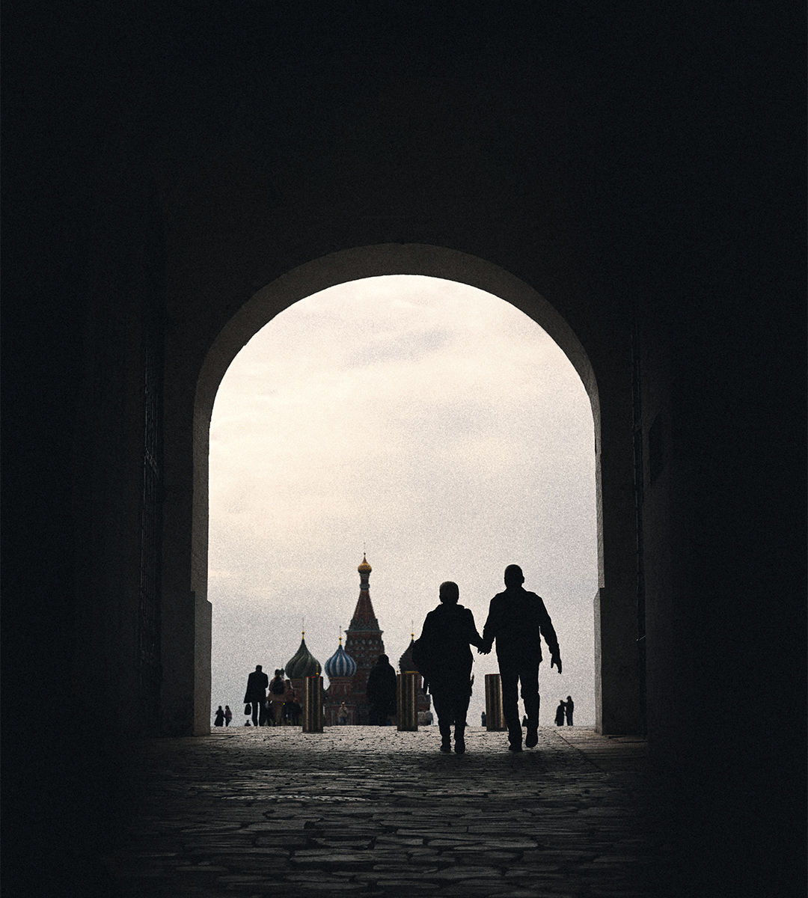

###### Beyond Ukraine

# Rogue Russia threatens the world, not just Ukraine 

##### The West must show its enemy is Vladimir Putin, not 143m ordinary Russians 

 

> Mar 14th 2024 

Like the tsar he models himself on, Vladimir Putin is about to be anointed as Russia’s ruler for another six years. The  will be a sham. But it should nonetheless be a wake-up call for the West. Far from collapsing, Russia’s regime has proved resilient. And Mr Putin’s ambitions pose a long-term threat that goes far beyond Ukraine. He could spread more discord in Africa and the Middle East, cripple the un and put nuclear weapons in space. The West needs a long-term strategy for a rogue Russia that goes much further than helping . Right now it doesn’t have one. It also needs to show that its enemy is Mr Putin, not 143m Russian people. 

Many in the West hoped that Western sanctions and Mr Putin’s blunders in Ukraine, including the senseless sacrifice of legions of young Russians, might doom his regime. Yet it survived. As our study this week of life in  shows, its resilience has several foundations. Russia’s economy has been re-engineered. Oil exports bypass sanctions and are shipped to the global south. Western brands from bmw to h&amp;m have been replaced with Chinese and local substitutes. In textbooks and the media a seductive narrative of nationalism and Russian victimhood is promulgated. Dissent at home has been strangled. Mr Putin’s most charismatic political rival, Alexei Navalny, was murdered in the gulag in February. So far the Kremlin has had no difficulty controlling the brave crowds mourning him. 

Over time the regime will face new vulnerabilities. The cumulative effects of being cut off from Western technologies will be a drag on productivity: think of wear-and-tear on Boeing planes, or having to rely on pirated software. Russia’s increasing dependence on China may become a weakness. The militarisation of the economy will hurt living standards. The population will shrink by a tenth or so in the next two decades. And as the 71-year-old Mr Putin ages, a succession struggle will loom. It is always hard to predict when a tyrant will fall. However, a prudent working assumption is that Mr Putin will be in power for years.

During the cold war, the Soviet Union posed both a military and an ideological threat to the free world. The West successfully contained it and, after it collapsed, welcomed its democratic and market reforms. Mr Putin, who took over in 1999, has rolled back Russian democracy, slowly at first, but more rapidly after young, urban Russians staged mass protests in the 2010s. He blames the West for challenges to his rule, and seeks to safeguard his regime by trying to shut out Western influence and unite the Russian people in a struggle against a caricature of America and NATO. Today, Russia has only a medium-size economy and no coherent ideology to export. Yet it poses a global threat. The immediate danger is a defeat of Ukraine and, after that, attacks on neighbouring countries such as Moldova and those in the Baltics; but that is not where Mr Putin’s ambitions end.

Consider new or unconventional weapons. Russia is reported to be experimenting with putting nuclear warheads into space. Its drones and cyber-warriors allow it to project force beyond its borders. Its misinformation industry spreads lies and confusion. This malign combination has destabilised countries in the Sahel and propped up despots in Syria and central Africa. It could also sway some of the plethora of elections the world will see this year. Many in the global south believe Russia’s false narrative: that Mr Putin is saving Ukraine from Nazis, that NATO is the real aggressor and that the West seeks to foist its decadent social norms on everyone else. Russia’s ability to hobble the global institutions established after 1945, not least the UN Security Council, should not be underestimated. It has morphed into a nihilistic and unpredictable foe of the liberal world order, bent on disruption and sabotage. It is like North Korea or Iran on steroids, armed with thousands of nuclear warheads. 

What should the West do? America and Europe have bet on two strategies: defending Ukraine and sanctions. Arming and financing Ukraine’s defenders remains the most cost-effective way to thwart Russian aggression, yet the West’s resolve to keep doing so is scandalously wavering. 

Sanctions, meanwhile, have been less effective than hoped. They can be counter-productive, and an excuse to avoid hard choices. Over 80% of the world, measured by population, and 40% by gdp, is not enforcing them, letting Russia trade freely and undermining the sanctions’ perceived legitimacy. If the West tried to use secondary sanctions to force the world to comply, it would backfire, leading some countries to abandon the American-led financial system. In the long run the most plausible path is more modest: maintaining targeted sanctions on Kremlin-linked individuals and ensuring that advanced tech, which still tends to be Western, is expensive or impossible for Russia to obtain.

That means an effective Russia strategy needs to put more weight on two other pillars. The first is a military build-up to deter further Russian aggression. In Europe the weakness is glaring. Annual defence spending is less than 2% of gdp, and if Donald Trump wins back the White House, America’s commitment to nato may wither. Europe needs to spend at least 3% of its gdp on defence and prepare for a more isolationist Uncle Sam.

A struggle of ideas

The West also needs to deploy one of its most powerful weapons: universal liberal values. It was these, as well as Star Wars and dollars, that helped bring down the Soviet regime by exposing the inhumanity of its totalitarian system. Western diplomacy must seek to counter Russian disinformation across the global south. It also needs to address Russian citizens rather than treat them as pariahs. That means highlighting human-rights abuses, supporting dissidents and welcoming Russians who want to flee their country. It means backing the forces of modernisation by promoting the flow of real news and information into Russia. And it means ensuring that there are humanitarian exceptions to sanctions, from medical kit to educational materials. In the short term there is little chance that Russia’s elite or its ordinary citizens will boot out Mr Putin’s regime. But in the long run Russia will stop being a rogue nation only if its people want it to. ■


