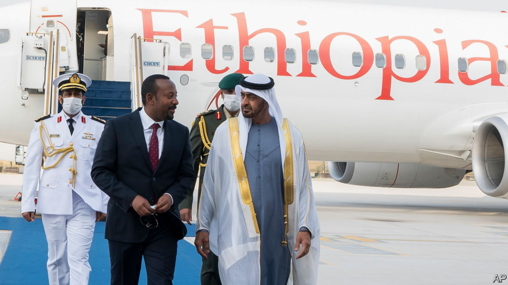

###### Geopolitics

# The Gulf’s scramble for Africa is reshaping the continent 

##### Its increased influence brings economic rewards and political risks 

 

> Mar 14th 2024 

During the cold war African leaders often sided with the West or the Soviet Union, extracting from them aid, arms, investment and other things they desired. After it ended, those wanting to build roads and ports generally did deals with China. Today African politicians are like customers in a geopolitical bazaar as middle powers—including Brazil, India and Turkey—extend their economic and diplomatic reach. Yet it is the rise of the United Arab Emirates (UAE)—and to a lesser extent Saudi Arabia and Qatar—that is the most striking. The Gulf’s  promises great economic benefits, but also threatens to fuel horrific wars.

Gulf influence stems from cash. In November Saudi Arabia held its first Africa summit, at which it announced billions of dollars of investment. Even that is dwarfed by the UAE, which in 2022 made investment pledges in Africa worth seven times those of American firms. In the previous ten years it was the fourth-largest foreign direct investor in Africa, behind China, the EU and America. DP World, a Dubai-based firm, runs ports in nine African countries. Masdar, a renewables firm, says it will splurge $10bn in Africa. In 2020 and 2021 the UAE traded more with sub-Saharan Africa than America did. Dubai, with its secure property rights and light (some would say lax) financial regulation, is home to over 26,000 African businesses. 

Diplomacy comes in concert with the money. The uae and Saudi Arabia were invited to join the brics at the bloc’s summit last year in Johannesburg. Qatar and the UAE increased the number of their embassies in sub-Saharan Africa five-fold and nearly three-fold, respectively, from 2012 to 2022. Saudi Arabia has promised to open a dozen or so more posts. One-third of all new embassies opened globally in 2022 were in the Gulf, driven largely by reciprocal African diplomacy. 

The attention will bring benefits to African states facing a funding squeeze. New Chinese loans granted to Africa slumped by 80% in the four years to 2022 over the preceding four. Africa’s share of Western aid has declined because of the war in Ukraine. Some Western officials hope Gulf countries can fill the gap and help them see off their main geopolitical rival by  that might otherwise end up in Chinese hands. 

Too many warlords

Yet turning Africa into an arena for the ambitions and rivalries of Gulf powers carries huge risks. The Gulf’s dynastic autocracies are neither champions of African democracy nor of human rights. Nor is China, though it at least tends to prize stability and has been a big financial supporter of UN peacekeeping operations. The UAE, by contrast, is a loose cannon that arms warlords, spreads chaos and provides a haven for corrupt elites. 

Exhibit A is Sudan, where the UAE has backed the Rapid Support Forces (RSF), a genocidal militia, which is waging a civil war against the national army. It is the world’s largest humanitarian crisis, with about 25m people in need of aid. The UAE, which denies arming the RSF (the UN deems the allegations “credible”), seems to be courting a network of strongmen—sometimes with arms—as part of a contest for influence in the region between the Gulf states. Among the UAE’s friends are Muhammad (“Hemedti”) Dagalo, the RSF’s leader; Khalifa Haftar, a warlord in Libya; Mahamat Déby, who took power in a coup in Chad; and Abiy Ahmed, who has led Ethiopia into a bloody civil war in Tigray. 

Oil and natural-gas wealth mean that the UAE, Saudi Arabia and Qatar will be . But the ripples of mayhem spreading from Sudan and Libya offer a warning: the West must see the danger of outsourcing its Africa policies to countries that do not share its values; and African countries should know the risks of letting themselves be used as pawns in someone else’s geopolitical games.■

