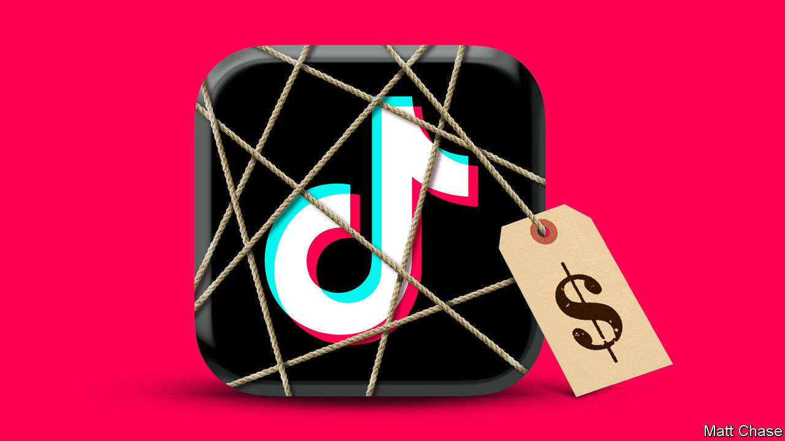

###### Time’s up

# Time for TikTok to cut its ties to China 

##### To stay on Western screens, the video app needs new owners 

 

> Mar 12th 2024 


TikTok’s videos keep its users up late into the evening. Now the app’s links to China are causing politicians to lose sleep, too. On March 13th America’s House of Representatives  that would force TikTok’s Chinese owner, ByteDance, to sell the app to an owner of another nationality, or else face a ban in America. If the Senate follows suit, the world’s most downloaded app, by one measure, may start disappearing from screens.

Some  are overblown. True, it hoovers up users’ data. But there is no evidence that it takes more than it claims (or indeed more than rivals such as Facebook). If Chinese spies want to find out about Americans, the country’s lax data-protection laws allow them to buy such information from third parties. Banning Chinese apps that gather personal data would mean outlawing many more, cutting off Western consumers from some of the world’s most dynamic digital services.

TikTok has also injected welcome competition into the social-media market. Six of last year’s ten most-downloaded apps came from Meta, Facebook’s owner. TikTok, which beat them to the top spot, has brought in a wave of innovation. Consumers everywhere are the winners.

Yet there is one reason why America’s crackdown is justified. TikTok has evolved into a broad media platform with 170m users in America alone. A third of American adults under 30 consider TikTok a source not just of entertainment but of news. It is therefore a real concern that it has links to China, whose government is in deep ideological conflict with the West and sees the media as a tool of propaganda.

Most countries place some restrictions on foreign ownership of old media (ask Rupert Murdoch, who became an American citizen before taking over Fox). A bid by Abu Dhabi’s ruling family for the newspaper prompted Britain to announce this week that it will ban foreign governments from owning British publications. Yet TikTok is fast becoming more influential.

It is time for governments to apply the same logic to new media as they do to old. If anything, the new platforms require greater vigilance. A newspaper’s editorial line can be seen in black and white; by contrast, every TikTok user gets a different feed, and the company does not provide adequate tools to examine its output in aggregate. Even if studies suggest bias—some allege a skew in TikTok’s Gaza coverage, for instance—it is impossible to know whether TikTok’s algorithm is responding to users’ preferences, or to manipulation from Beijing.

TikTok admits it once blocked videos on subjects like Tiananmen Square, but insists it has changed. It has made expensive efforts to separate American users’ data from others’ and opened its code for inspection. But it has undermined itself, too. It argues that selling its American operations would be impractical, since they are so closely linked to the rest of the business—thus casting doubt on its claims of strict separation from Beijing. It has rallied users to its cause, pinging some last week to contact Congress. That only emphasised its potential political clout; some wavering representatives reportedly flipped against TikTok after their switchboards blew up.

The best outcome is one in which TikTok survives. It provides competition and innovation, as well as . The bill before Congress allows ByteDance to sell up, rather than simply shut down. If it is unwilling to do so—or if China does not let it—ByteDance could float TikTok as a public company. Americans and others benefit from freedom of choice. But it is time the same standards were applied to new media as old. That requires separating a platform as large and influential as TikTok from the sway of a country as manipulative and ideological as China. ■

