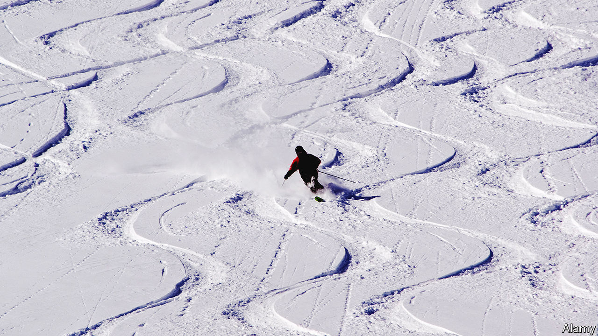
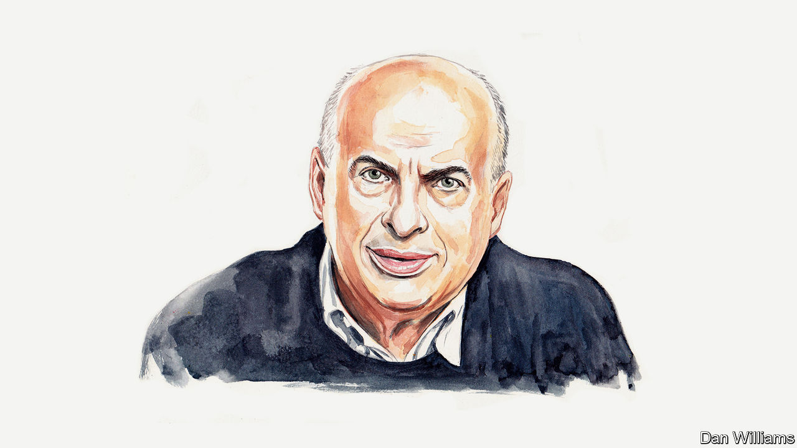
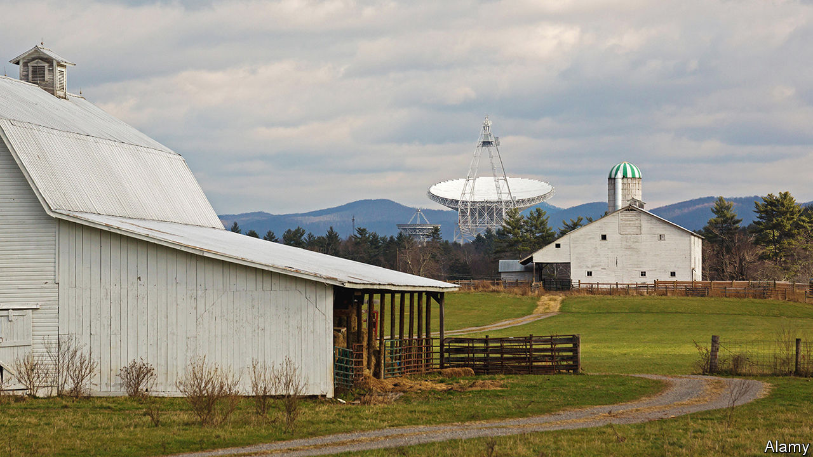

###### On skiing, defence, Russian refugees, mining, Blackpool, the Moon, office meetings, Twitter

# Letters to the editor 

##### A selection of correspondence 

 

> Mar 14th 2024 


Ski someday

Climate change is a business risk for the ski industry that is not mentioned in your article (“”, March 2nd). By selling season passes before the first snow, crafty corporate moguls have moved most of the financial risk of a bad winter onto individual skiers. If climate change shortens future ski seasons, this pricey pastime will become more elitist as skiers crowd mountains across fewer potential powder days. There’s still time for the American ski industry to learn from Europe about how to move more skiers sustainably to the slopes, protecting winter sports for all.

Kristofer Peterson


Skiing recently in Breckenridge, Colorado, I enjoyed your reflections on the dynamics of the ski-resort business. Unlike your correspondent I was lucky to have bought my “Epic Pass”, offering unlimited skiing, well in advance. This made the experience a bit less expensive, but it required a leap of faith about weather and snowpack several months in advance. The price increases have not dented demand. The slopes seemed busier compared with my first trip there in the 1990s. It will be interesting to see how the Epic concept will play out in Europe, where there has been much less consolidation among resorts. 

Skiing has become more expensive, straining family budgets, especially since larger resorts have switched to “dynamic pricing”. But the lifts in Breckenridge haven’t been upgraded much, no seat warming or protective bubbles on chairlifts that we have come to appreciate in Europe. 

Thomas Meyer


 


Artillery rounds

America’s defence establishment continues to focus on capabilities and not on the specific context of a potential war (“”, February 24th). When it comes to the Pacific, the army’s new doctrine envisions vague campaigns of island-hopping rather than deterring the actual limited objective of China, which is to seize Taiwan. You quoted a Pentagon official who wasn’t sure where else to fire a 155mm round in the Pacific “other than the water”. The Chinese infantry who land on the limited suitable beaches of Taiwan, unable to dig into flooded rice paddies as they try to assemble forces to seize Taipei, would fear massed artillery barrages far more than costly hyper-sonic missiles or cyber-attacks. 

Robert Rose


 


Russia’s new exiles

Natan Sharansky’s moving tribute to Alexei Navalny brings out the harrowing continuity between the Soviet gulag and contemporary Russia’s system of oppression (, February 29th). Mr Sharansky is right to note the contrast between the cultivation of dissident and exile culture during the cold war and in the present conflict. Nearly a million Russians have left the country since the beginning of the war in Ukraine. Although most of those are not dissidents, they are overwhelmingly against the war and against this present reign of terror. Yet draconian migration policies, migrant fatigue, the taint of Vladimir Putin’s regime and general mistrust have kept most exiles from finding even long-term residency, much less integration, in their host countries. 

These are some of the brightest lights in Russian society, young and gifted biologists, physicians, computer scientists, entrepreneurs and social workers. America was willing to accept German engineers and Soviet physicists, so there is no reason why this new wave of immigrants could not help fill current needs for highly educated talent in IT and the green revolution. Apart from Germany, the EU and America are woefully lagging behind giving these people jobs. 

Most do not want to return to Russia, and can only hold out for so long before they have to choose between deeper desperation and returning home. As one 22 year-old sleeping rough in Georgia told me: “I will not kill and I do not want to die.” In its own interest and in the interests of a future Russia, the West needs to do more to make these choices less existential.

Walker Trimble


 


What exactly are you digging?

Let’s not forget that large mining operations are financial speculations focused on mineral assets rather than mineral production (“”, February 24th). Big mining companies remain fixed on accessing sizeable deposits, even when the grades of the deposits are notably low. Such large, low-grade deposits necessitate substantial investments in infrastructure and capital, generating significant waste in the form of large storage facilities for tailings (the by-products of a mine). Consequently, these projects become mired in intricate permitting processes. 

We need a paradigm shift to embrace the concept that responsible mining extends beyond environmental and social considerations. This means adopting a new corporate vision prioritising production over asset speculation. What if the future of mining pivoted towards smaller, more manageable deposits, rather than a handful of massive ones?

Dr Davide Elmo

Professor of rock engineering

University of British Columbia


You bemoan the fact that mining companies are investing insufficiently in new capacity, putting the energy transition at risk. Yet for decades the industry has over invested, resulting in falling real mineral prices and the industry barely meeting its cost of capital. 

Mineral markets are remarkably self-correcting. Although higher prices will be a consequence of mining companies reinvesting a smaller proportion of their free cashflows, new supply will eventually be incentivised. The mining industry will then be able to generate higher returns for shareholders and make larger tax and other payments to host regions and countries. With the right governance, this should go some way to help the industry tackle the many real ESG (environmental, social, governance) pressures it faces.

Neal Brewster

Mining consultant


 


Real levelling up

It is worth mentioning that the single biggest boost to Blackpool could come from the jobs and tax revenues that flow from fracking for gas in the area (”, February 24th). Unfortunately the middle-class eco-warriors who campaign against fracking have little concern for these things. With a serious fracking industry higher gas prices after the Ukraine invasion would have bankrolled the Treasury. As for emissions, more gas typically results in less coal consumption. And had Britain not been forced to get into so much debt to buy fracked gas from America then Labour might have been able to keep its £28bn ($36bn) a year green-energy plan. For many towns across the north of England this opportunity remains ripe for exploitation.

Matthew Leese


 


Moon shadows

Bouncing radar off the Moon may be an incredible achievement (“”, February 24th), but it almost caused a third world war. The Union of Concerned Scientists reported in 2015 that on October 5th 1960, America’s nuclear command centre received signals from its early warning radar indicating that a massive Soviet nuclear attack was under way with a certainty of 99.9%. The warning was found to be a false alarm minutes before the president would have been required to issue counter-attack orders. The culprit was a rising Moon, which reflected radar waves back to the early-warning stations in Greenland. 

The radar system was correct in concluding that it was seeing something big coming from the precise direction that a Soviet attack would have been launched, but it was not detecting missiles, only moonbeams.

Robert Checchio


 


Dogmatix speakers

’s ode to listening (February 17th) struck a chord, but in reality nobody in the office meeting wants to be the one who didn’t contribute, so silence is rare. Juniors feel they must speak, to come across as intelligent. Seniors try to sound casual as they drone on. Those in the middle, the doers, perform a delicate verbal ballet, insightful yet careful not to outshine the seniors. As Laurensolivius said to Obelix when he suffered from stage fright in “Asterix and the Cauldron”: “Say something! Come on, anything! Whatever comes into your head!” And so we do.

Zubin Aibara


The X factor

Please stop, immediately, using the phrase “formerly known as Twitter” (“”, February 17th).

Bob Hustead


