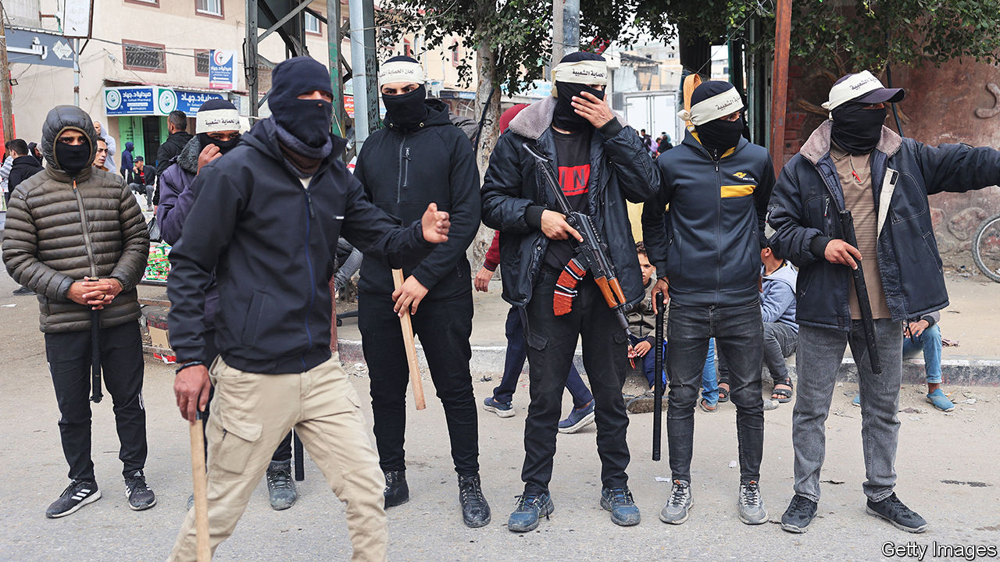
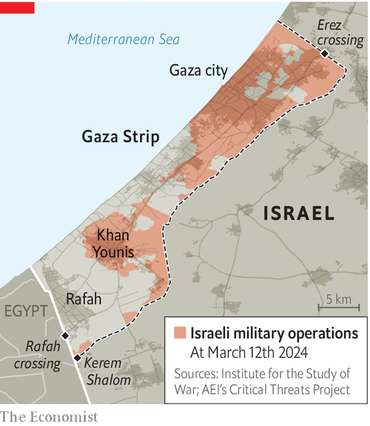

###### Gaza’s shadow economy

# A shadowy wartime economy has emerged in Gaza 

##### Clans, gangs and dodgy businessmen prosper while Israel clobbers Gaza 

 

> Mar 14th 2024 

After the trauma of repeated displacement from her home in Gaza city, Suha Alam felt there was little left to lose. Having fled to Gaza’s southernmost city of Rafah, she messaged a friend still in the north to check on the family home, only to be told that looters had got through a hole in a broken wall and stolen everything.

Numerous displaced Palestinians say their homes in the north have been ransacked while they sought shelter in Gaza’s south. Everything from televisions and kitchen appliances to furniture has been taken by Palestinian gangs, which aid workers say have been increasingly well organised in the north, even as Israel’s army claims to be in full control of the area.


Much of the loot is then offered for sale in makeshift markets, where the victims of robbery have sometimes been able to buy back their own stolen goods, including furniture. These flea markets are part of an emerging patchwork economy where clans, local mafias and established businessmen can use their know-how and muscle, in some cases abetted by links to Israel and Egypt, to fill a vacuum.

Gaza’s clans have long been power-brokers. They never went away under Hamas, whose cannier leaders learned not to pick quarrels with the larger families, preferring to operate in tandem or alongside them rather than in opposition. Aid officials and observers say the clans are involved in both types of crookery: in some cases they offer NGOs safe warehouses and merchants protection for their goods—for a fee; in others they arrange the theft of aid, which they later sell at extortionate prices.

In January reports that Israel’s security chiefs favoured the idea of using Gaza’s clans to help temporarily administer the strip drew widespread international criticism. Yet it is already beginning to happen. NGOs are indirectly employing the services of southern Gaza’s biggest families to protect and help distribute aid to the lawless territory’s desperate people. Videos circulating on social media depict men armed with sticks, sometimes with guns, riding on top of humanitarian convoys. Israel has cited this as evidence of Hamas stealing aid. But aid workers say in many cases members of powerful families have been hired to protect goods from desperate crowds that might ransack the lorries.

 


The rise of these families is “a recipe for internal strife”, says Mkhaimar Abusada, a professor of politics at Gaza’s al-Azhar University (now destroyed) who has fled to Cairo. “These big clans will try to monopolise and dictate the lives of other Palestinian families,” he warns, noting that some more established families were involved in extrajudicial killings during past periods of turmoil. One of them, the Dughmush, was involved in the kidnapping of a BBC journalist, Alan Johnston, in 2007. UN officials say that lorries trying to reach central Gaza have been stopped at makeshift roadblocks and ransacked by organised groups.

One aid worker said that, if the flow of food and medicine remains clogged, thus pushing up prices, “you are going to encourage these gangs and families to consolidate and then they simply become part of the landscape.”

A Western diplomat involved in trying to arrange emergency supplies says he is exasperated. In December, he says, lorries owned by Palestinian businessmen with links to Israel carrying commercial goods were allowed through a crossing from Israel at Kerem Shalom, days before any humanitarian aid was let in. “The Israelis have a big hand in making the selections and creating these crazy prices,” he adds.

As prices soar and so much aid is stolen and sold on, access to cash has become vital. The Palestinian Monetary Authority, based in Ramallah in the West Bank, is the closest thing the Palestinians have to a central bank. It has scrambled to put cash into the strip’s few ATMs. Just six of Gaza’s 91 are working. Pleas to get permission from Israel for engineers to fix the broken machines have fallen on deaf ears.

Jamie McGoldrick, the un’s humanitarian co-ordinator in Gaza, has said that one way to combat the growing anarchy, especially in the north, is to “flood” Gaza with aid so that it is not used for extortion or sold on the black market. 

America’s plans for a floating pier off Gaza’s coast may well allow more supplies into the strip, but NGOs and the UN repeatedly say that aid alone cannot stave off a famine. To tackle the crisis, private Gazan businesspeople must be given their head. Yet commercial imports remain minuscule. Private business in Gaza has virtually collapsed since October 7th. But an aid official remarks: “With supplies so short, there is plenty of money to be made.” 

A handful of Israeli-vetted Palestinian businessmen with old ties to Israel have been able to bring goods into Gaza privately. But this can have disastrous consequences, as in February when 112 people were killed trying to get to aid in lorries brought in by Palestinian merchants. And traders uncertified by the Israelis have to co-operate with the clans or families to do the same. Corruption is inevitably rife. “You are allowing these six or seven individuals to control the economy,” says a former official of the Palestinian Authority. “What is developing is warlordism—and it’s Israel who decides.” ■

