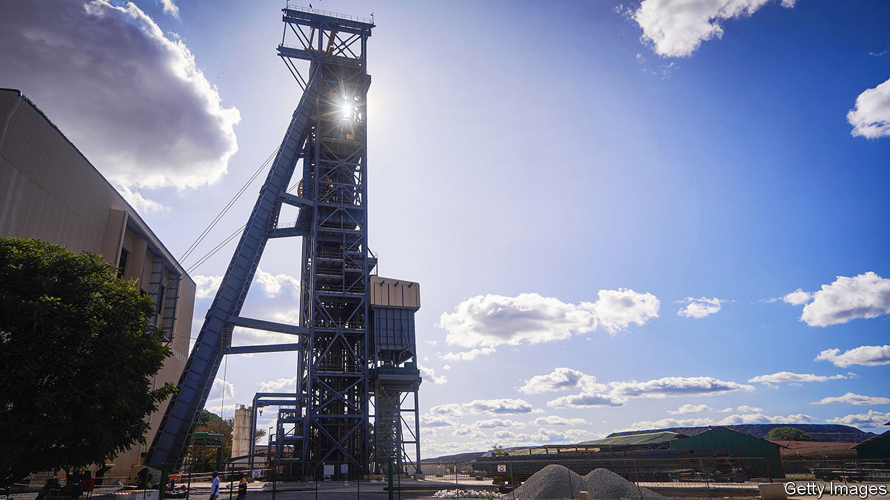
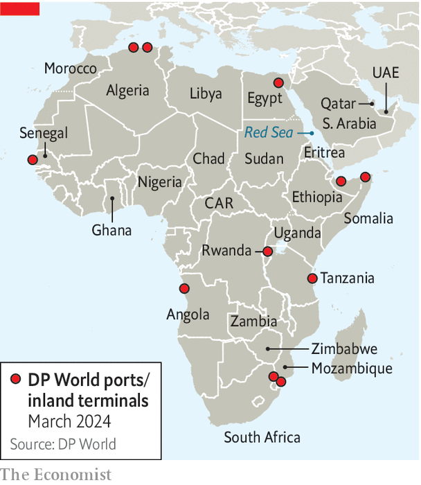

###### Don’t call it a scramble

# Gulf countries are becoming major players in Africa 

##### African leaders hope the Gulf is the “new China”. Not quite 

 

> Mar 13th 2024 

Mining Indaba, Africa’s biggest mining conference, is a geological jamboree. But the latest bash, held in Cape Town in February, was also a geopolitical spectacle. For as well as the usual Chinese and Western firms there were arrivistes from the Gulf. Manara Minerals, a state-backed Saudi Arabian fund, has up to $15bn to spend on foreign mines. Also browsing is the International Holding Company, an Emirati conglomerate with a market capitalisation of $240bn, around that of Blackrock and BP combined; in November its minerals arm bought a 51% stake in a Zambian copper mine. 

Gulf interest in African mining is part of a broader trend. The United Arab Emirates (UAE), Saudi Arabia and Qatar are increasingly influential in Africa. The continent is a destination for their capital, an arena for their rivalries and a test of their global ambitions. Dubai has become the crucial financial hub for African elites. As African leaders seek alternatives to dwindling Chinese loans and Western aid, the Gulf’s rise is reshaping geopolitics on the continent, with effects good and bad. 

Gulf-Africa relations go back centuries; archaeologists have found Arab coins at Great Zimbabwe, a medieval city-state. The Horn of Africa, separated from the Arabian peninsula by the Gulf of Aden and the Red Sea, has long been seen by Arabs as in their neighbourhood. Interest in the rest of Africa has focused on supporting Muslim charities and buying agricultural land, yet waxed and waned with the oil price. 

 


That on-off relationship has become more consistent as Gulf countries assert themselves as middle powers in a multipolar world. Though their approaches differ, they share a belief that African countries are neglected by other states—and that because they are poor, influence is cheap. Sub-Saharan Africa has more than 20 times the population of the Gulf Co-operation Council countries (Saudi Arabia, UAE, Qatar, Oman, Kuwait and Bahrain), but a smaller GDP. 

Economic ties are the clearest evidence of closer Gulf-Africa relations. In the 2010s annual average trade between sub-Saharan Africa and the UAE was less than half of that between the region and America. But since 2020 the sum of imports and exports between the UAE and sub-Saharan Africa has been larger. Over the past decade the UAE has been the fourth-largest foreign direct investor in Africa, behind China, the EU and America. It has come to the rescue of African states running short of hard currency, for instance bailing out Sudan in 2019 and Ethiopia in 2018. Recently it pledged to invest $35bn in Egypt. The millions of Africans in Gulf countries are a vital source of remittances back home. 

The UAE has been particularly active in logistics and energy. It is China’s main rival for African ports. DP World, a Dubai-based firm, runs ports in nine African countries and in October won a new concession in Tanzania. The Abu Dhabi Ports Group runs several more. These bolster the UAE’s position as the hub between Africa and Asia, a role boosted by the Emirates airline. 

The UAE is also helping Africa develop oil and gas projects at a time when some in the West are wary of falling foul of climate agreements. In December Morocco and the UAE agreed to build a pipeline that could take gas from Nigeria to the Mediterranean. At the same time, Emirati investors are among the biggest spenders on renewables projects in Africa. Masdar, a state-owned firm, says it will invest $10bn to increase sub-Saharan Africa’s electricity-generation capacity by 10GW—a big boost given that, excluding South Africa, the region’s installed capacity is 89GW, roughly the same as Mexico’s. “They want to show that they can do these projects better than the West, and they want Africans to love them,” says an adviser to Abu Dhabi. 

November saw the first Saudi-African summit, the latest “Africa+1” event inspired by China’s triennial gatherings. Saudi Arabia announced it would invest more than $25bn in Africa by 2030, and give a further $5bn in aid. Having helped bail out Sudan and, reportedly, the Central African Republic (CAR) in recent years, Saudi Arabia has since pledged help to Ghana and other countries with debt crises. 

Qatar’s role in Rwanda shows how small investments (by Gulf standards) go a long way in Africa. The Qatar Investment Authority (QIA), a $500bn sovereign-wealth fund, has been a co-investor in a pan-African fund with the Rwandan Social Security Board, a domestic fund. QIA also has a 60% share in a project to build a new airport to the south of Kigali, the capital. 

The Gulf states’ appeal to Africa is three-fold. First, they have money to spend when others are pulling back. In the 2020s annual new Chinese lending to Africa is on average 10% of what it was during the 2010s ($1.4bn per year versus $14bn). In 2022 the share of Western aid to Africa was at its lowest since at least 2000. Second is speed: Gulf autocracies are seen as much faster than the West or the World Bank. In January Uganda picked an Emirati firm to build a $4bn refinery having ended a deal with an American group it said was taking too long. Third, the Gulf is seen as something of a model for African countries seeking to diversify away from natural resources. And “like the Chinese it does not hurt that they are courteous and roll out the red carpet, even for leaders of small countries,” adds an adviser to an African president. 

The Gulf’s economic push is coupled with a diplomatic one. From 2012 to 2022 Qatar and the UAE more than doubled the number of embassies they have in Africa. Saudi Arabia plans to increase its diplomatic posts to 40 (from 28). African leaders have joined it in condemning Israel’s invasion of Gaza. It is hard to imagine South Africa bringing its case at the International Court of Justice alleging genocide by Israel in Gaza without the support of Gulf countries including Qatar, which Cyril Ramaphosa, South Africa’s president, visited in November, about six weeks before he launched the application.

Gulf attention to African problems has, at times, been effective. Qatar mediated between America and Rwanda over the release from prison last year of Paul Rusesabagina, the hero of the film “Hotel Rwanda”. And in 2018 Saudi Arabia and the UAE helped broker a rapprochement between Ethiopia and Eritrea. Both Gulf states have contributed money to the fight against jihadists in the Sahel.

Yet Gulf states can also destabilise Africa, undermining Western aims in the process. That is especially true of the UAE, which is the most risk-taking in pursuing its geostrategic interests on the continent. So much so that for all Africans’ talk about the UAE becoming the “new China” in terms of investment, the way it stealthily builds a network of strongmen is equally suggestive of Russia’s Africa strategy. 

The UAE has used economic might and supplies of weaponry to stitch together a web of clients in north-east Africa. These include Khalifa Haftar, a Libyan strongman; Muhammad Hamdan Dagalo, a Sudanese warlord better known as Hemedti; and Chad’s president, Mahamat Déby. The UAE’s support for Hemedti’s Rapid Support Forces in Sudan’s year-long civil war—during which his paramilitary force has been accused of genocide—has complicated Saudi- and American-led peace talks and is encouraging his opponent, the Sudanese Armed Forces, to seek weaponry from Iran. (The UAE denies arming the force.)

In addition, the UAE has forged a close relationship with Abiy Ahmed, Ethiopia’s prime minister, funding infrastructure projects and supplying drones used in the civil war in Tigray. Eritrea and Somalia have sought Saudi Arabian support in opposing what they see as a uae-backed plan by landlocked Ethiopia to recognise Somaliland, a breakaway part of Somalia, in exchange for a lease of land on the coast. “We’re aware we don’t have enough of an understanding of the uae dynamics,” says a Western diplomat in Ethiopia.

With friends like these

The effects of Emirati adventurism are a reminder that the Gulf is hardly going to champion African democracy. The Saudis have welcomed juntas that took power via coups. In Somalia, Qatar and the UAE have accused each other of bribing rival politicians. America has imposed sanctions on firms based in the UAE for their alleged connections to al-Shabab, the Somali jihadist group, and to Wagner, the Russian mercenary force that had close links to Hemedti and other strongmen. 

Then there is the role that Dubai, in particular, may play in enabling African corruption. Over the past decade, as European countries have at least pledged to tighten financial regulation, African business and political elites—often the same thing—have turned to Dubai. In 2021 there were more than 26,000 African companies in Dubai, an increase of around a third from four years earlier, according to the Dubai Chamber of Commerce.

Most capital flows from Africa into Dubai are perfectly legal—and rational, for elites keen to keep their cash. “Many Africans don’t trust their own economies,” argues Ricardo Soares de Oliveira of Oxford University. And in contrast to Chinese or Indians using Caribbean tax havens or Mauritius before bringing the money back home, “Africans don’t do much round-tripping: it’s mostly one-way.”

Yet various reports suggest a more worrying side to Dubai. In 2020 a report by the Carnegie Endowment for International Peace, a think-tank, argued that “Dubai’s property market is a magnet for tainted money.” It identified 34 Nigerian governors, seven senators and 13 ministers with Dubai properties, the cost of which it says would seem to “exceed what their official salaries should permit”. Also in 2020 the Sentry, a watchdog, claimed that Dubai imports around 95% of the gold coming from conflict hotspots such as Sudan, South Sudan, Congo and the CAR. Last year a report by Al-Jazeera, a Qatari news outlet, alleged that Zimbabwean elites have smuggled billions of dollars in cash and gold to Dubai. Hemedti has become rich, in part, by selling Sudanese gold via Dubai, says the UN. 

Last month the UAE celebrated its removal from an official money-laundering “grey list”. Yet Dubai remains home to many people accused by African and other states of graft, such as Isabel dos Santos, the daughter of Angola’s ex-president. South Africa has for several years struggled to extradite from the UAE two of the Gupta brothers who allegedly orchestrated “state capture” under Mr Ramaphosa’s predecessor. They all deny wrongdoing.

Dubai’s openness—in ways good and bad—is not designed with Africa in mind. But its role as a one-way ticket for rich Africans and their money has a disproportionate impact back on the continent. “Africa may be small fry for Dubai but Dubai is huge for Africa,” says Mr Soares de Oliveira. 

The rise of the Gulf presents African leaders with a familiar choice. Do they use partnerships with outside powers for their self-interest or to benefit their citizens? For the West there is another challenge. America and European powers want to secure more African minerals, reduce the influence of Russia and China, and promote good governance. The Gulf countries may help with some of these goals some of the time, but are not reliable means to Western ends. As in other parts of the world, the ascendant petrostates have their own ambitions—and will pursue them ruthlessly. ■

