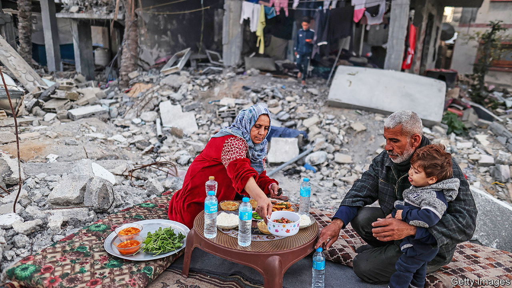
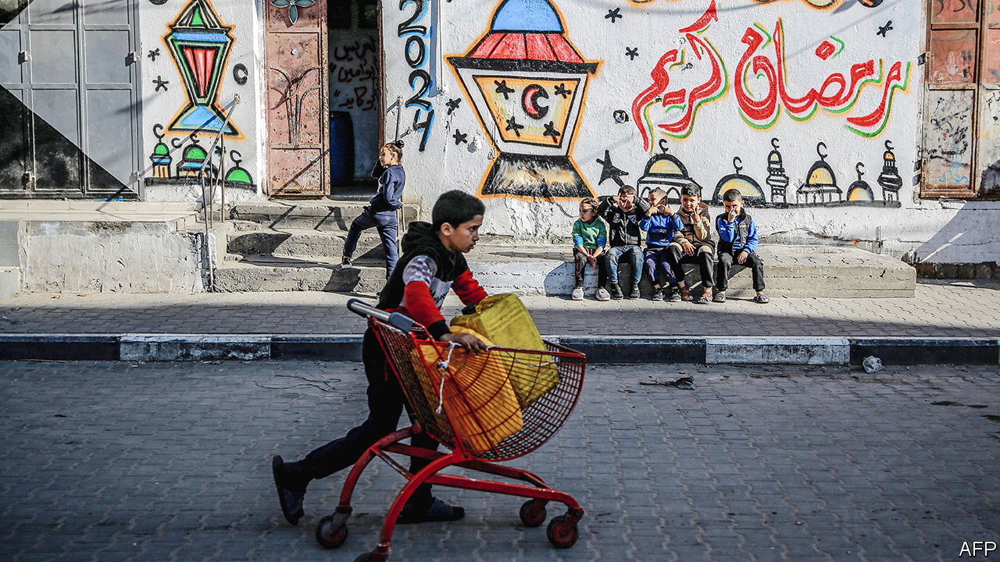

###### The Israel-Hamas conflict

# Hopes for a truce in Gaza give way to fears of a long stalemate 

##### The fighting has continued into Ramadan, but neither Israel nor Hamas can achieve much 

 

> Mar 14th 2024 

RAMADAN, the Muslim month of fasting, was never going to be a joyful time in Gaza this year, but it was at least meant to be a hopeful one. For weeks Western and Arab officials laboured to strike a truce between Israel and Hamas before it began on March 10th. Palestinians in Gaza would have had a respite from five months of near-constant war. Dozens of Israeli hostages would have returned home. Diplomats hoped they could then turn the temporary ceasefire into a permanent one.

It was not to be. The talks failed, and the war continues. The death toll in Gaza has passed 31,000, a majority of them civilians, including 67 people who were found dead on the first day of Ramadan. Families are struggling to find food for , the nightly fast-breaking meal. The more than 130 remaining hostages have now entered their sixth month of captivity, and dozens of them are thought to be dead already.


Negotiators are still talking. Ramadan was a symbolic deadline, not a final one. But their failure to meet it raises questions no one had wanted to answer. First is whether Israel will go ahead with a long-threatened offensive in the southern city of Rafah, where much of Gaza’s population is now sheltering. Next, amid repeated warnings of looming famine, is how to increase the flow of humanitarian aid without a truce. Last is whether the war will now drag on for further months, with neither side able to declare victory nor willing to cut their losses.

In the run-up to the holiday, negotiators shuttled between Cairo, Doha and Paris for talks. They hoped to secure a six-week pause in the fighting. Hamas would have released roughly 40 Israeli hostages during that time, in exchange for hundreds of Palestinian prisoners. Israel was adamant that it would resume fighting once the deal expired. Still, it agreed in principle to a pause (a final deal would have required cabinet approval).

Yahya Sinwar, the leader of Hamas in Gaza, did not agree. His emissaries struggled to reach him during the talks (he is thought to be hiding underground somewhere in southern Gaza). When they did, just days before Ramadan, he insisted on a permanent ceasefire, a demand he knew that Israel would reject. Negotiators from Hamas grew obstinate. Asked to provide Israel with the names of surviving hostages, they refused.

No one can say exactly what Mr Sinwar is thinking. Diplomats in the region, however, believe he is gambling on two things: that continued scenes of death and deprivation in Gaza will increase international pressure on Israel, and that Ramadan will be a trigger for violence in Jerusalem and the Israeli-occupied West Bank. Both would push Israel to end its war for good, sparing Hamas the need to make concessions for another temporary lull.

The prospective offensive in Rafah has unnerved even Israel’s closest allies. Joe Biden, the American president, has warned Israel not to proceed without a plan for protecting the 1.4m civilians displaced to the city. “[We] cannot have 30,000 more Palestinians dead,” he told MSNBC, a cable-television channel, on March 10th. His phrasing was somewhat garbled, but he called an invasion of Rafah a “red line” and seemed to imply that he might withhold shipments of offensive weapons if Israel crossed it (though Jake Sullivan, his national security adviser, was later careful to play down the idea).

As he has for weeks, Binyamin Netanyahu insists Israel will press forward. Rafah is Hamas’s last redoubt, he argues, and Israel must attack its remaining battalions. “We’ll go there. We’re not going to leave them,” the Israeli prime minister said in an interview with Axel Springer, a German media conglomerate. On the ground, however, there are still no signs of an imminent offensive. Israel has withdrawn many of its troops to Gaza’s periphery, and to a corridor that bisects the enclave. Unless it remobilises some of the reservists it has sent home over the past two months, it lacks the manpower for a major offensive in a densely populated city. 

Watching and waiting

Hamas has kept up a drizzle of rocket fire on southern Israel, to demonstrate that it is not vanquished, but it is too battered to pose a serious threat. Israel’s generals are thus in no rush to enter Rafah: they want time to allow their troops to rest and regroup, and may also want to avoid an offensive during Ramadan, which has been a catalyst for violence in the past. Clashes between Israeli police and Palestinian worshippers at Jerusalem’s al-Aqsa mosque during the holiday in 2021 helped fuel a round of bloodletting across Israel and the occupied territories.

On March 12th a tugboat hauling 180 tonnes of food left the Cypriot port of Larnaca for Gaza. Organised by José Andrés, a Spanish-American chef and philanthropist, it is the first ship authorised to deliver aid to Gaza since Hamas seized the enclave in 2007. It was due to arrive as  went to press. Smaller boats will probably ferry its cargo to shore, since it has nowhere to dock (the fishing port in Gaza city was bombed early in the war).

It is a trial run of sorts for a more ambitious plan to deliver aid. In his state-of-the-union address on March 7th, Mr Biden announced that America would construct a temporary pier on Gaza’s coast to receive larger vessels. A warship left Virginia two days later carrying equipment; at least three others have embarked as well. It will take several weeks for them to reach the eastern Mediterranean, and several more to build the dock. The pier is unlikely to be operational until May.

Building it will be the easy part, though. The maritime route could bring thousands of tonnes of aid to Gaza each day, the equivalent of around 200 lorries. It will probably arrive in the northern half of the enclave, which is largely in ruins and slipping into anarchy. The 300,000 Palestinians who remain there have been worst affected by the lack of food. Once on land, supplies will have to be stored and distributed around Gaza. Aid workers are vague when it comes to the details of how all this will work—it is not yet clear where they will find the necessary warehouses and trucks, or how they will secure them.

 


Still, if Israel does delay its Rafah operation, and if some combination of air-drops, ships and lorries ease the worsening hunger in Gaza, the international pressure Hamas is hoping for may not materialise. Violence may not, either: tensions are high, but Jerusalem and the West Bank have been unexpectedly calm since October. It would not be the first time Mr Sinwar miscalculated. He believed that Iran and its proxies in the “axis of resistance” would join the fray after Hamas assaulted Israel on October 7th and was disappointed by the tepid response from his allies.

With no truce and no climactic battle, the alternative is stalemate. Israel will not be able to defeat Hamas absolutely or free all of the hostages, its stated goals for the war. It cannot even find Mr Sinwar, despite a months-long manhunt. What remains of Hamas, for its part, can hope for nothing more than to endure, at horrific cost to its own people. Ambitious plans for a new government in Gaza and post-war diplomacy will gather dust. That may suit Mr Sinwar, who sees mere survival as victory. It may also work for Mr Netanyahu, who fears that ending the war will also end his time as prime minister. But it is a bleak scenario for everyone else. ■

