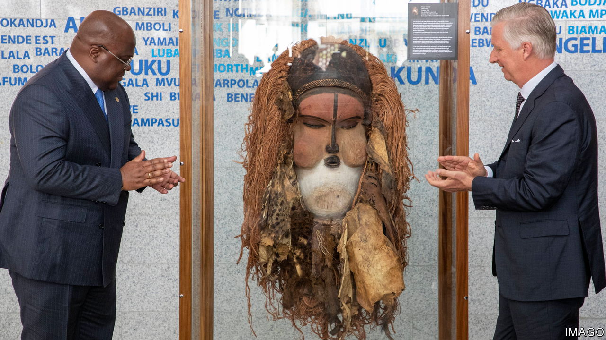

###### Restitution gone wrong

# The return of a mask stolen by Belgium is stoking violence in Congo 

##### Some believe the mask gives fighters magical powers 

 

> Mar 14th 2024 

Whenever a Belgian king takes an interest in the Congo, history looms large. In the late 19th century King Leopold II turned the territory into a giant slave plantation, murdering, raping and slicing off limbs in a ruthless bid to profit from its resources. So when Philippe, Belgium’s current king, visited the Democratic Republic of Congo in June 2022, he did so in the spirit of atonement. He wanted to open a “new chapter” in the two countries’ relations, he said, and handed over a precious wooden carving known as the Kakungu mask, one of thousands of cultural artefacts looted from Congo that Belgium has promised to give back.

Alas, violence seems to have followed Philippe into the Congo like Leopold’s ghost. In the same month that he visited, ethnic conflict broke out in Kwamouth, a district just north of Kinshasa, the capital. It pitted the local Teke people against their neighbours, the Yaka and the Suku. The Kakungu mask is venerated by both the Suku and Yaka as an ancestral symbol of war. They believe it confers magical powers on their fighters, making them invulnerable to bullets and giving them the ability to disappear. These attributes had helped their ancestors resist colonisation. 

According to the UN Group of Experts on the Congo, the return of the Kakungu mask has emboldened Suku and Yaka militias, who call themselves “Mobondo”, to carry out vicious attacks on Teke communities. At least 300 people have been killed and some 160,000 have been forced to flee. The true death toll is probably far higher, though no one knows for sure because the Congolese army has sealed off the worst-affected areas. Humanitarian groups cite unconfirmed figures of more than 3,000 deaths. “Wait a few years and we’ll start finding mass graves,” says a journalist based in Kinshasa. 

Although the return of the Kakungu mask may well have inflamed the violence, the conflict has deeper roots. It began with a disagreement over land rights. The Yaka and Suku had for years paid taxes to Teke customary chiefs in return for permission to farm the land. An attempt by those chiefs to increase the customary tax in early 2022 was the trigger for the initial clashes, which have spiralled into something verging on ethnic cleansing. The Mobondo appear to be trying to drive out the Teke from Kwamouth and nearby areas. 

The Congolese government has made things worse. It appointed a “pacification commission” to defuse the conflict in September 2022, led by a member of the Suku royal family, Fabrice Kavabioko, who is also known as King Mini-Kongo. But, according to a UN report, Mr Kavabioko is one of the figureheads of the Mobondo and “was accused of having been an instigator of the conflict”. Many Teke thus felt that the government had sided with their rivals. Mr Kavabioko has reportedly said he was “entrusted with the mission...of restoring peace” and that he had done so.

Nearly 300 suspected Mobondo fighters have since been detained, according to Human Rights Watch, an international monitor. Yet over 1,000 more faced no punishment at all. Instead, under a deal apparently brokered by Mr Kavabioko, some were drafted into the Congolese army and sent to fight against M23, a Rwanda-backed rebel group active in the country’s far east. “The lack of accountability for alleged perpetrators deepens mistrust among communities,” says Thomas Fessy, a Congo researcher at Human Rights Watch.

Congo’s army may have also been heavy-handed with Yaka and Suku communities suspected of harbouring Mobondo militants. Five soldiers have been convicted of rape or extrajudicial killings. Some reckon the government is blocking journalists and aid workers from entering Kwamouth for fear they will unearth evidence of further abuses by the armed forces. The Mobondo, meanwhile, continue to attack soldiers and civilians alike. ■

