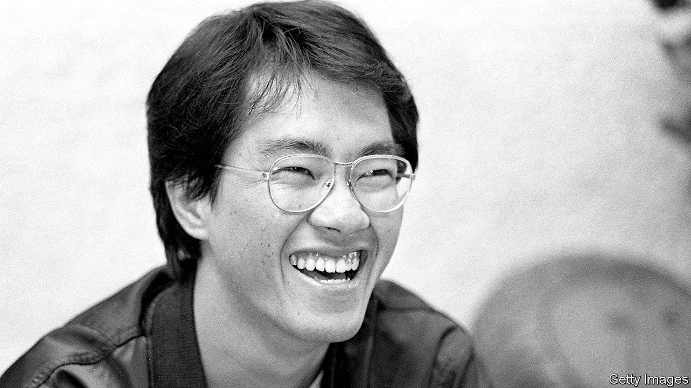

###### From strength to strength

# Toriyama Akira was probably Japan’s greatest manga master 

##### The reclusive but tireless creator of “Dragon Ball” died on March 1st, aged 68 

 

> Mar 14th 2024 

He had lost it again. It must have slipped down somewhere, between his papers and the low table he liked to work at. He was so careless with his stuff—all his stuff. But this was urgent. With steadily rising anxiety, he rummaged through his office. No sign. And yet he couldn’t draw properly, therefore couldn’t function, without it. 

It was his pen-holder he was looking for. His old wooden pen-holder, pinkish-cream and black. Nothing to look at. Over the years he had worn it down with sharpening, sandpapering and simply drawing manga, Japan’s dynamic version of the graphic novel. He had customised it, cutting the business end so that the nib went in deeper. Whenever it broke, he had fixed it. Of course he had tried others, but he couldn’t get on with them. Over thousands of pages, with that little scratching sound it made (he often used the worst paper), it had become his beloved and his friend.

Toriyama Akira’s whole career was mapped out by it. He was 14 when he bought it, randomly, somewhere. It drew the first story accepted by , the best manga magazine, when he was 23, and the first one  serialised, “Wonder Island”. For four years from 1980 the pen-holder worked overtime on “Dr Slump”, his first colour comic, which when printed as a separate volume sold 35m copies in Japan. But far greater things were to come. In 1984, having retired Dr Slump, he introduced a character who, for the first time, carried manga successfully to the West and then across the globe. 

That character was Son Goku, the greatest hero on Earth, and his story was “Dragon Ball”. The plot was simple enough, based loosely on a classic Chinese novel, “Journey to the West”. Goku was a human boy, but with oddities: a monkey’s tail and extraordinary strength. Rather than keep failing at his martial arts lessons, he teamed up with a girl, Bulma, who was on a quest to collect seven magic balls scattered over the Earth by a terrifying dragon. Each time they were all collected, the dragon granted one wish. Then it scattered the balls again.

There was no reason why such a story should ever end, and it hardly did. It ran for ten years in  , filling 42 volumes, before migrating to 153 anime TV episodes and to film. As it ran it changed. Goku aged, became a father, acquired greater powers and took on more and more snarling enemies. He lost, even died, but was revived, still with his orange  and his shock of black hair, which turned blond as his power level rocketed to over 9,000 and electricity blazed from his hands. The earlier volumes had part-likeable villains and fights staged as tournaments, but by “Dragon Ball Z” in 1989-96 all-in brawls were exploding from almost every page. Cries of Haya!!! Arghh!!! and HWOOO!! spiralled out of the frames as the characters sprang to destroy each other. That crazed action was what teenage boys in America, reading the comic books or watching on Toonami, especially seemed to go for.

His new fame and new wealth astonished Mr Toriyama. Dr Slump’s success was surprising enough, when the main star was not the genius inventor with his crazy machines but Arale-chan, a plump, shortsighted robot girl in blue dungarees. Now the whole world had apparently gone mad for “Dragon Ball”, which he had thought up only to make Japanese boys happy. Fans of his work found grand themes there of friendship, kinship and hard work, but he went only for fun, gags and kung-fu fighting, and seldom sat down to draw with any idea of where the plot was going. He made it up as he went along. The surest part of the exercise was the perfect fit of the pen-holder in his hand, perfectly conveying to the blank page his characters’ next expression.

Manga had not been his first idea of how to spend his life. He went into design, but it didn’t suit him. By his early 20s he was broke, reduced to begging 500-yen notes from his mother. Since that could not go on, and he was good at drawing, he tried manga. On one level he loved it, letting his imagination rip unconfined. But it was really rough, too. Working on Dr Slump, he once pulled four all-nighters in a row to meet his relentless deadlines at , even calling on his family to ink in the black bits. He scarcely believed it was possible to do so much drawing. That part got easier: the colouring was soon done digitally, and eventually the characters left the page for the screen. But then new characters would come into his head to be thrown into even wilder adventures, into other universes, or through time. Goku’s great wish was to defeat ever-stronger enemies, one-on-one, so his creator provided them in numbers. None pleased him more than the Great Demon King Piccolo, Goku’s first arch-enemy. Piccolo went swathed in a white cloak, white turban and terminally brooding look, but he came good in the end, and saved the Earth.

Plenty of other projects flowed first from that pen-holder, including “Chrono Trigger” and designs for the video game “Dragon Quest”. Each anime or film (22 were based on his characters) was overseen by him. It was hardly surprising, given his workload, that he was a recluse. But that was his temperament anyway. With friends he would laugh, joke and talk nonsense, but he had very few. Most were manga artists, as his wife Yoshimi was. Living out in Kiyosu City, where he was born, rather than Nagoya, where he had his studio, he liked to play the rural hermit. His author portrait was a cartoon, usually smoking; his public persona became “Robotoriyama”, “Tori” for short, a cartoon cyborg with a gas mask and grabber arms. Sometimes Tori would wear Goku’s orange costume, the same one that now graced a statue on a street in Tokyo, toyshops from Shanghai to Paris and Macy’s Thanksgiving Parade. At other times he wore green coveralls, like a workman. 

As a workman, he needed his special tools. Fans noticed that after he mislaid his old, precious pen-holder while finishing the serial “Sand Land” in 2000, losing it for good this time, he drew manga much less. He explained the tragedy as his excuse for being lazy. Yet perhaps it was a sign, nonetheless, that together they had fought, and yelled, and leapt, and saved mankind, just enough. ■

