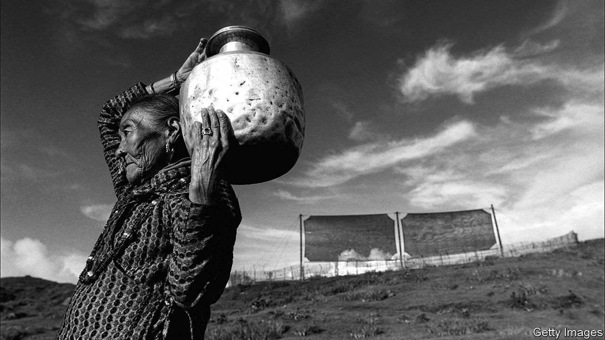

###### Water, water, everywhere

# How to harvest moisture from the atmosphere 

##### New technologies could provide water to Earth’s most arid climates 

 

> Mar 13th 2024 

Even in the most speculative reaches of science fiction, there is no escaping humanity’s dependence on liquid water. Luke Skywalker, the hero of the original “Star Wars” trilogy, grows up on his uncle’s moisture farm, extracting water from Tatooine’s arid atmosphere. The residents of the desert world Arrakis, accessible to anyone with a copy of Frank Herbert’s novel “Dune” (or with three hours to kill at their nearest cinema), likewise use windtraps to steal precious liquid from the air.

Engineers on Earth, too, are increasingly looking to the atmosphere for water. They have good reason to do so. Even in the depths of Chile’s Atacama Desert, often called the driest place on Earth, estimates suggest that fog and dew can generate some 200ml of water per square metre. Elsewhere, the atmosphere is even more generous. Worldwide, it is estimated to contain 12,900 cubic kilometres of water, roughly the volume of Lake Superior. Moreover, models indicate that evaporation driven by global warming will increase these levels by 27% over the course of the next 50 years. 

Tapping this invisible reservoir is a priority. As Earth’s temperatures rise and its population grows, ever more people are likely to run short of water. More than 2.3bn are currently living in water-stressed countries and analysts predict that further droughts will force roughly a third of these to move from their homes by 2030. 

Collecting water from the air is nothing new. The Inca, who are widely thought to have invented the technique, placed buckets under trees to collect the condensation from heavy fog drifting in off the sea. On the Canary Islands laurels, junipers and pines have come to be known as “fountain trees” for their association with fog harvesting. People dwelling in the arid mountains of Oman have long built cisterns under trees for the same reason. 

Modern atmospheric water harvesting follows many of the same principles. Instead of using leaves as condensation traps, however, which drip over an impractically large area, modern traps instead consist of sheets of very fine polymer mesh. As fog flows through the sheets, tiny droplets of water stick to the polymer fibres. These droplets grow until gravity pulls them into a compact trough and, thence, a reservoir. While collectors vary in size, a 40-metres-square collector in a reasonably foggy area yields around 200 litres a day, enough to supply 60 people with drinking water. 

Further improvements are possible. A team led by Urszula Stachewicz at AGH University of Krakow in Poland found that the sheet could be made even more productive by changing the way in which its polymer threads were manufactured. Dr Stachewicz theorised that careful manufacture via a process known as electrospinning could lend the sheet a slight electrical charge that would prove attractive to water droplets in fog. In experiments conducted in 2021 she and a team of colleagues found that such sheets yielded 50% more water. 

This past August, she and Gregory Parisi, a phd student at Rensselaer Polytechnic Institute in New York reported yet further improvements by adding titanium dioxide (TiO) to the mesh. Previous work had shown that titanium dioxide could be rendered superhydrophilic (intensely attractive to water) upon exposure to ultraviolet light—a hindrance under extremely foggy conditions, as water would stick to the mesh rather than trickle into the cistern. When fog was light, however, Dr Stachewicz and Mr Parisi found that a TiO-enhanced mesh became 30% more effective. Her fog collectors are now being used at sites on three continents.

Further inland, where fog is scarce, other solutions are needed. One effective approach involves harnessing the water already present in the air. When the temperature drops, the water-carrying-capacity of air decreases with it. This leads to excess water condensing onto surfaces, a process most often seen as dew. It is common in water-saturated places like Britain, but anywhere with little wind and an average relative humidity of 70% or greater can cajole water out of the air.

A key way to do this is with radiative cooling, a phenomenon that occurs at night when certain materials (like aluminium) radiate enough heat to cool below the ambient temperature of their surroundings. After sunset, water condenses on these materials, forms droplets and trickles off. Chambers built of these radiative materials sometimes include adsorbent inner surfaces to which water in the air readily sticks. When humid air drifts into such chambers, it loses its water upon exposure to the cool conditions before drifting out. One big benefit is that such techniques work best in places like deserts, with clear skies, high daytime temperatures and cool nights. 

An important limitation of radiative cooling has long been its relative ineffectiveness by day. That changed in 2021 when Dimos Poulikakos and his then-doctoral-student Iwan Haechler, at ETH Zurich, crafted a piece of glass with a layer of silver at the bottom and a layer of silicon polymer, sandwiched between layers of chromium, at the top. The silver layer reflected away the incoming sunlight while the sandwiched polymer allowed the device to shed heat in the form of infrared radiation. This cooled the glass by up to 15°C below ambient temperatures, driving condensation even during the heat of the day. Paired with a heat shield, a condensation chamber built with this glass helped produce 1.2 litres of water per square metre a day.

Another challenge posed by radiative cooling systems is that water needs to be wiped off the surface of the collection chambers. This requires power, typically from nearby turbines or solar panels, which can be expensive. To cut costs, Dr Poulikakos and Dr Haechler applied a superhydrophobic coating to the surface of the chamber, forcing water droplets off the surface and making it possible for the device to function without electricity.

Such technology is indeed affordable, with the prototype itself costing less than $50. But in many regions where water is desperately needed, humidity levels are too low for dew harvesting to be feasible. In places like these, the most promising options are those that make use of superabsorbent materials.

Many salts, chemical cousins of the familiar sodium chloride, will readily snatch water out of the air. With this in mind, an engineering team led by Peng Wang at King Abdullah University of Science and Technology in Saudi Arabia studied the effectiveness of hollow nanocarbon capsules filled with lithium chloride. In 2020 the researchers reported that these capsules could capture more than double their weight in water vapour from ambient air when relative humidity was below 60%. Similar techniques using other salts have proved capable of gathering water in humidity levels as low as 10%. 

The findings are promising, but the technology has yet to advance beyond the prototype stage. The problem is inefficiency; even Dr Wang’s world-leading capsules can only produce 1.6 litres of water per kilogram of lithium chloride over the course of ten hours in very arid conditions. Better than nothing, but inadequate for sustaining a community.

Between them, though, these technologies suggest a brighter future is possible. Areas so dry as to have gone without rainfall since modern records began may one day yield enough water to sustain settlement. And not just on a fictional planet. ■


