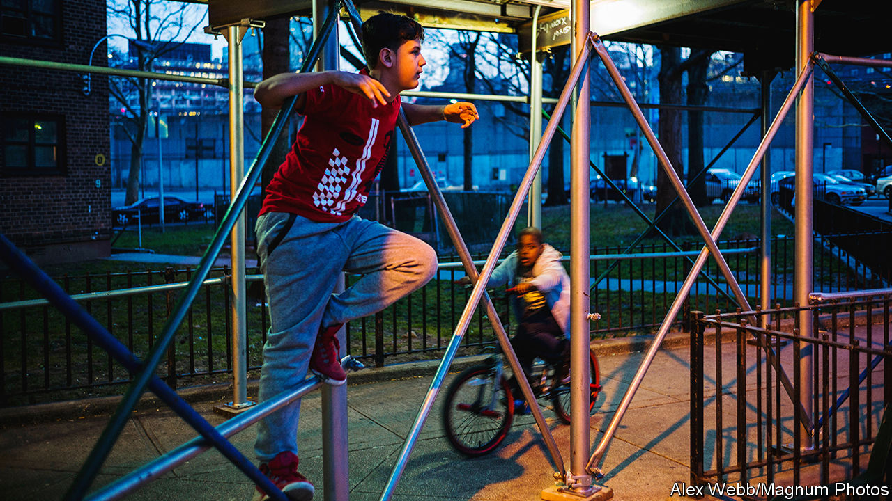

###### Under construction

# New York City is covered in illegal scaffolding 

##### Machine learning algorithms could help bring it down 

 

> Mar 13th 2024 

The city that never sleeps is also, it seems, unable to take down scaffolding. New Yorkers have grown so sick of the ugly structures, and the accompanying ground-level cages in place to protect and divert pedestrians, that Eric Adams, the mayor, last year launched a campaign to clear them from the streets.

Now computer scientists in the city have made a hit list of possible targets. Using AI to sift through thousands of hours of dashcam footage, the researchers identified some 5,000 scaffolding sites across all five boroughs, of which 500 were found to have no permit. “This city is the best but also kind of a disaster,” says Wendy Ju, a computer scientist at Cornell Tech in Manhattan, who worked on the project.

New York’s steady submergence beneath scaffolding is a classic example of a well-meaning policy producing bad side-effects. (Or in this case, sidewalk effects.) Shocked by deaths from falling masonry, officials in 1980 introduced compulsory façade inspections every five years.

As a result, city records show more than 8,000 current permits for scaffolds, which often include what New Yorkers call “sheds”—dark and claustrophobic street-level tunnels. Many remain in place long after the permit expires because building owners find it more convenient to leave the scaffolding in place between inspections. As part of his ongoing war on sheds, Mr Adams celebrated the removal of 21-year-old scaffolding from a Harlem street that had become a local landmark in its own right.

To get a street-level view of the problem, the Cornell scientists trained an algorithm to find scaffolding in images and then set it loose on a huge data set collected between August 2023 and January 2024 by cameras fitted to ride-sharing vehicles. They then asked the computer to find all the sheds in a colossal 29,156,833 geotagged images.

The researchers went on to cross-reference scaffolding identified by the AI with records of approved projects. The 500 or so unpermitted sheds discovered don’t necessarily contravene the rules, as city regulations do allow some without permission (for emergency work, for instance). But they would seem a good place to start investigating.

The scientists are waiting until the results are accepted for an upcoming conference before sharing them with city officials. They also want to convert the data into an interactive map that will show residents the location of scaffolding, tell them how long it’s been there and reveal whether or not it has a permit. Soon, New Yorkers will be able to sleep easy once again. ■


