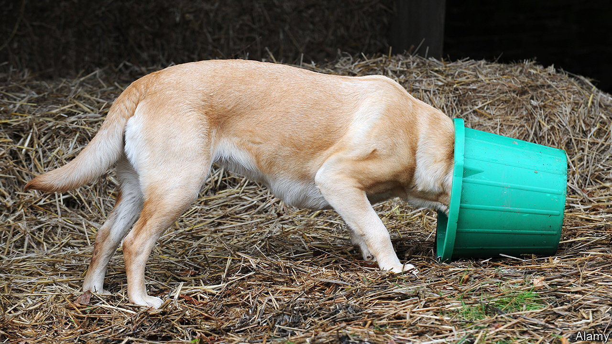

###### Puppy fat

# Some Labradors have a predisposition to obesity 

##### A gene mutation slows the dogs’ metabolism and makes them constantly hungry 

 

> Mar 8th 2024 

Much like their human owners, dogs are experiencing an obesity epidemic. One recent study of British pooches found that one in 14 is too pudgy, putting them at higher risk of conditions like arthritis, shortening their lifespan and making walks more of a drag. Certain breeds, like Labradors, are particularly prone to fatness. Purebred Labs are around 70% more likely to be overweight than mixed-breed mutts. A new study, published in the journal , has identified one reason why—a genetic quirk makes some Labradors prone to obesity.

The study, led by Eleanor Raffan, a veterinary geneticist at the University of Cambridge, focused on a gene known as POMC, which is found in humans as well as dogs. In a previous study, published in 2016, Dr Raffan and her colleagues found that obese Labradors were much more likely than slimmer dogs to be missing a small section of DNA in the gene, a so-called deletion mutation. In the latest study the researchers set out to identify how this genetic variant, which is present in a quarter of Labs, might cause them to gain weight. 

Their first finding was that dogs with the mutation seemed to be hungrier than dogs without it. This conclusion rested on the results of a “sausage-in-a-box test”. Experimenters recorded the Labs’ reaction to a meaty treat that they could see and smell, but couldn’t eat. On average, dogs with the POMC mutation spent almost twice as long looking at, or—for whatever reason—playing with, the tantalising box than did those without.

The POMC mutation seemed to boost how much the dogs wanted food, but not how much they liked it. Dogs with and without the mutation were just as likely to be put off their kibble if it had been slathered with lime juice. If the dogs were given the chance to eat unlimited food in one sitting, there were also no clear differences in how much they binged. The authors suggested that Labs with the mutation may be more inclined to seek out food in between meals, causing them to put on the pounds.

Not only did the mutation influence the dogs’ desire for food, it also slowed their metabolism. In another experiment the dogs were encouraged to sleep in a respiratory chamber, which measured the volume of oxygen and carbon dioxide breathed in and out. From this, the scientists calculated that Retrievers with the POMC mutation burned 25% fewer calories at rest than those without, indicating that the hungry dogs may need to stick to a particularly light diet in order to stay slim. 

Many other factors are likely to influence obesity in dogs. The authors have only found the POMC deletion in Labradors and Flat-Coated Retrievers, despite testing for it in many other portly breeds. But in these dogs the mutation is probably here to stay, as selective breeding to eliminate it would require a huge reduction in an already limited gene pool. The scientists also suspect that the variant may make dogs easier to train—it is present in around three-quarters of Labrador assistance dogs. 

Dr Raffan’s work also provides insights into the biology of POMC mutations, which are relevant for humans too. People with these rare mutations report extreme hunger and many become obese as children. Scientists investigating the effects of genes typically study rats and mice, but in the case of POMC there are important differences between the genes of rodents and other mammals. The authors identified a protein which is affected by POMC mutation in the Labradors, but is not present in mice. They think this overlooked protein may well be involved in human weight control too. 

Medication targeting the faulty POMC pathway in humans has already been developed. In 2020, setmelanotide, a drug that mimics one of the proteins produced by POMC, was approved for use in humans. It is unclear whether it would work in dogs, and with a price tag of at least £240 in Britain ($330 in America) per daily dose, it is unlikely to be prescribed to even the most pampered pets anytime soon. “There are many healthy, happy Labs who have a POMC mutation,” explained Dr Raffan. For now, owners looking to keep their pets in shape will just need to hide the treats and resist those pleading, puppy-dog eyes. ■


