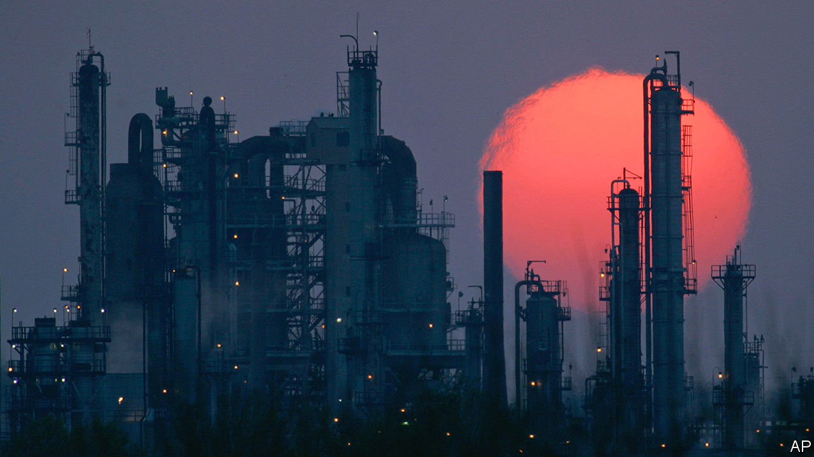
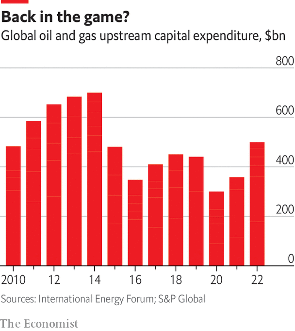

###### The molecular turn

# Can Big Oil run in reverse? 

##### Some of the industry sees putting carbon dioxide back in the ground as key to its future 

 

> Mar 11th 2024 

Wael Sawan, the boss of Shell, is not planning to cede the world of oil production to the advantaged countries of the Gulf in the immediate future. He says the company hopes to compete with the Gulf “to the point of discomfort”. But he also acknowledges that “there is no chance for any of the investor-owned companies to be the last man standing.” 

As of today, those oil companies look in reasonably good shape. In the late 2010s the industry spent a lot less than usual on ensuring future production, with bosses grumbling about how climate-based regulations, anti-oil activism and environmental, social and governance (ESG) concerns made their lives impossible. When it further cut capex during the pandemic demand slump, Daniel Yergin of S&amp;P was one of those publicly worrying about a new era of “pre-emptive underinvestment” built on the mistaken assumption that “sufficient alternatives to oil and gas would already be in place at scale by now.”

 


In truth, investors had a simpler reason for withholding their cash in the pre-pandemic years: the industry’s pathetic returns. The oil and gas industry was the worst performing sector of America’s benchmark S&amp;P 500 share index from 2010 to 2020, in large part due to the money-sucking shale boom. Since then the investor-owned firms have boosted efficiency, slashed costs and ditched assets. Natasha Kaneva of JPMorgan Chase has calculated that $1m spent on upstream capex in America in 2023 yielded twice as much oil as did the same amount spent in 2014.

Investors have taken note of this more efficient use of capital, and also of the bumper profits which followed the return of demand when lockdowns ended and Russia invaded Ukraine. Upstream investment rose to $500bn in 2022, halfway back up to its 2014 peak of $700bn. For worries about supply being jeopardised by under-investment, in the near term it now makes more sense to look at the high-cost .

Nevertheless, a recent survey by BCG, a consultancy, found that 84% of investors worldwide thought it important for oil and gas companies to demonstrate profitable growth from low-carbon investments by 2025. Over half the investors based in Europe said they felt pressure to divest from fossil fuels. 

A sense that this reluctance will only strengthen has shortened the firms’ outlook on investments in their core business. “They are not going into ten-year projects,” says Edward Morse, formerly of Citi. Instead they want “short-cycle” projects with the lightest carbon footprint and lowest cost per barrel. A prime example is ExxonMobil’s massive recent find in Guyana, which moved from deepwater discovery to production in just a couple of years. Everyone knows such low-hanging fruit is rare.

Enhancing old rationales

In a sector that will have to shrink there is much to be said for getting out. This is certainly the view among some of the NOCs. In electrification-mad China CNOOC says decarbonised energy will make up over half of its total production by 2050. Colombia’s Ecopetrol and Thailand’s PTT are also moving into renewables. Some European oil companies have tried similar shifts. Unfortunately, as a study by the Oxford Sustainable Finance Group points out, the project developers and utilities which dominate the renewables business typically pay less for their capital than oil companies, and so can make do with lower returns. It is in part because of their turn towards renewables that shares in European oil companies are trading at a hefty discount against their American peers. 

Both BP and Shell have been back-peddling on their embrace of green electrons. BP is making investments in fossil fuels of which there was no inkling in its forecasts of a few years ago. Its hydrocarbon output in 2030 will be just 25% below the 2019 level, rather than the 40% it once touted. Shell’s Mr Sawan told an investor day last year that the company is “not particularly differentiated” in the renewables sector. Instead, he is positioning Shell to be a “premium player for molecular energy today and into the future”. 

Molecular, here, is a bit of jargon which can cover both established fossil-fuel businesses and new ventures which involve other energy-related gases and liquids: biofuels, hydrogen and carbon dioxide itself. Again, some NOCs are interested in this. Saudi Arabia has plans for both hydrogen production and carbon-dioxide sequestration. Tengku Muhammad Taufik, the boss of Malaysia’s Petronas, wants to use the firm’s many depleted oil fields to sequester carbon dioxide from across South-East Asia. But Big Oil’s technological acumen may offer it a real advantage. 

At a massive refining and petrochemical complex in Baytown, Texas, ExxonMobil is building what it says will be the world’s first full-scale natural-gas-fired clean-hydrogen plant. It will turn methane and water (in the form of steam) into 28m cubic metres (1bn cubic feet) of hydrogen a day and a smaller but still substantial flow of carbon dioxide. The hydrogen will be used elsewhere in the plant or sold on while an underground repository receives 10m tonnes of carbon dioxide a year.


Those 10m tonnes a year on their own would make the Baytown plant one of the largest carbon capture and storage (CCS) projects in the world. But there are a lot of other installations in the greater Houston area that may soon be required to clean up their acts. ExxonMobil hopes to get the total amount of carbon dioxide it disposes of up to 50m tonnes a year by 2030 and twice that by 2040. In the long term, the company reckons that carbon-capture services, which it could sell to industry, and low-carbon businesses like hydrogen and biofuels could become a market in the “trillions of dollars”. 

ExxonMobil and its peers are confident that they can make the storage bit of ccs work because they have a lot of relevant experience. Pumping carbon dioxide into depleted oil wells can be a way of squeezing a lot more oil out of them, a process called enhanced oil recovery (EOR). If the carbon dioxide can be shown to stay down the well after the oil comes out, the companies involved can get a tax credit for carbon sequestration on top of the value of the oil recovered. 

Last July ExxonMobil paid $5bn to acquire Denbury, which owns a large pipeline network for getting carbon dioxide to wells that need their recovery enhanced. In August Occidental Petroleum, which is something of an EOR specialist, paid $1.1bn for Carbon Engineering, a Canadian startup which has developed technologies to extract carbon dioxide from thin air, a process called direct-air capture (DAC). Vicki Hollub, the chief executive of Oxy, as the company is known, has grand plans for this DAC technology. Oxy has received a grant from the American government worth up to $600m towards the $1bn-or-more required to build a commercial-scale DAC facility in Texas—one capable of removing 1m tonnes of carbon dioxide from the atmosphere every year. 

Oxy plans to build over 100 plants at this scale so as to allow the company to offer barrels of oil attached to “verified decarbonisation credits”. These credits would guarantee that an amount of carbon dioxide equivalent to that produced when the oil in the barrel is burned has been sucked back out of the atmosphere at one of Oxy’s plants. Ms Hollub says the ability to sell net-zero-emission oil of this sort would give her firm the “social licence to operate” it needs to stay in the oil business. 

When Ms Hollub says that “we’re not going to move away from oil and gas,” those who believe that much of the push into CCS, DAC and fossil-fuel-derived hydrogen is intended merely as cover for fossil-fuel business-as-usual no doubt feel vindicated. Even climate hawks generous enough to overlook the oil industry’s shameful history of promoting climate denialism it knew to be nonsense will be disturbed by the idea of using DAC to produce “green” gallons of petrol, rather than to offset emissions from processes where avoiding them is very much harder. 

You do not need to buy into Oxy’s plans, though, to think that the best way to decarbonise some industrial plants will be through CCS, that hydrogen may be a good solution for some problems or that DAC has some sort of future role. Oil firms have the balance-sheets, project-management skills and engineering know-how needed to do that. Such businesses look like a better fit for them than renewable electricity (other than in offshore developments, perhaps, where Big Oil has relevant expertise). 

A surplus of stones

The idea that the oil age will come to an end is not new; nor is the idea that it will end because of alternatives rather than shortages. “The stone age did not end for lack of stones,” Sheikh Yamani, Saudi Arabia’s energy minister during the first two oil shocks, told his counterparts at OPEC oil ministries, “and the oil age will end long before the world runs out of oil.” When he said it, it was a warning about high prices encouraging the search for alternatives. Now, with global warming perilously close to 1.5°C above the pre-industrial level, the meaning is different—and more urgent. 

Demand is not set to wither organically in the face of better alternatives or as a response to high prices. Its putative decline will follow a policy-driven trajectory. But that trajectory is not set, and will not remain steady. In the face of such uncertainty it makes sense for some to try and get ahead and move on to other things while others double down, insisting that demand will last. Some will win, some will lose, and the spread of options may mean that supply shocks are minimised in a way that could not be guaranteed if everyone was getting out.

But there is a second concern. The end of the stone age did not mean that, after bronze-orientation day was over, stone was done. The world still uses a great deal of stone. Some in the oil industry seem to think that the same will apply to them; road transport may escape them, as electricity generation has, but with hard-to-displace products like jet fuel still needed and some DAC to clean up its products and image the industry will endure. Such die-hards will lobby ferociously for policies that slow the transition away from them, just as the boosters of renewables argue their opposite case. The difference is that those lobbying for survival will do so more ferociously than those who simply fancy a bit more growth. 

The shock of October 1973 showed both suppliers and consumers that they did not fully understand how far into the oil age the world had passed, and how that had made possible a remarkable geopolitical upset. Today’s crisis is one of consumers not knowing how to get where they have to go, and producers not knowing how, if at all, they can survive the journey. It is not as dramatic. The prospect of a ruined climate makes it yet more important. ■

