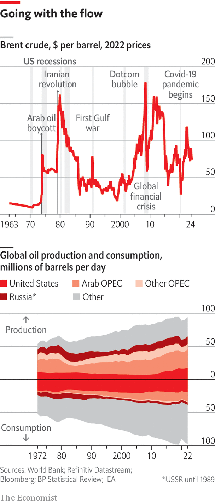

###### The long goodbye

# For 50 years the story of oil has been one of matching supply with increasing demand 

##### The next 50 years will be different, argues Vijay Vaitheeswaran in a special report 

 

> Mar 11th 2024 

Fly WEST across the United Arab Emirates from Fujairah, a tanker-filled port on the Gulf of Oman, towards the Persian Gulf and you get a sense of the vulnerability arid lands have to climate change. The farms around Dhaid provide a splash of green, but homegrown food is scarce, homegrown staples next to non-existent. Drinkable water comes mostly from desalination plants. The heat is growing inhumane; outside work is banned during the hottest hours of summer afternoons. 

The Emiratis know their predicament. The gleaming cities of Abu Dhabi, Dubai and Sharjah are fully aware of the threats of sea-level rise. As you reach the Persian Gulf you can see a coast-protecting carbon-sequestering ribbon made up of millions of mangroves, their seeds planted by drone. At the same time those gleaming cities are built on oil. The UAE produces about 3m barrels of oil per day (bpd) and the state-owned producer, the Abu Dhabi National Oil Company (ADNOC), hopes to increase its production capacity to 5m bpd by 2030. The UAE is a major force in OPEC, the cartel of oil-producing nations. It is a hub for oil traders, too. In 2021, the Intercontinental Exchange, a commodity exchange with big operations in Europe, America and Asia, started trading a new oil futures contract for regional crudes delivered in Fujairah. 

The emirates are thus the world in microcosm. The disastrous hazards of climate change are manifest. The oil industry has never been bigger. When demand slumped during the covid-19 pandemic some hoped that it would never return to its previous heights. But it has since surpassed them. In 2023 the world produced 101.8m bpd, according to the International Energy Agency (IEA). Carbon-dioxide emissions from oil in that year are estimated to have reached 12.1bn tonnes a year, according to the Global Carbon Project, an academic consortium, representing 32% of all industrial emissions. Any attempt to keep the increase in average global temperature since the 19th century “well below 2°C [3.6°F]”, as required by the Paris agreement of 2015, has to see those emissions reduced both sharply and soon. 

No one is being forced to buy oil (though in many places people receive subsidies to help them do so). And every economy needs it. Nevertheless, many of those pushing for emission cuts have a deep distrust of the industry which provides it to the world. That the oil industry has an interest in self preservation is hardly surprising. But it also has a history of attempting to undermine climate science so as to encourage climate-change denial even while its own scientists have known full well what was going on. It wields huge lobbying power which frequently (infuriatingly so, to opponents) prevails when climate action threatens its future profits. Oil companies which try to seem like climate goody-goodies—witness the attempt by BP, a British oil major, to rebrand itself as Beyond Petroleum in the 2000s—routinely revert to type when the associated business strategies fail to deliver the goods. 

Oil-producing countries have worked to lower the ambitions of the annual conferences, known as COPs, held by the UN Framework Convention on Climate Change (unfccc) ever since the COPs began in 1995. They are a large part of the reason why, for decades, the COPs never specifically acknowledged the need to reduce the use of fossil fuels. When, in November 2023, thousands of diplomats, politicians, scientists, entrepreneurs, lobbyists and journalists arrived in Dubai for COP28 many did so itching for a fight about this, their indignation whipped up by the UAE’s decision to appoint Sultan al-Jaber, the boss of ADNOC, as the COP’s president. 

But COP28 ended in December with a significant, though symbolic, step forward. Its final communiqué called on the countries of the world to contribute towards a transition “away from fossil fuels in energy systems…accelerating action in this critical decade, so as to achieve net zero by 2050.” 

 

To “call on” is not to require; to “contribute to” is not to wholeheartedly pursue. “Transitioning away” is not the “phasing out” many of the delegates would have preferred. In all those ways, the agreement was weak beer. But it still marked a historic turning point in climate negotiations: a declaration from the heart of the oil establishment that demand for the defining resource of the 20th century should start to fall. Though “we didn’t turn the page on the fossil-fuel era in Dubai,” Simon Stiell, the head of the unfccc secretariat, said afterwards, “this outcome is the beginning of the end.”

If that is true, it is not necessarily to the disadvantage of the UAE. The country sees itself as being able to keep going until the end of the end, if necessary. The best of the reserves around the Persian Gulf are both vast and relatively cheap to exploit. What is more, for the most part working them does not, in itself, emit as much carbon dioxide as does production in other places. Other things being equal a world reducing its dependence on oil will abandon higher-cost producers first. 

 


But transitioning away still means a change in the fundamental dynamic of the oil industry, one which has shaped it and its relationship to the world economy for 50 years. In October 1973, infuriated by America’s support for Israel in the Yom Kippur war, the Gulf nations in OPEC placed an embargo on sales to America and its allies. Before that embargo a barrel of oil cost a bit more than $3. By March 1974 it cost $13. Before the embargo the oil price had been stable for decades. Since 1973 it has been persistently, sometimes remarkably, volatile (see chart).

“It’s hard to overstate the shock to the American psyche from the seemingly overnight skyrocketing of prices, stations running out of fuel and long lines,” says Jason Bordoff, an energy policy expert whose father’s petrol station in Brooklyn was besieged by angry customers. Now head of the Centre on Global Energy Policy at Columbia University, he remains convinced that the oil shock of 1973 and its successor, the shock which followed the Iranian revolution of 1979, “framed energy policy for half a century”. 

The 1970s showed what a range of economic, political and geopolitical effects oil-supply shocks can have. In developed countries the increases in prices and the central-bank reactions to them drove up inflation and stifled the economy. That set the scene for the rise of free-market politicians like Margaret Thatcher and Ronald Reagan in the years which followed.

Because many of the OPEC countries had little to invest in at home, the “petrodollars” they were raking in ended up invested in international banks, making them keen to lend. Developing countries, keen to borrow, saw their debt climb quickly. The IMF calculates that 100 developing countries saw their foreign debt rise by 150% between 1973 and 1977. The 1979 shock then sent interest rates soaring, triggering the third-world-debt crisis of the 1980s—sometimes called the lost decade of international development.

Two score years and ten

Fifty years on is often a good time to look back on a radical change. It fits well with a human lifespan. It lets people born after the change understand better what is special about the world they have always known, what is necessary and what contingent. Those towards the end of life can provide first-hand accounts of the change and its aftermath. 

That would be reason enough for taking stock of the world which the oil shock of 1973 created. But the turn acknowledged in Dubai last December makes the task more urgent. The post-1973 oil market has always been a tussle between the rate at which supply—sporadically co-ordinated by OPEC—and demand have grown. In a climate-constrained world that growth must end. Some imagine it plateauing; some insist it must fall far and fast. If, or as, that happens, the questions of the past—where will new supply come from, and how secure will it be—become further complicated by new worries: who will stop supplying, and what effect will that have. When demand is rising, overestimating the trend can lead to over-investment. When demand is falling, under-investment may be a bigger risk.

This special report will assess how oil consumers could come to demand less and the effects that shift can be expected to have on both OPEC and on the West’s big oil companies. First, though, it will look at how much more resilient the oil world has grown to upsets since the shocks of the 1970s.■

