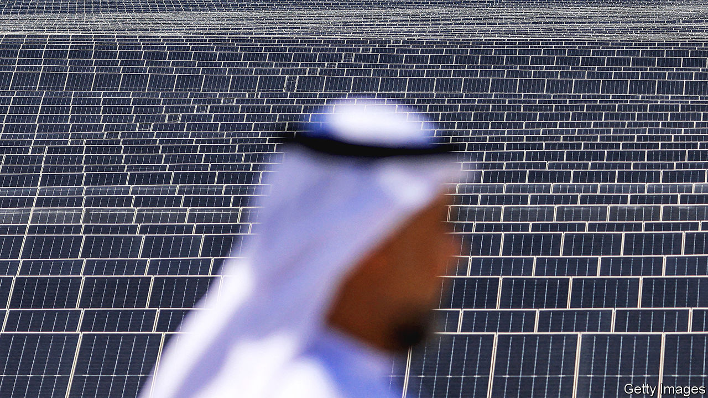
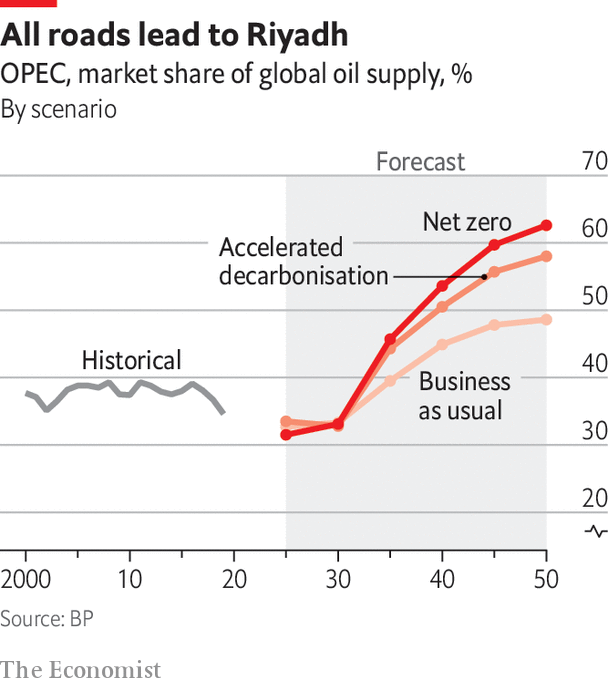

###### Last men standing

# Oil’s endgame will be in the Gulf 

##### And the Gulf states know it 

 

> Mar 11th 2024 

The run-up to a special OPEC symposium held in Vienna last July saw concerted efforts to show the cartel to be effective and united. Pressure from Russia, one of ten countries that align themselves with opec’s policies to form what is known as OPEC+, for a higher production quota was faced down in April, when it agreed instead to cut production along with the rest of the cartel. A squabble between Saudi Arabia and the UAE, which had demanded an increase in its quotas to accommodate a planned big expansion in production capacity, was resolved in June.

Then, in a surprise move, Saudi Arabia announced a further, unilateral 1m bpd cut in its own oil production from July. This “lollipop”, as it was termed by Prince Abdulaziz bin Salman, the self-confident Saudi energy minister, was intended to further shore up prices to the benefit of its fellow cartel members. It was a welcome sweetener. 2022 had been a bumper year with OPEC’s net oil exports totalling $888bn, a real increase of 31% over the pre-pandemic figure three years earlier. But soft demand, especially from China, and lower oil prices were taking the edge off. In the end OPEC’s net oil export revenues in 2023 dropped to $656bn.

 “Saudi Arabia has played its cards very well,” Christyan Malek of JPMorgan Chase, a bank, observed at the time. With opec+ controlling 40% of the world’s oil production, the card sense of the cartel’s dominant power matters a lot. Saudi Arabia’s clout within the cartel comes not so much from the level of its production (Russia produces roughly as much), but more from its singular willingness to allow significant capacity to sit idle. As the swing producer it can stabilise or raise prices by reducing production or soften the market by increasing it. Lower prices cause disproportionate harm to producers whose costs are higher than the kingdom’s—that is, to almost all the rest of the cartel.

That clout does not come cheap. In 2022 Saudi Aramco posted profits of $161bn, the largest ever seen at a publicly listed firm. The lollipop was one reason that the quarterly profits it reported in November 2023 were nearly a quarter lower year-on-year. Production capacity is costly. Spare capacity is, in the short term, money left on the table. Saudi Arabia’s post-lollipop 9m bpd leaves it 3m bpd below what it could be producing—roughly equivalent to the entire production of Kuwait. 

Some, such as Badr Jafar of Crescent Group, an Emirati business, think the Saudis use this power to keep things on an even keel. They act “as a kind of beneficial central bank for oil supply”, he says, “with price stability [the] primary objective.” Others are less charitable. Saudi Arabia has twice flooded the market to lower prices, in 1986 so as to punish the cartel members who were not adhering to the cartel’s production quotas, and in 2014 to hurt US shale-oil producers. In its attempt to squeeze a recalcitrant Russia into cutting production in 2020, when covid lockdowns were crashing demand, it kept its taps so open that oil prices became negative; for a short while traders had to pay for the stuff to be taken off their hands. Edward Morse, formerly of Citibank, argues that on balance the Saudis are “a very disruptive entity in the market despite claims of being a force for stability.” 

Adnan Shihab-Eldin, who was acting secretary-general of OPEC in 2005, sees the stability Mr Jafar praises and the disruption Mr Morse deplores as natural poles for a strategy that inevitably “oscillates between going for market share and going for stabilisation in a comfortable price range for both producers and consumers”. He says he would grade OPEC’s stabilising of oil markets at between a B+ and a B-. But he adds that he would give it an A for its surprising endurance: “People have written it off every decade.” 

In 1960 OPEC’s founders—Iran, Iraq, Kuwait, Saudi Arabia and Venezuela—were seeking collective bargaining power in their negotiations with the international oil companies—the “Seven Sisters”—over the amount of oil revenue that should revert to the country in which the oil was produced. Daniel Yergin, author of a magisterial history of the oil business in the 20th century, “The Prize”, says the shocking impact of the grouping’s entry into geopolitics in 1973 came from three conditions being met at once. 

The first was the blow dealt to the pride of the Arab members by the defeat of forces they had bankrolled in the war against Israel. The second was an America with its eye off the ball. As the Watergate scandal neared its endgame Richard Nixon was becoming increasingly erratic and distracted. The third was that the Seven Sisters had been underinvesting in capacity at a time when demand was growing quickly. The market was very tight. 

 

The effect on the fortunes of the oil producing states was remarkable. Jim Krane of Rice University’s Baker Institute calculates that by 1975 Saudi oil revenues were $26.7bn, 40 times higher than they had been ten years before. The revelation of what oil could mean led to more countries deciding that the share of oil revenues they deserved was 100%. The share of oil reserves controlled by the Seven Sisters and other private-sector firms fell from 85% in 1970 to 12% in 1980. 

 


Beyond state coffers, the longer-term results were more mixed. In 2010 Sheikh Zaki Yamani, who as the energy minister of Saudi Arabia became a global figure in the 1970s, said the embargo’s aim had been “not to hurt the economy, just to attract international public opinion” to the plight of the Palestinians. On that basis, hardly a success. So that would be zero for two. And not much more than a decade after the first shock the cartel came a cropper when Saudi Arabia’s attempt to discipline the market in 1986 sent the price plummeting to a third of what it had been. Only with Chinese demand in the 2000s did OPEC begin to take on some fraction of its former glory. 

It is not all-powerful. Its members cheat on their quotas as they always have. But the results of its perpetual and imperfect trade-off between market share (and with it, influence) and high prices (and with them, income) matters. This should be an affront to all free-marketeers. But many have made their peace with it. The cartel is part of the furniture of geopolitics.

Robert McNally, who was President George W. Bush’s energy adviser, says studying oil’s painful price cycles shows that “the only thing worse than opec controlling the world oil market is opec not controlling it.” Meghan O’Sullivan, who also worked in the Bush White House and is now an adviser to the secretary of state, Antony Blinken, points to the booms and busts which have bedevilled the oil industry from its early days and suggests the market “seems to require some kind of intermediary”. Before OPEC, the oil market was tightly controlled by the Seven Sisters in the 1950s and 1960s and in the 1930s by the Texas Railroad Commission. OPEC’s distinction lies in the endurance Dr Shihab-Eldin points out—and in the fact that its interests are not always aligned with the West’s.

What does this endurance look like in a world with a structural decline in demand driven by climate policy? For the Gulf states the outlook is rosy. They produce a lot of oil cheaply and have the capital needed to produce more. Predictions of future supply see more of it coming from them, and the faster the world decarbonises the further their concentration goes. 

Saudi Arabia and the uae are reducing domestic oil usage to allow more exports. The Saudis are following the UAE towards nuclear energy. Both are deploying renewables at home and looking to export them overseas. Masdar, an Emirati green-energy company run by Sultan al-Jaber before he moved to ADNOC, its oil-producing part-owner, plans to install 100GW of renewable capacity around the world by 2030, a plan which if achieved would make it one of the world’s biggest operators of wind and solar power.

Gulf oil has the advantage of being less carbon-intensive than other oil: low in carbon content and easy to extract. The UAE is leaning into this. ADNOC has committed $23bn to decarbonisation projects, including $4bn for shipping onshore carbon-free electricity to power its offshore operations. The same money could be used to expand production. The emirates chose instead to produce more cleanly. Western oil majors are pursuing decarbonisation strategies because investors demand them. As with hosting the UN’s COP28 climate conference, the UAE’s aim is to be seen as supplier of choice in a climate-concerned world.

Other members of OPEC+, and national oil companies (NOCs) beyond the cartel, cannot or do not want to be part of this trend. Many have reserves that are expensive to access (what the trade calls “high lifting costs”) or have greenhouse-gas-intensive operations. Sonatrach, the Algerian noc, emits three to four times as much carbon-dioxide-equivalent per unit of oil and gas produced as do the goliaths of the Gulf. Whereas the oil majors in the West put about 15% of their capex into decarbonisation, Wood Mackenzie, a consultancy, finds that on average state firms spend less than 5% of their capital that way, despite the efforts of outliers like the UAE and Malaysia, where Petronas plans to devote 20% of its capex to decarbonisation. Some do not need to. But those which must seek capital in international markets will find it increasingly difficult if they do not. 

Firms like Indonesia’s Pertamina, Angola’s Sonangol and Mexico’s Pemex will struggle as reserves dwindle and production costs rise. But the investments that might keep them in business look unlikely to pay off if demand were to drop substantially. A recent analysis by the Natural Resources Governance Institute, an American watchdog, suggests that, of the $1.8trn that NOCs plan to invest over the next decade, $1.2trn is in projects which would not break even under the IEA’s net-zero scenario. 

Even if the real decline in demand is slower than that, many NOCs still have an incentive to produce as much as they can with the kit they already have at hand, a strategy known as “pump and slump”. If they do so too blatantly, though, they may attract the ire of Saudi Arabia and see prices fall beneath their feet. 

The massive investments the Gulf countries’ sovereign-wealth funds are making in private-equity and venture-capital funds abroad and in sectors like tourism, sports and finance at home means that their incentives are to keep the oil price from doing undue harm to the world economy. That does not mean a low price. The imf believes Saudi Arabia needs $80 a barrel to cover its lavish spending. A bit more is always welcome; you never know when it might be nice to supersize a football league. But pushing prices sharply up for short-term gain looks unlikely, as does any attempt to use the price politically. “The oil weapon is not on the agenda,” says Dr Yergin.

The logic is sound. But leaders of countries can change, and priorities change with them. Another geopolitical crisis could put the oil weapon back in play. The world economy is more resilient than 50 years ago, but what remains true now is that the power to wield such a weapon is in the hands of so few. As Fatih Birol, the IEA’s boss, puts it with admirable restraint, “Concentration in one or two countries is risky—even if they are the most innocent.”■

