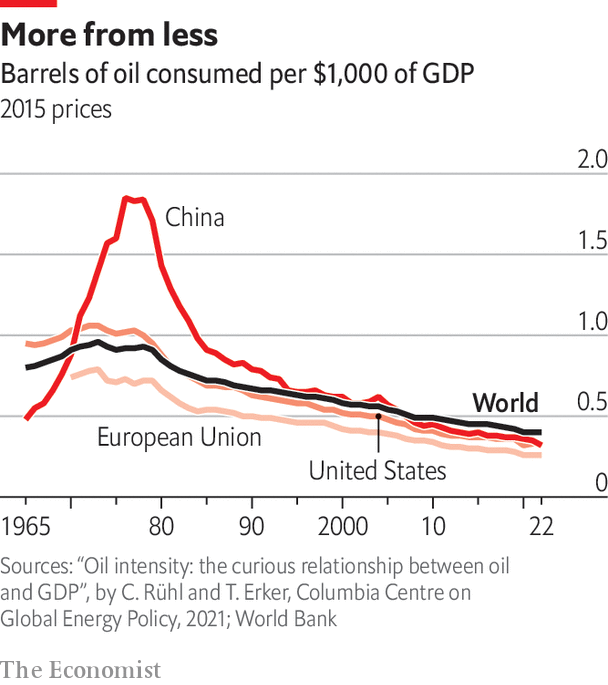
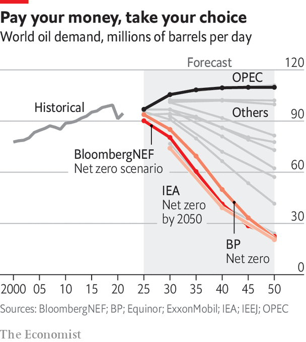

###### Demand

# The end of oil, then and now 

##### It is possible to cut oil demand. That does not mean it is easy, or will be done well 

 

> Mar 11th 2024 

IN 1977 JIMMY CARTER told the American people it was time for “an unpleasant talk” about the energy crisis. The off-putting subject matter—the greatest peacetime “threat our country will face in our lifetimes”—was not just the need to import more oil at higher prices than almost ever before as a result of America’s falling domestic oil production. It was the idea that America’s falling production was a harbinger of reserves running out everywhere. It was time to think of a world without oil. 

His belief in a fundamental constraint proved wrong both globally and within the United States. Increased production from Alaska’s North Slope, made possible by the trans-Alaska pipeline system which the federal government had approved in response to the shock of 1973, saw a moderate bounce-back in American production in the years that followed. Another government measure taken in response to the embargo—in 1977 a Department of Energy project in Colorado demonstrated the feasibility of “massive hydraulic fracturing” as a way of releasing hydrocarbons from shales—would in the long run have an even greater impact.

But if Mr Carter’s long-term view was wrong, the mixture of policy and innovation that he championed still had a big effect over the decade which followed. And it is also central to today’s attempts to bring about a world without oil by design, rather than stumble into one catastrophically.

The approach was based on two proven ways to reduce dependence on a fuel: use a different source of energy in its place; or improve the efficiency with which the fuel is used. Faced with much more expensive oil, utilities in America and elsewhere in the developed world took the substitution route and gave up on the fuel as a way of making electricity. In some places, such as France, Japan and Sweden, government-controlled utilities switched to nuclear power instead. In America the market-driven response was to switch to coal, in part because of ample supplies, in part because of the higher costs of nuclear energy. 

The American government took a more active role when it came to efficiency. Corporate Average Fuel Economy (CAFE) standards were mandated by Congress in 1975. When they came into force in 1978 they required an average fuel efficiency of 18 miles per gallon (13 litres per 100km) across carmakers’ product lines; by 1985 that was up to 27.5mpg. There were other efficiency programmes, too. And consumers economised off their own bat. 

Efficiency sufficiency

All told, American oil consumption fell by 17% from 1977 to 1985, even as the country’s GDP rose by 27%. Coupled with similar responses elsewhere this led to a glut that almost destroyed OPEC by heightening the fundamental tension within any such cartel. In the long run the cartel as a whole stood to gain if its members limited production enough to raise prices; in the short run each member had an incentive to try and circumvent such limits. 

As the swing producer, Saudi Arabia had the job of matching supply to demand. In 1985 it became sufficiently fed up with reducing its own output to try and constrain supply while other OPEC members broke their quotas that it turned on the taps. The oil price fell like a stone. With the exception of a spike when Iraq invaded Kuwait in 1990 it remained at its lowest post-1973 levels until the second half of the 1990s. 

The response to the oil shocks was thus an example of the oldest adage in the oil market, that high prices are the cure for high prices. What followed in the late 1980s and 1990s was an example of a less storied corollary: low oil prices erode policies designed to lower oil consumption. In a world of cheap oil, measures aimed specifically at increasing the efficiency of its use fell by the wayside. In 2005 the total-fleet CAFE standards for American cars were the same as they had been in 1985. 

 


But even without active encouragement one crucial measure of efficiency continued to improve long after oil prices took their downward slide: the amount of oil it takes to produce a given amount of economic output (see chart). Research on the oil intensity of GDP conducted by Christof Rühl of CGEP and Tit Erker of the Abu Dhabi Investment Authority shows that from 1984 to 2019 the fraction of a barrel of oil required to produce $1,000 of income (at 2015 prices) fell by almost exactly 1% a year.

This does not mean less oil was used. It is possible to use something more efficiently and also to increase the amount you are using. Indeed, using something more efficiently can help drive such increases, because it raises the value of what you can do with the stuff. But lowered oil intensity does show that economic growth is not tightly coupled to oil use, which is an important proof of principle for decarbonisation. And because it happened without significant interventions, it suggests that with the right policies the trend could be steepened. 

On a beautiful summer day last year, dozens of energy ministers, company bosses and international policymakers gathered at a conference a stone’s throw from the palace of Versailles for an energy-efficiency summit hosted by the IEA. Fatih Birol, the agency’s executive director, was keen to tell them that the adoption of energy-efficiency measures was both necessary and achievable. Countries representing some 70% of the global economy, he said, introduced efficiency policies in 2022. And that year’s rate of improvement turned out to be much higher than the historical average. Later in 2023 many of the nations attending COP28 in Dubai signed a renewables and energy-efficiency pledge which committed them to doubling the average rate of energy-efficiency improvements over the rest of the decade from the current 2% a year to over 4% a year. 

These measures are aimed at energy efficiency in general. For oil, in particular, there is also a new interest in substitution. For the first time since electricity utilities abandoned it in the 1970s and 1980s, a large oil-consuming industry has a new alternative. 

In 2016 annual worldwide sales of electric vehicles (EVs) were still below 1m. In 2022 they surged past the 10m mark. In 2023 sales of EVs and plug-in hybrids reached almost 14m. This growth, originally driven by subsidies (though good engineering helped), is getting close to self-sustaining as economies of scale drive down prices. With evs making up more than 10% of new-car sales worldwide, it is now plausible to imagine scenarios in which oil demand begins dropping faster than it has grown.

 


Perhaps the most influential of these scenarios is from the “Net Zero by 2050” report the IEA published in 2021, which featured a scenario in which radical action reduced net emissions to zero by mid-century. It saw oil demand drop by more than a quarter by 2030 and by three-quarters by 2050. Scenarios similarly constrained by net-zero targets produced by BP and BloombergNEF, an energy-research firm, produce similar results (see chart).

Some forecasters assumed that demand would never fully recover from the 20m bpd drop experienced at the nadir of the covid-19 pandemic, that peak oil demand was in the past. The IEA’s original scenario fell at the first hurdle. But the agency maintains that even under today’s policies oil use will peak this decade, and with more aggressive policies it could fall by a quarter by 2030. 

Under Dr Birol the IEA is an openly partisan reasoner. It knows the world needs demand to drop fast if warming is to be kept anything like in check. Others reach different conclusions. Some see the potential of EVs as overblown. Yes, sales have been peppy, but their share of the fleet is still only 2% worldwide. What is more, cars last a long time these days. Ben Dell of Kimmeridge, an energy-investment firm, says that without policy interventions fleet turnover takes a couple of decades, with older petrol vehicles being sent to poorer countries rather than simply being scrapped. Rystad, an energy-research firm, notes that passenger vehicles account for not much more than a quarter of global oil demand. Other sectors like aviation and shipping, which lack competitive alternatives to petroleum, may see increased efficiency but are less amenable to outright substitution.

Such considerations allow OPEC, ExxonMobil and others with preconceptions unlike the IEA’s to imagine oil demand growing into the 2030s, and after that declining only slowly. Arjun Murti of Super-Spiked is truly bullish: Global oil demand is “on track to obliterate peak demand concerns fuelled by the IEA’s infamous ‘Net Zero by 2050’ report…The oil industry is nowhere near being in its sunset phase.” Daniel Yergin, a Pulitzer-prize-winning chronicler of oil’s effects on the world as well as vice-chairman of S&amp;P Global, a financial-data firm, observes that “a quarter-century is a very short time to change a $100trn global economy.” 

That said, sometimes a long-marginalised technology can make a sudden and dramatic difference. Fracking did it for supply; is it impossible that something else will do it for demand? It used to be quite widely accepted that haulage would not fall to electrification in the way passenger vehicles seem likely to. Today that once-conventional wisdom seems much less of a sure thing. A sustainable substitute for jet fuel seems unlikely, but the right incentives could see a fair bit of shipping move to methanol instead of bunker fuel. And if technology is hard to predict, so is policy. Could intensifying climate impacts speed things up at some point? Or will voters reward politicians who slow things down?

It goes to show you never can tell

Such divergent views might seem like cause for despair. They are not, though, all that unusual. Forecasts of demand for oil are frequently all over the place. In “Energy at the Crossroads” (2005) Vaclav Smil, a polymathic Canadian professor who wields what may be the most influential pocket calculator in the world, forswears all attempts at forecasting. Among his justifications are the forecasts he himself and others made at an IEA meeting in 1983. As ever the predictions ranged widely; yet in a number of cases the whole range ended up missing the mark. One of the all-too-high cases was oil demand in 2000; the experts had underappreciated the improvements in efficiency that were already under way. “The only small consolation that I can draw”, Dr Smil says about that particular set of predictions, “is that my…forecast was less ridiculous than that of the World Bank’s chief economist.”


And back then oil demand was still concentrated in a relatively small number of developed economies. This century, as the latest of the  produced by BP points out, has seen a “shift in the centre of gravity of global oil markets”. In all three of its scenarios the developing-world share of global demand, 55% in 2021, reaches 70% in 2050, and the factors influencing its oil-relevant policies vary greatly from economy to economy. China remains a huge consumer, but becomes less important with time as a marginal buyer. Its very aggressive electrification means its demand could soon start dropping. By 2030 it will be India which contributes most to global demand growth; consumption in Africa and South-East Asia is set to follow fast.

The sheer range of scenarios ensures that most of them are not accurate. Indeed, it is quite possible that uncertainty will remain not just high, but become even higher than it has been in the past. When it comes to increasing supply, the oil industry has a fairly good sense of what is possible at what price. The only time since the 1980s when demand consistently pushed prices up in spite of this was during the unprecedented rise of China. Patrick Pouyanné, the CEO of France’s TotalEnergies, recalls how that ended the doldrums of the 1990s: “The lesson is that we are quite good planning the supply but always wrong on demand.” 

If the oil market is tight, changes in policy by big consumers could roil it. Jason Bordoff worries that a “jagged” energy transition might see new instabilities driven by policies affecting demand. “Could policy in consuming economies be a source of instability and policy shocks, both with climate policies and how clean energy is deployed?” he asks. It is hard not to answer “Yes”. ■

