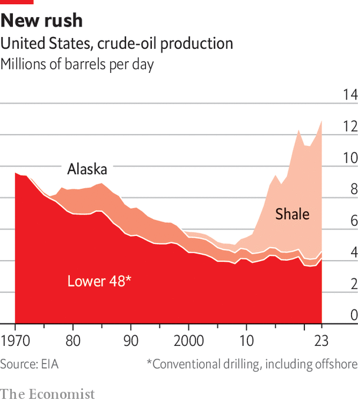

###### A changing market

# Why oil supply shocks are not like the 1970s any more 

##### America has a lot of oil now, and the global energy market is more robust 

 

> Mar 11th 2024 


IN January 2022 Brent crude, the benchmark against which the majority of crude oil is priced, soared above $87 per barrel for the first time since 2014. By early March, after Russia’s invasion of Ukraine, the price had jumped another 50%. The markets were afraid that sanctions on Russia, one of the world’s three largest oil producers, would sharply reduce worldwide supply. 

Governments were worried about gas, too; if Russia turned off the taps what would happen to the European economies reliant on the stuff? The “World Energy Outlook” published that autumn by the IEA, an intergovernmental organisation which brings together big energy-consuming countries, proclaimed that the invasion’s impact on oil and gas markets had brought about the world’s “first truly global energy crisis, with impacts that will be felt for years to come”. The shock of 1973 (which had, among other things, led to the creation of the IEA) was focused on oil alone and had its prompt effects in developed countries. The post-February 2022 energy crunch was felt more widely more quickly. 

But if more of the world was vulnerable than it had been in the 1970s, the energy system was also more robust. In response to the shock of 1973 consumer nations set up petroleum reserves, co-ordinated by the IEA, with which they could counter sudden supply shocks. March and April of 2022 saw the largest-ever releases from those reserves, including major withdrawals from America’s Strategic Petroleum Reserve (spr). 

Opening reserves offers some respite; America’s treasury department calculated that the withdrawals from the spr in the first part of 2022 lowered petrol prices at the pump by between 17 and 42 cents a gallon. But it is necessarily a short-term response. A greater source of resilience was the market itself. In the 1970s the oil market was a brittle, secretive enterprise. Over the decades which followed it grew into a sophisticated and largely transparent market worth over $2trn—bigger than the markets for the next ten commodities combined. 

Edward Morse, who until recently ran commodities research at Citigroup, a bank, says the development of new ways of trading contracts and futures has, along with a much more liquid market, come to “provide an alternative world to the beggar-thy-neighbour approach that lay at the core of the Arab boycott and which has characterised opec politics since”. As a senior figure at a trading house puts it: “We now have a much more global, interconnected system that responds to price. If an arbitrage opens up in crude or products…you’ll see it happen.” With Russia’s export markets restricted, in practice, to China, India and Turkey, the market adapted to the new realities.

This did not just mean the efficient reallocation of supplies from countries other than Russia. It also meant that the sanctions were not as effective as those imposing them had hoped. Saad Rahim, chief economist of Trafigura, a commodities-trading goliath, points to the role played by middlemen in rerouting Russian oil away from its usual customers. Traders based in Dubai and Singapore have rejigged tanker fleets to send vast quantities of discounted oil through Indian refiners, changing established routes with astonishing agility. 

Badr Jafar, head of Crescent Group, a firm with natural-gas operations in Iraq and Egypt, says the world may see a big rise in “grey-zone trading” of sanctioned crude, often through smaller trading companies. He says the lack of “secondary sanctions on Russia that would actually stifle this trend” shows a tolerance from the West, “perhaps to prevent too much price growth”. The success in getting Russian oil to market may see more grey-zone trading from countries like Venezuela and Iran, too. 

Even when sanctions leak they still have an effect on the price the sanctioned country can get, and thus its income. And they erode future capacity. Sanctions aimed at stopping oil companies from getting the technology they need have holes of their own, but they still have an effect. Arjun Murti, a veteran market-watcher who writes about energy at a site called “Super-Spiked”, says Iraq, Iran, Libya and Venezuela have never fully recovered the production levels they had before America sanctioned them. Some in the industry are impressed by how well Russia’s resourceful oil sector has kept production going in the face of such sanctions; it remains to be seen, though, how long it can do so. 

Give me a shale play and a place to stand...

And then there was a third factor. Over the course of the 1980s and 1990s a small number of American entrepreneurs pursued an apparently quixotic interest in using high-pressure water laced with chemicals and grit to break up recalcitrant rocks. They believed that this hydraulic fracturing, or “fracking”, an approach which had been the subject of government research in the 1970s, might get gas out of rocks that were too “tight” to yield it up under normal conditions. They were right. In the early 2000s fracking, coupled with advances in horizontal drilling, saw previously untappable shales produce gas in abundance. 

Sometimes, in the oil business, geopolitics drives technology, as when the closing of the Suez canal in 1956 brought the supertanker into being. On other occasions new technology drives geopolitics. That is what has happened with fracking. 

 


Shale-gas production quickly rose to the point where the American market was glutted. Liquefied natural gas (LNG) terminals originally intended for imports were thus reconceived as a way for shale-gas producers to access the higher prices offered on world markets. Between 2016, when the first American export terminal opened, and 2022 the volume of the world’s LNG trade rose by 56%. Further growth in American lng exports should see the trade overtake pipelines to become the main modality for cross-border natural-gas sales. 

Because of this, the winter of 2022-23 was nothing like as bad for Russian-gas-deprived Europe as had been feared. The continent reduced demand through various measures and increased LNG imports by more than 50m tonnes, or 66%. Some 44% of that came from America, with customers in Asia selling their contracts to customers in Europe as the ships involved were at sea, re-routing the flow almost in real time. The spike during that period in LNG prices around the world, a serious blow not just to poor and natural-gas-dependent countries such as Bangladesh and Pakistan but also to middle-income countries such as India and Brazil, was part of what the IEA had in mind when signalling the global nature of the crisis.

The blunting of Russia’s gas weapon is just one of the ways in which America’s new drilling technologies changed the world. The fracking which worked for gas also worked, , for oil. Between 2005 and 2015 petroleum production in America rose from 8m bpd to 15m bpd and the country’s oil imports fell from 14m bpd (an all-time peak) to 9m bpd. Having lost its long-held crown as the world’s largest oil producer in the 1970s, falling first behind the Soviet Union and then Saudi Arabia, in 2018 America regained it. It is now not just the world’s largest producer and consumer of both oil and gas but a net exporter of them, too. 

This does not mean America has complete sway over the energy world. In oil it is a price-taker, not a price-maker; its shale sector cannot ramp production up and down in the way that Saudi Arabia can. But it does mean that the world’s most powerful country no longer faces crippling worries about energy security. In the future protracted high prices will see the shale sector expand. 

...and I will move the world

The geopolitical implications go beyond keeping Europe warm. America’s lessened imports meant its worries about the flow of oil from the Gulf, a constant from 1973 through the Gulf war of 1991 and into the 2000s, began to wane. They also made it possible for more of the Gulf’s oil to flow east. In the 2000s China’s economy was growing at an unprecedented rate, and with it the country’s thirst for oil. The addition of America’s shale oil to the global supply thus came at an opportune moment. “US-China competition for resources…seemed inevitable in the mid-2000s”, says Meghan O’Sullivan, director of the Belfer Centre at Harvard’s Kennedy School of Government. But despite the fact that China’s demand drove prices up, that competition did not become the flash point many feared, she says, because “energy was abundant”. In 2013, the year after Xi Jinping took power, China overtook America to become the world’s largest crude-oil importer. 

With China’s rise becoming the paramount geopolitical factor of the age, America’s response was a “pivot” to East Asia—and thus away from the Middle East. That change in focus was put on clear display when, on September 14th 2019, two oil-processing hubs owned by Saudi Aramco, the country’s national oil company, were crippled by missile and drone attacks staged, at least in part, by Iranian-backed Houthi rebels in Yemen. Aramco’s production fell by 5.7m bpd. 

In 1990 a fall in production of 5m bpd caused by the Iraqi invasion of Kuwait saw prices spike to a once-in-a-decade high—followed, six months later, by an American-led war. In 2019 America offered a token increase in the number of troops it had in the Gulf and some upgrades to their kit. If attacks on Saudi assets had continued or threatened stability, much more would surely have been done. But the American response, or lack of it, was keenly felt. “Abqaiq got attacked and the United States didn’t raise a finger,” says Jason Bordoff of Columbia; it marked a turning point. 

Yet the change in America’s priorities is hardly abandonment. And if it has created even a partial void, it is not one others are keen to fill. The increased role Asian economies play in the Gulf is plain for all to see. Chinese state enterprises are the leading investors in Iraq’s oil sector and have invested in one of the biggest Saudi refineries. Chinese solar firms have made inroads into the uae. On a state visit to the uae in July 2023 Narendra Modi, India’s prime minister, persuaded his hosts to start trade settlement in local currencies, not the dollar. 

These economic ties do not, however, mean that Asian countries are keen to take on a role in ensuring the region’s stability. Robin Mills of Qamar Energy, an advisory firm in Dubai, says relations between China and the Middle East are broad but shallow, with little attention paid to security. The deal normalising relations between Saudi Arabia and Iran that China brokered in 2023 suggests deeper engagement is possible, but it is likely to be slow. 

The current turmoil in the region makes the case. For all its attempted pivot, America remains deeply involved and implicated in the conflict which began with the Hamas atrocities of October 7th. Asia’s major oil consumers are not. They do not share America’s interest in containing Iran, which in 2023 sold more than 90% of its crude to China. Few are committed to the support of Israel, or to backing America’s effort to keep the Red Sea safe from the attacks Houthis are launching in support of Hamas.

Things would doubtless be different if it were transit out of the Gulf, rather than through the Red Sea, which was at risk. Something like a fifth of the world’s oil flows through the Strait of Hormuz at the mouth of the Gulf. Since 1980 America has been committed to opposing outside influences in the Gulf, including by force of arms if necessary; assuring free passage through the strait is at the heart of that “Carter doctrine”.

Despite its shale-oil wealth America still has a clear interest in staving off the shock to the world economy, not to mention the blow to its own prestige, which would ensue if the strait were closed. And Iran has every reason not to jeopardise the 1m bpd that it exports to China through the strait. It would take a big shift to change things. But that big shift is not unthinkable. If China mounted a blockade of Taiwan, or invaded it, America’s response might include attempts to try and shut off China’s supply of oil at the Strait of Hormuz or the Strait of Malacca, between Malaysia and Indonesia. It would be one of the many ways in which such a conflict could prove disastrous for the world economy.

Absent such greater global conflict, turmoil in the Middle East seems no longer enough, in itself, to roil oil markets which are sophisticated and global, and in which America can operate with the confidence of a major producer. The rise of LNG further stabilises the energy picture. But there are two caveats. 

One is that climate politics might see countries try to restrict supply. It would be a hard task. To shut down another country’s fuel exports is both hostile and difficult, as Russia’s ability to keep exporting oil shows. To shut down your own exports penalises domestic industry and, in a world with large and liquid markets, is unlikely to do much to lower overall emissions. 

Take the “temporary pause” in the granting of permits for new American LNG terminals which the Biden administration announced in January, citing the need to better understand the climate impact of increased gas exports. The pause is widely seen as a move to placate young voters for whom climate is a big issue and to whom the idea that America can at the same time be a leader on climate and the world’s biggest oil and gas producer makes no sense. It will certainly not stand if Mr Biden loses the election. 

Nor is it clear what an audit of the net climate effects would show. To the extent that less growth in American LNG exports is not simply offset by more from Qatar and Australia, consumers who might otherwise have used LNG might be tempted back to coal. In America natural gas kept cheap by being shut off from the world market might displace renewables. 

The other caveat is that, for the moment, the oil market is quite slack. Though demand is at an all-time high, it is not as high as it might have been, in part because of China’s economic woes. Stocks are robust, and the countries of opec have spare capacity. 

Were the market to tighten, though, supply-side signals would then take on new meaning. And how tight the market ends up depends not just on demand but also, crucially, on what producers expected demand to be today when they made their investments yesterday. When it comes to the prediction of demand, concerns about climate change have a much bigger role. ■

