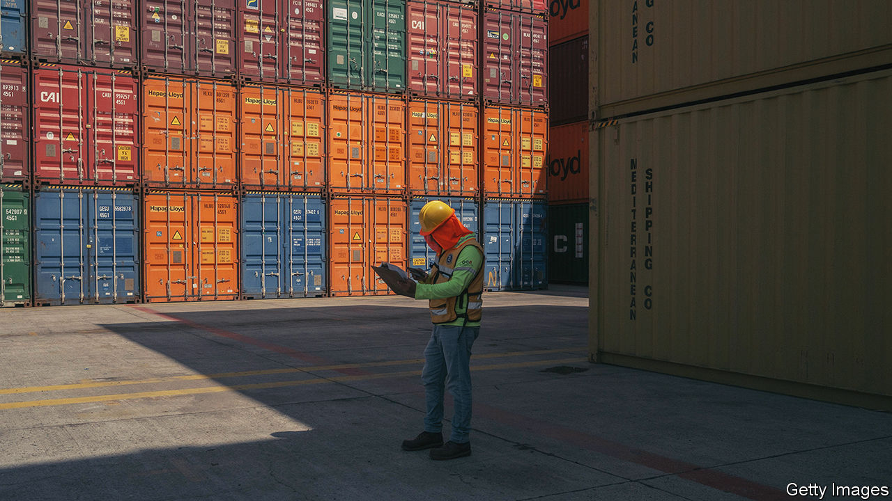
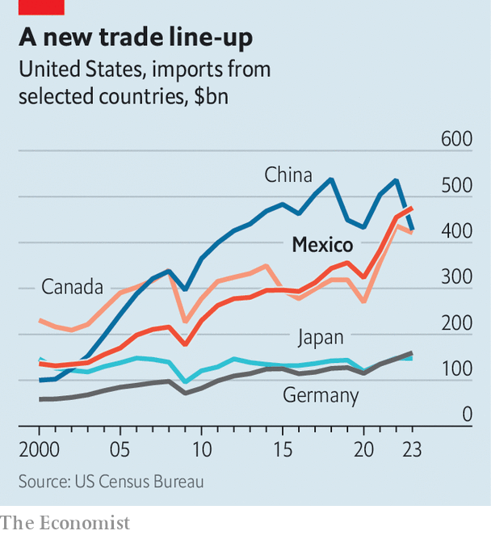
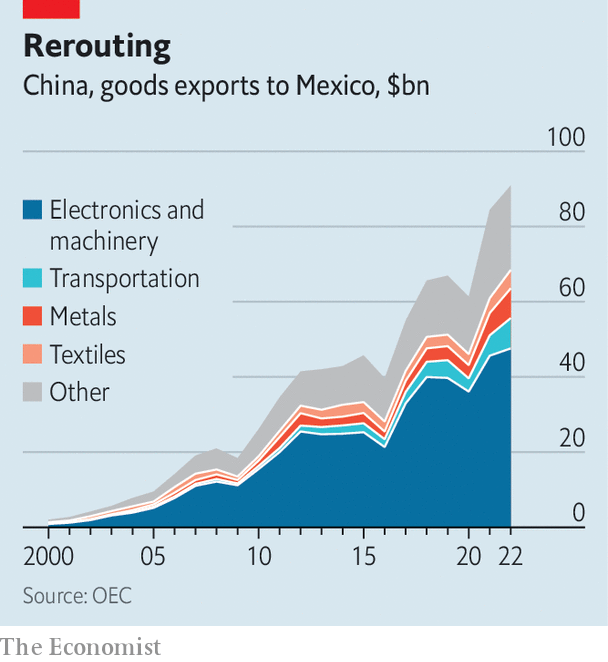

###### The China-Mexico-US triangle

# Could there be a US-Mexico trade war? 

##### The bilateral trade deficit has exploded since Donald Trump was president 

 

> Mar 12th 2024 

Mexican and US officials were cheered by trade data released in February. It showed that Mexico overtook China in 2023 to become the number-one exporter to the United States (see chart). The value of goods sold has been rising steadily, and reached almost $476bn for the year; the equivalent figure for Chinese goods fell sharply, from $536bn in 2022 to $427bn in 2023. 

The last time Mexico overtook China, in 2002, it was a blip (and Canada held the top spot). Today its rise has the whiff of a new order for global trade. Data for January 2024 show the trend remains strong. United States’ efforts to decouple from China and bring supply chains closer to home are intensifying, pushing trade through other countries. An updated free-trade agreement between the United States, Mexico and Canada, known as USMCA, has been in force since 2020. It supports Mexican exports of car parts, medical supplies and agricultural products to the United States.

 


But the third side of this trade triangle, between Mexico and China, is creating tension. China’s firms did not sit idle while incentives were created for companies to look beyond its shores. They have been pushing into the same markets where the US aims to supplant China, including Mexico. This means many Chinese exports are simply taking “a slightly longer road to get to the same place”, says Ana Gutiérrez of IMCO, a think-tank in Mexico City. 

China appears to be promoting this strategy. In December the country’s leaders said it was a priority to export products that are used to make finished goods, rather than the finished goods themselves. Mexico is an attractive beachhead into the United States because USMCA gives tariff-free access for goods made with enough North American content.

Mexico’s official customs data show no sustained influx of goods from China. But some US officials and industrialists believe Chinese inflows are being undercounted, whether deliberately or not. The suspicion is that Mexico turns a blind eye to imports from China, and that those are then re-exported to the United States. 

 


Steel and aluminium are the main concern. In February Katherine Tai, the United States Trade Representative (USTR), noted a “lack of transparency regarding Mexico’s steel and aluminium imports from third countries”. In December Mexico imposed tariffs of up to 80% on some steel imports from China, but US officials remain frustrated. Setting tariff levels is one thing; actually enforcing them is another.

“What we’ve seen is that USMCA has really become a US, China and Mexico deal, where China is trans-shipping a lot of product through Mexico,” says Jeff Ferry of the Coalition for a Prosperous America, a group that represents manufacturers.

Electric vehicles are a looming concern. The price of the average EV in China is roughly half that in the United States, and China produces more than half the world’s output. Without hefty tariffs in place, Chinese EV sales in the United States would probably boom, much as they have in other countries. President Joe Biden’s administration is mulling raising tariffs on the vehicles above their current level of 25%.

USMCA has rules against unfair subsidies and market practices, which are common among Chinese companies. But in many cases no law or rule is being breached. Mexico offers Chinese automakers a path around the tariff wall because USMCA’s rules of origin contain what one US official calls “loopholes” that allow for the integration of Chinese components. An importer can assemble Chinese components in Mexico and label Mexico as the country of origin, obscuring Chinese involvement. “New tools may be needed,” says the official.

There is already a large car-manufacturing industry in Mexico, and Chinese money is pouring in, especially to northern states that are the biggest exporters to the United States. In February BYD, China’s most successful EV manufacturer, said it would make 150,000 vehicles a year in Mexico. BYD says that production will serve the local market, but many companies are eyeing the larger, wealthier market north of the border. 

Chinese foreign direct investment in Mexico hit $2.5bn in 2022. Margaret Myers, of the Inter-American Dialogue, a think-tank in Washington, notes the “remarkable growth” of sophisticated manufacturing by Chinese companies in Mexico. 

No China in the chain

What might the United States do about this? In the case of steel and aluminium imports, it could copy its approach with the EU and Japan, where there are limits on the volumes that can be imported at lower tariff rates. Higher tariffs kick in after those limits have been reached. When the Trump administration lifted steel and aluminium tariffs on Mexico in 2019, it was on the condition that Mexico restrain export surges into the United States.

Electric vehicles are trickier. Some would like new rules to cut China out of supply chains entirely. “If you want to be a trading partner with the United States, we’re not going to allow your country to be a stopping point for goods from China,” says Mr Ferry. That would mean restrictive rules of origin and a tighter enforcement regime. It would also raise thorny questions about how to treat production by Chinese-owned factories in Mexico.

Robert Lighthizer, who was the lead trade negotiator during Donald Trump’s presidency, has said that a first step would be to strip China of its most-favoured-nation status. That would automatically ratchet up tariffs on Chinese products across the board. Enrique Dussel of UNAM, a university in Mexico City, says this would unmoor the world trade system. “The United States [would be] saying ‘adopt my rules or you’re against me’.”

If Mr Trump wins in November, he is likely to adopt a harder stance toward Mexico. As well as Chinese trade, there is also the issue of migration. But perhaps most importantly Mr Trump loathes trade imbalances. The United States’ trade deficit with Mexico rose to $152bn in 2023, up 17% from 2022. In 2026 Mexico and the United States, along with Canada, have to discuss whether to extend USMCA’s validity by another 16 years, to expire in 2052 instead of 2036. Mr Trump signed USMCA, but that is no guarantee that he would not scrap it, or use its extension as leverage to extract concessions from Mexico. He has already talked of a 10% import tariff on goods from all countries, which is not possible for Mexico and Canada under USMCA’s rules.

Mexico seems unprepared, says Mr Dussel. Claudia Sheinbaum, who is expected to be elected Mexico’s next president in elections on June 2nd, is promoting “nearshoring” to raise Mexico’s economic growth to 5% of GDP annually. “Mexico has an enormous sign reading ‘Welcome China’,” says Mr Dussel.

The question confronting Mexico is the extent to which it is willing to risk its vital relationship with the United States, to keep that welcome sign shining.■


