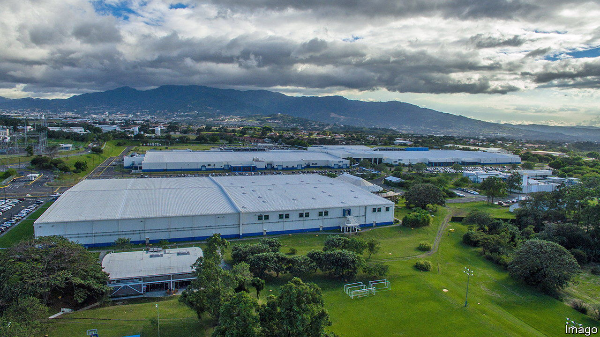

###### A tempting package

# Mexico and Brazil dither as chip supply chains are reforged 

##### American efforts to reduce reliance on Asia for semiconductors present an opportunity 

 

> Mar 14th 2024 

Latin America is famous for many things, from magical realism to the Amazon rainforest. Semiconductor manufacturing is not one of them. But that could be changing. In July last year the United States and Costa Rica announced they would work together to “diversify and grow the global semiconductor ecosystem”. Days later the US unveiled a similar partnership with Panama. Intel, a US chip manufacturer, then said it would invest $1.2bn in Costa Rica over two years. Mexico and Brazil, the region’s biggest economies, claim to have ambitions in silicon.

Growing Latin American interest in chipmaking is driven by US attempts to loosen Asia’s grip on the business. About 75% of the world’s chips are made in Japan, South Korea, China or Taiwan. This irks US policymakers, partly because they covet manufacturing jobs for discontented blue-collar workers, and partly because they worry about relying on countries within China’s potential sphere of influence for products as vital as chips. The protectionism these concerns have prompted may well end up boosting Latin America.

To see why, consider how chips are made. First they must be designed. Silicon Valley dominates this bit of the business, through companies like Apple, Nvidia and AMD. The second phase sees those designs etched into silicon wafers, creating electrical circuits which do the mathematics that draw Instagram feeds on phone screens, or manage the batteries of electric vehicles. Here, Asian countries dominate. During the final phase chips are assembled together into an electronic component, wrapped in protective casing, and tested to ensure that they work.

The US government is doling out billions in subsidies to entice chip companies to set up manufacturing facilities on its soil. As of last August, those blandishments had attracted $166bn in capital investment. But assembly, testing and packaging (ATP) is too labour-intensive to be profitable in the high-wage US economy. Making chips in Texas and Arizona only partially solves the problem of Asian reliance if they must still be shipped across the Pacific before they are used. More than 95% of ATP facilities are located in Asia. China alone holds 28% of the market.

This is where Latin America can help, and be helped. Relatively low wages make ATP investments viable; shared time zones make co-ordination with United States firms easier. Even a sliver of an industry projected to be worth $1tn a year by 2030 would be a boon to struggling economies. True, most of the value in the chip industry is in design and fabrication. But as chipmaking becomes ever more expensive, firms are turning to more advanced ATP to keep seeking out improvements. Asian economies found it to be a good way to climb the value chain. Replicating the success of South Korea and Taiwan is unlikely, but countries with no chip industry must start somewhere.

Intel’s ATP facility in Costa Rica now employs some 4,000 workers. Panama is working with Arizona State University to improve the skills of its semiconductor workforce. These developments are encouraging, but countries like Panama and Costa Rica “probably lack the scale for a major chip ecosystem”, notes Chris Miller, the author of , a book about the semiconductor industry. If chipmaking is to transform Latin America, bigger fish must get involved. 

But the big fish are floundering. Mexico has much to gain from the re-ordering of the semiconductor supply chain thanks to its free-trade agreement with the United States. It has a long history of assembling electronic components. Chipmakers should be piling in. They are not. 

One issue is that chipmaking consumes a lot of water, and Mexico is dangerously parched. Another is leadership. “In South-East Asia and India, there is high-level political support for semiconductor investments,” says Mr Miller. Lack of that in Mexico blunts the effectiveness of otherwise supportive policies. In October Mexico introduced tax breaks of up to 83% on some ATP investments. That was enticing to chip firms, but it did little to reduce uncertainty. Chipmakers are left to hope that Mexicans will elect a more chip-friendly president when they go to the polls in June. 

Brazil is also wishy-washy on semiconductors. Its officials, absurdly, talk up semiconductor “self-reliance”, impossible for any country, rather than trying to get a mere toehold in the supply chain. President Luiz Inácio Lula da Silva has spent nearly a year talking chips with China, with nothing to show for it thus far.

While he and other Latin American leaders dither, the coffers of ATP operations in Asia spill over. Intel and Infineon, a German chipmaker, are spending some $22bn to build new chip packaging facilities in Malaysia. Vietnam and India have also won big projects. “Latin America is missing a big opportunity,” says Mr Miller. “The window for action is closing rapidly.”■


