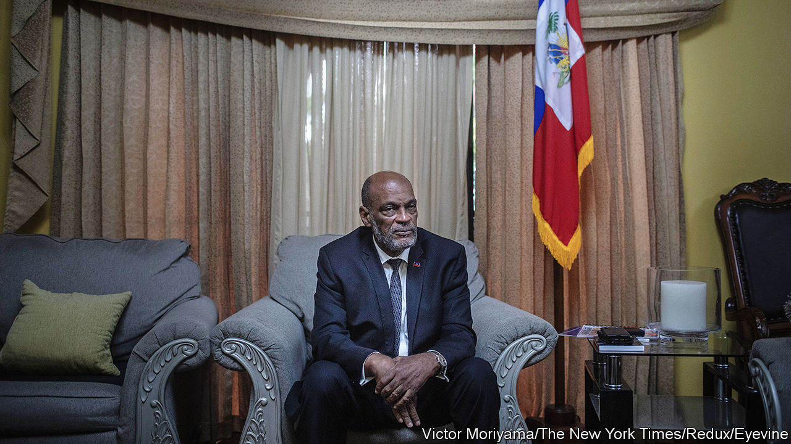

###### Infinite regress

# The struggle to free Haiti from violence and impotent governance 

##### Disagreements have already sprung up about who will manage the transition of power in the country 

 

> Mar 14th 2024 

Haitians have been demanding the resignation of Ariel Henry (pictured), their unelected prime minister, since almost the moment of his appointment in July 2021. On March 11th, under pressure from foreign government officials gathered at a summit in Jamaica, and with the gangs that control Port-au-Prince, the capital, blocking his return to Haiti, Mr Henry finally said he would stand aside. Stranded in Puerto Rico, he was reduced to delivering the message via a video posted on social media. 

Haitians celebrated in the streets, but their country needs rebuilding. A combination of gang violence and the contested legitimacy, impotence and unpopularity of successive governments has dogged Haiti’s 11.6m people for decades. The country has not a single elected official. Its legislature sits empty. Haiti has been in freefall since July 2021, when Jovenel Moïse, who was president at the time, was murdered. 

Mr Henry, who was appointed prime minister two days before the assassination, made things worse. He argued, with some good reason, that elections were not possible while Haiti was so insecure. But he also seemed keen to cling to power. His government’s impotence left a vacuum to be filled by the gangs. Even before they blockaded Mr Henry’s return, the UN reckoned they controlled 80% of the capital.

Mr Henry’s resignation is, in theory, the first step on the path to long-overdue elections. Leaders at the Jamaica summit proposed a “transitional presidential council” of nine members drawn from political factions, the private sector, civil society and religious groups. That council would appoint an interim prime minister, who would rule while elections are organised.

Yet, as is common in Haiti, squabbling started within hours of the announcement. Multiple factions have made a claim to power. The “National Awakening for the Sovereignty of Haiti”, a coalition, issued a statement saying that it was immediately installing a presidential council of three members in the National Palace. The coalition is led by Guy Philippe, a former senator who led an uprising in 2004 that ousted President Jean-Bertrand Aristide. Mr Philippe returned to Haiti last year after serving time in an American prison for laundering drug money.

He is not the only one with ambition. Jimmy Chérizier, a Haitian warlord better known as “Barbecue” who leads a group of gangs called G9, warned that decisions made outside the country would plunge Haiti into “further chaos”. He said that his group would “figure out how to get Haiti out of the misery it’s in now”. Both men are disqualified from sitting on the Jamaican summit’s version of the council: Mr Philippe for his criminal record and Mr Chérizier for being under UN sanctions. But refusing to give the gangs a seat at the table risks them overturning it. Politicians and political elites, who have long paid the gangs to do their bidding, may well use them to spoil an agreement they don’t like. 

This bodes ill for a transitional government, and for the UN-authorised security mission that is in the works. The Jamaican roadmap calls for the mission to go ahead. It bars anyone who opposes it from the transitional council. On March 11th the United States pledged an extra $100m to the cause, bringing its total donation to $300m. But troops are still in short supply. On March 12th Kenya, which has agreed to lead the mission, said that its deployment of 1,000 police officers cannot be sent until Haiti’s new government is in place. It seems unlikely that the Haitian police can maintain security until that happens. They are outmanned and often outgunned by the gangs, despite the United States’ assurances that it is supplying the police with equipment, resources and ammunition. 

The United States says polls indicate that “the vast majority” of Haitians support the Kenya-led security mission. But it faces resistance, not least because it was initially requested by Mr Henry. He was largely seen to be doing so to prop up his rule. The last mission, run by the UN between 2004 and 2017, inadvertently introduced cholera and became notorious for reports of sexual exploitation and abuse against Haitians. Haiti will turn into “a Somalia in the Caribbean” if the force arrives, reckons Georges Duperval, a 58-year-old entrepreneur in Port-au-Prince, who opposes it.

Many Haitians say they want to throw off the shackles not only of foreign powers but of the elite Haitians who, they say, do their bidding. Unsavoury as he is, support for Mr Philippe is strong in Port-au-Prince and some areas around it.

Meanwhile Mr Chérizier seems in no mood to lay down arms. “We are making a bloody revolution in the country because this system is an apartheid system, a wicked system,” he said this week. Many Haitians agree with this sentiment, says Mr Duperval. “From 2004 to today, elections have been controlled by the Haitian oligarchs,” he says. “Now the Haitian people’s eyes are open to this.”■


