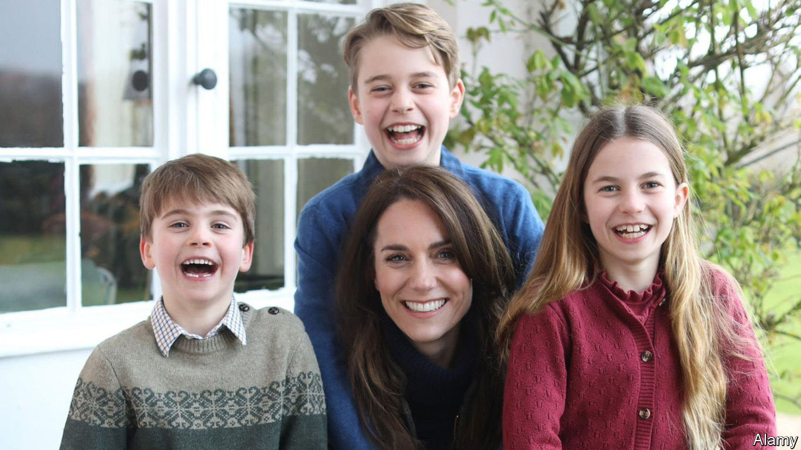
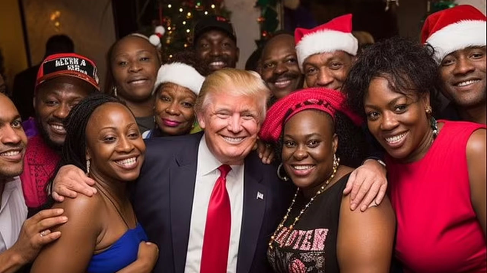
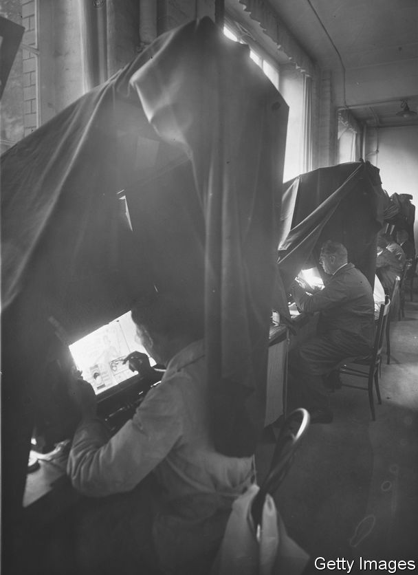
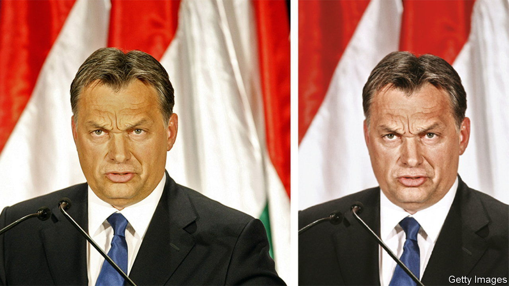
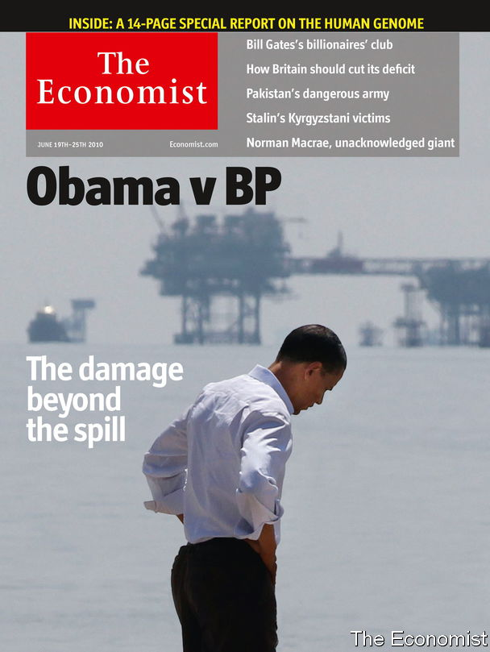

###### The Economist explains

# What is photo retouching and when is it permissible? 

##### The edited photo of Kate Middleton shows what a minefield it can be 

 

> Mar 13th 2024 

ON MARCH 10th Kensington Palace released a photograph of Catherine, Princess of Wales celebrating Mother’s Day with her three children. By the next day, after discovering that it had been edited, five photo agencies had pulled the picture from their wires. Princess Charlotte’s hair, sleeve and skirt seemed to have been tinkered with. The Princess of Wales apologised for the changes, which she says she made herself, characterising them as the experiment of an amateur photographer. There is no suggestion that they were intended to deceive the public.

In an age when artificial intelligence (AI) tools can be used to distort or generate images, such changes are coming under more scrutiny than ever. In recent weeks pictures of Taylor Swift at an American-football game have been altered to suggest, falsely, that she was brandishing pro-Trump banners. Images fabricated by AI appeared to show the former president with black Americans, a group he is trying to court. Such falsehoods are clearly unacceptable. When is photo retouching valid—and when does it go too far?

 


Even an untouched photograph is selective: the photographer controls the composition. But that is rarely the end of it: almost all photographs in newspapers and digital media have been subtly adjusted. Social-media users often make bigger changes. Smartphones with simple, free editing software have democratised the process.

First there is the crop. A photograph normally has a fixed ratio determined by the camera. But that shape can be altered when it is reproduced. When cropping a photograph important context can be lost, deliberately or inadvertently. 

 


Next there is retouching, which includes a variety of techniques. Newspapers have for decades tweaked pictures to ensure that they look true to life when reproduced. Such changes take into account the variations of paper stock and ink or the demands of screens. Retouchers of black-and-white photographs used a fine brush and white paint to add, for example, highlights to eyes or contrast to the line of a trouser. 

Today computers make almost anything possible. A mark caused by a hair on the lens or a speck of dust in the camera can be removed from an image. Overexposure, which washes out the subject, or an odd hue can be adjusted. That can sometimes lead to spurious criticism. In 2011 Hir TV, a Hungarian channel, accused  of portraying Viktor Orban, the country’s prime minister, unfavourably after we published a photograph of him cropped to fit the width of our print columns and edited to remove a yellow tint. 

 


News organisations are often criticised. In 2010, in the aftermath of the  oil spill,  published a cover showing President Barack Obama looking out on the Gulf of Mexico. The original picture showed two officials next to him: one was cropped out, and the image was edited to remove the other. The strap line—“The damage beyond the spill” —and the altered image presented Mr Obama as a lonely figure, without making it clear that the picture had been changed to make a point. 

 


Photo agencies, which most news organisations rely on for verified images, have strict standards about the changes they make to photos that appear on their wires. (They also require their clients to seek their permission and, in some cases, the permission of the subject before making serious changes to the picture.) Agencies do not run pictures that have been materially altered with image-editing software. They ban additions and deletions of subject matter, such as editing out a person. Cropping is allowed, so long as it does not remove important context. Most allow subtle lightening or darkening to improve the tonal balance of an image—but anything that hides an element of the subject is forbidden. Simple colour adjustments, to create a natural image, are usually fine, but manipulating colours—making a grey sky blue, for example—is not. Some agencies edit photographs to remove “red eye” caused by flash photography; others do not.

Picture agencies supply various industries, all of which have different standards. Fashion magazines are filled with edited images. Pores are blurred, blemishes removed and bodies slimmed. E-commerce sites often remove the backgrounds on product shots to give the prospective buyer a better view. Pictures that show the news are held to a different standard. Given AI’s increasing ability to create fake images, rigorous rules for genuine photographs are becoming all the more important. ■

