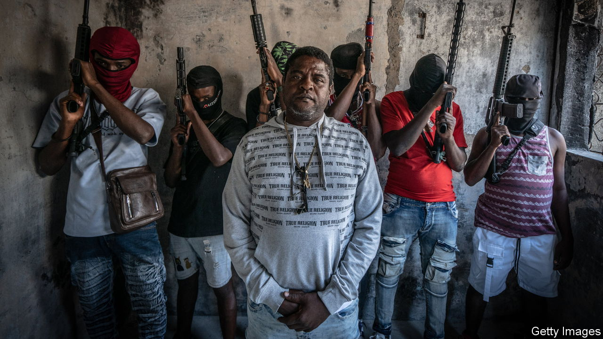

###### The Economist explains

# Who is Jimmy “Barbecue” Chérizier, Haiti’s most prominent gang leader? 

##### The warlord is one of the country’s most powerful men—for now 

 

> Mar 12th 2024 

IN THE DAYS since  took advantage of a trip abroad by Ariel Henry, the prime minister, to seize control of prisons and police stations, only one man seems to have authority. Jimmy “Barbecue” Chérizier, the country’s most prominent warlord, has been as present and vocal as Mr Henry has been absent and silent, stranded in Puerto Rico. On March 12th, after a meeting in Jamaica of leaders from Caribbean countries and officials from elsewhere, including Antony Blinken, the American secretary of state, Mr Chérizier achieved his stated aim: Mr Henry said he would resign as soon as a transitional government was in place. Who is the gang leader apparently calling the shots in Haiti? 

Mr Chérizier appears to have political ambitions. As foreign leaders discussed the contours of a transitional government, he warned that decisions made outside the country would plunge Haiti into “further chaos”. He claimed that his group would “figure out how to get Haiti out of the misery it’s in now”. 

Mr Chérizier himself plays a large role in Haiti’s misery. A former police officer in his 40s, he leads the G9, a group that began with nine gangs and has since expanded. He has controlled several neighbourhoods around Port-au-Prince, the capital, for years. The UN said that even before the latest rampage some 300 gangs controlled 80% of the capital. 

Mr Chérizier was allegedly allied with Jovenel Moïse, Haiti’s president, who was murdered in 2021. Pacts between gangs and politicians are common. Insight Crime, a regional reporting outfit, reported that Mr Chérizier’s gang got half its income from Moïse. But he has also profited from the vacuum left by the president’s death. The Haitian state has crumbled under Mr Henry, an unelected caretaker whom Mr Moïse appointed to be prime minister two days before his murder. Mr Henry has put off holding elections, blaming gang violence (not without justification). At present the country has no elected officials. Haitians had been calling for the prime minister to step down. 

By echoing their call, Mr Chérizier has portrayed himself as the champion of the people. He now paints himself as a revolutionary, a Robin Hood or Che Guevara for the Caribbean nation of 11.6m. The youngest of eight children, he grew up in a slum in Port-au-Prince. He says his father died when he was a child and that his mother sold fried chicken on the street to support the family. (That, he claims, is the origin of his nickname, “Barbecue”, not the belief that he has set enemies on fire.) Mr Chérizier joined the Haitian police, one of the few decent jobs in the desperately poor country.

But there the story takes a darker turn. The police expelled him in 2018 for alleged abuses, including taking part in a massacre at La Saline, a slum, in which at least 71 people died and 400 homes burned. Soon after he was taking part in gang-led massacres in Port-au-Prince; he has subsequently been involved in many more. In 2020 he founded the G9, which seemed to help prop up Mr Moïse, who was facing protests against his rule. Mr Chérizier faces sanctions imposed by both the United States and the UN. He has said that fighting with guns is necessary and that he is inspired by François Duvalier, also known as “Papa Doc”, a brutal dictator who ruled Haiti from 1957 to 1971. 

Once Mr Henry steps down, Mr Chérizier may have to deal with a transitional government and potentially the arrival of a security mission authorised by the UN and led by Kenya—although Kenyan leaders say it cannot be sent while there is no government in Haiti. On March 11th the United States, which hopes the force will restore some degree of order, promised to give it an extra $100m. It is hard to imagine Mr Chérizier retreating into the background.■

