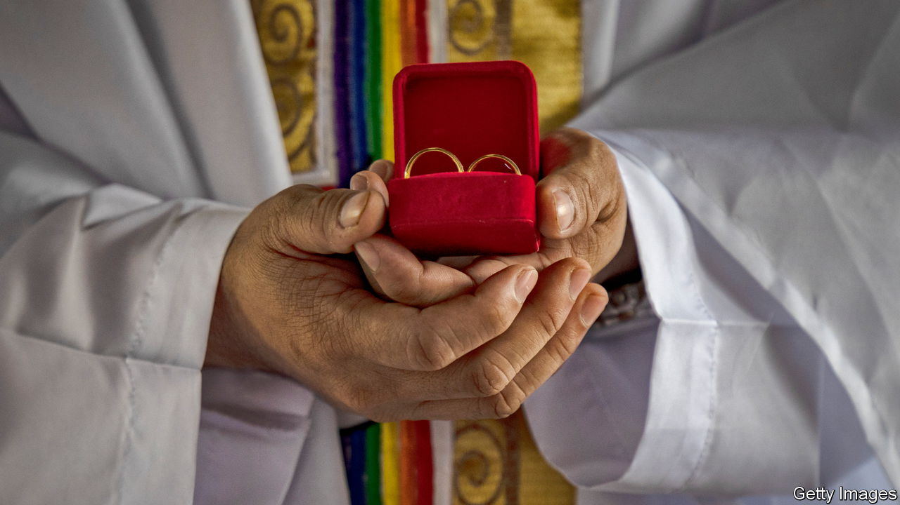

###### The Economist reads

# What to read to understand God and sex 

##### The Almighty has almighty problems with (some sorts of) it 

 

> Mar 14th 2024 

IMAGINE IT. You are an omnipotent, omniscient deity. You have created not only the world and everything in it but also the sky, the stars, the heavens and, for that matter, Tuesdays. So what do you spend your time worrying about? Well, to judge by many of today’s most heated ecclesiastical arguments, what men do with other men in their bedrooms. And (though much less often) what women do. 

It is a tricky time for Christianity. Many Catholics are vexed because Pope Francis has modernised the church’s attitude towards blessings for same-sex couples (though that word “modernised” should be read with caution: the change appeared in a document bearing the title “Fiducia Supplicans”, which itself clarified “Responsum ad dubium”). Many in the Anglican communion are similarly vexed thanks to the Archbishop of Canterbury’s willingness to allow the Church of England to bless same-sex partnerships. Talk of schism, heresy (and a sure sign of ecclesiastical outrage) earnest prayers for erring brethren are in the air.

So why is He thought to care so much about sex? It is a good question—and one that has baffled observers of Christianity for 2,000 years. Before He came along, European gods rarely cared about this stuff: the chief problem Greek and Roman deities had with sex was when they couldn’t get enough of it. When Christianity turned up, classical intellectuals were baffled by its “restless, shamelessly curious” new deity, a “nuisance”, they felt, who watched “man’s every act”—and then judged it. Surely a god had better things to do? As the subsequent millennia showed, He did not. Here are six books that help explain why. 

 By Catullus. Translated by Peter Whigham. ; 

To understand sex after Christianity, it is necessary to understand what sex was like before Christianity. Which is to say: it happened more or less everywhere, with everyone. Catullus’s sinewy, sensuous poems, often written to his lover , are a good place to start. Though equally you could choose the similarly sensuous poems of Sappho (the Greek poet from Lesbos, and the original lesbian); or Ovid’s “Art of Love”; or Martial’s “Epigrams”. Suffice it to say, the list is long. 

 By Augustine of Hippo. Translated by R. Pine-Coffin. 

This is one of the most famously racy books about early Catholicism. In other words, it is not very racy at all. It does however contain one of late antiquity’s most famous lines: “Grant me chastity…but not yet.” Happily for the reader (if not for , who frets about everything, from the fleshpots of Carthage to a trip to the bathhouse with his father) God seems to have granted both parts of the prayer. 

By Reza Aslan. 

“On earth as it is in heaven” runs the Christian prayer. Bunkum, says Reza Aslan in this engaging biography of God. The truth, argues Mr Aslan, an Iranian-American who converted to Christianity, then converted back to Islam, is much closer to the reverse: “In heaven, as it is on earth.” Humans create societies—then cook up heavens to match. Democratic societies had squabbling democratic heavens; autocratic societies had autocratic deities. This seems to be true of sexual politics, too. Vicars in south London think the heavens bless same-sex unions; conservative prelates in South Sudan doubt it. 

By Francesca Stavrakopoulou. 

Christians argue that God is sexless, bodiless, lustless. Nonsense, says , a British scholar of the Bible. On the contrary, if you read the Old Testament carefully it becomes clear that God was thought to have a massive body. Part two of Professor Stavrakopoulou’s book is simply called “Genitals”, and explains what God could do with them. It is safe to say that you will never look at a rainbow in the same way again. But then early Christians de-sexualised God, she writes, with profound results for Christian thought and society.

By David Brakke. 

Lust, as good Christians know, is one of the seven deadly sins. Except, as this magnificent book shows, the deadly sins were not always deadly sins; they were first imagined as demons—and originally there were eight (the eighth, “listlessness”, appositely dropped by the wayside). Here, David Brakke, an American historian of Christianity, explains how demonic fears shaped the fourth-century monkish mind—which went on to shape Europe. 

 By Peter Brown. 

Why not? That is the question on modern minds when they consider ancient ideas of sexual renunciation. Why not just have sex? The Bible is one reason. The good book is not fond of “fornicators”; it criticises even more harshly people who fornicate with others of the same sex (for example, in one interpretation, in the letters of St Paul). And, as Peter Brown points out in this sweeping book, there were good reasons for people in the ancient world to adopt this abstemious, censorious attitude: sex wasn’t fun for everyone, and its consequences were certainly often less than fun for women. Contraception was all but absent. A gynaecologist’s toolkit contained such devices as “the embryo-slaughterer” (a detail Professor Brown’s book does not mention.). For many people in antiquity a better question was: why have sex?

Also try

Here we reviewed a book that insists, unfashionably, that the West . These days the Anglican church debates not just sexual morality but also the question of . More than a decade ago our Erasmus columnist argued that  that was pertinent to troubled times. (The times are still troubled.) In the Middle East, where inspectors at airports , taboos about women’s sexuality remain strong. One of our Britain correspondents has written a . 

