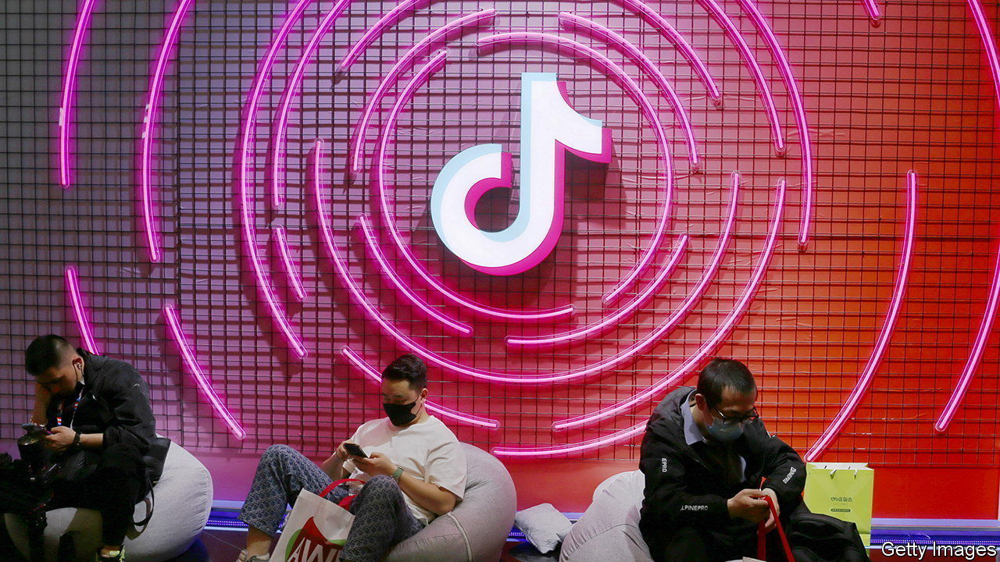
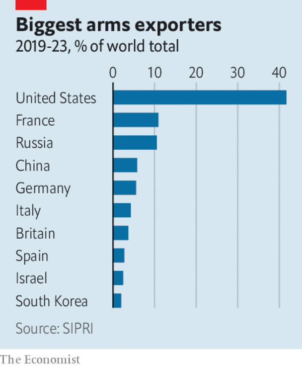

###### The world this week

# Business 

#####  

 

> Mar 14th 2024 

America’s House of Representatives passed a bill which would require ByteDance, the Chinese firm that owns , either to sell the platform or to stop operating in America, TikTok’s biggest market. The bill’s supporters worry that China could lean on TikTok to massage content to its liking. TikTok became popular with its quirky video clips, but has morphed into a big provider of factual media. A third of American adults under 30 use it to catch up on the news. The bill now goes to the Senate. 

All’s well that ends well

 was restored to the board at OpenAI. Mr Altman was sacked as chief executive by the previous board last November but swiftly reinstated in that job following a revolt by employees and investors. An independent review into those events has concluded that there was a “breakdown in the relationship and loss of trust” between the prior board and Mr Altman. 

 reported a net profit of $121bn for 2023, more than the combined profits of the West’s five biggest oil companies. Aramco increased its dividend pay-out to $98bn, a big source of income for the Saudi state, and promised even higher payments this year.

America’s annual rate of  rose slightly in February, to 3.2%. Separate data showed that American employers created 275,000  last month. Although that was more than expected, January’s red-hot figure of 353,000 new jobs was revised down to 229,000. Neither set of figures changed investors’ expectations that the Federal Reserve will start cutting interest rates in June. 

In the annual rate of inflation surged again, to 276% in February. But the month-on-month increase in prices slowed to 13%, from 21% in January. Javier Milei, the country’s president, has embarked on economic reforms that he acknowledges are painful. UNICEF has warned that 70% of Argentine children could be living in poverty. Meanwhile, the government rolled over $50bn-worth of debt that was to mature this year for securities that are due next year, the largest debt-swap in Argentina’s history. And the central bank cut its benchmark interest rate from 100% to 80%. 

 


France increased its share of the  market to 11% in 2019-23 from 7.2% in 2014-18, according to the Stockholm International Peace Research Institute. France gained by selling more weapons to countries such as India, the world’s biggest arms importer, taking some of Russia’s business. Russia’s share of the global market dropped to 11% from 21%. 

, a social-media platform, will float its shares in New York on March 21st, according to Bloomberg. Reddit hopes to raise nearly $750m, which could be one of the biggest IPOs so far this year. 

 said it would allow developers to sell apps in the European Union for download onto an iPhone without having to use its App Store. It is a big concession to European regulators; a new Digital Markets Act came into force this month. Developers will still have to comply with Apple’s stringent safety standards, and be a “member of good standing” in its developer programme for at least two years. 

One of China’s biggest smartphone-makers accelerated its move into the electric-vehicle business. is launching its SU7 sedan on March 28th, with the first deliveries taking place soon after. The car will be available only in China. It will join a crowded market; existing EV-makers have started another round of price cuts to entice buyers. 

 reported an annual net profit of HK$9.8bn ($1.25bn), its first since 2019 and its biggest since 2010. The Hong Kong airline lagged behind most other international carriers in returning to post-covid profitability because of the pandemic measures that the city lifted at only the end of 2022. It expects to return to providing 100% of its pre-pandemic flights in the first quarter of next year. 

By contrast,  posted its first annual net loss in 30 years. Sales in North America dropped by 16%, in part because of the “negative Yeezy impact”, according to the German sportswear company. Adidas cut its ties with Ye, formerly Kanye West, over his antisemitic remarks in 2022. But it has been selling off its inventory of Ye-branded products, which are still popular. 

Market demand

Britain’s Office of National Statistics updated the basket of goods and services that it uses to calculate inflation. Reflecting the changing , new additions include vinyl albums (“a record revival”, according to the normally humourless number-crunchers), air fryers (which are “cooking up a storm” in sales) and gluten-free bread. Out go such things as hand sanitisers, sofa beds and roasting tins. 

