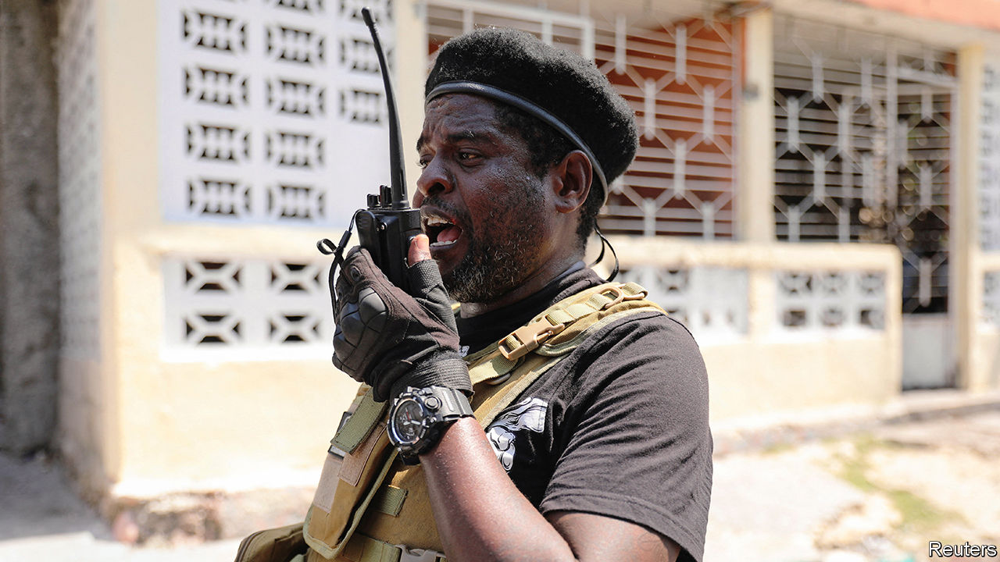
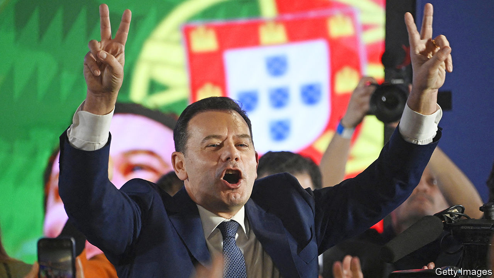

###### The world this week

# Politics 

#####  

 

> Mar 14th 2024 

Ariel Henry agreed to step down as prime minister of once a new governing council is in place. Mr Henry has been out of the country for several weeks. In his absence Haiti became even more chaotic, with armed gangs, who now wield the real power, roaming at will. Jimmy “Barbecue” Chérizier (above), a prominent gang leader, had called for Mr Henry to go. Earlier America evacuated most of its embassy staff from Port-au-Prince. 

The  government announced the arrest of another prominent opposition member. It claims that Emill Brandt Ulloa had taken part in violent protests and insulted an official. María Corina Machado, the main opposition leader, who has been banned from running in July’s presidential election, said Mr Brandt had been “kidnapped”.

A fox guarding the hen house

Juan Orlando Hernández, president of  from 2014 to 2022, was found guilty by a court in New York of trafficking cocaine. Mr Hernández’s election campaign promised to crack down on narcotic gangs. While he was in office Honduras received more than $50m from America towards his war on drugs. His wife is running for president in 2025.

and Hamas  that would have seen the release of some of the remaining hostages in  in exchange for a temporary ceasefire and the freeing of hundreds of Palestinian prisoners. Negotiators had hoped that an agreement could be finalised before the start of Ramadan, the Muslim month of fasting. Joe Biden suggested that an invasion of Rafah, the city in southern Gaza where many Palestinians are now sheltering, was a “red line” and seemed to imply that America could limit its supply of weapons if Israel crossed it.

Mr Biden announced that America will build a pier off the coast of Gaza to enable the delivery of far greater quantities of . Separately a boat bringing 180 tonnes of food left Cyprus. It is the first ship authorised to deliver aid to Gaza since Hamas took control of the coastal strip in 2007.

Almost 3m children in  are acutely malnourished and nearly 230,000 children, pregnant women and new mothers may die in the coming months without urgent aid, according to Save the Children. A civil war that erupted last April has caused the world’s biggest humanitarian crisis, with 8m Sudanese forced from their homes, according to the UN.

More than 300 pupils have been abducted from schools in  in recent weeks. In all more than 1,400 pupils have been kidnapped since 2014. 

Groups of fighters who are based in  but claim to be Russian said they had conducted raids across the border into  to draw Kremlin troops away from the front line. The fighters say they oppose Vladimir Putin—his government said it had repelled the assault. Russia also had to defend itself against a wave of Ukrainian drone attacks, some of which targeted oil refineries. 

Meanwhile the head of the Russian navy was reportedly sacked. Ukraine’s offensive against Russia’s  fleet has been highly effective. America thinks Ukraine has sunk 15 Russian ships over the past six months alone. 

Nevertheless, the head of the CIA and the director of US national intelligence said that Russia was gaining the upper hand in the , had increased its production of artillery shells and secured a supply of drones. The officials said that an American aid package to Ukraine, which is stalled in Congress, would enable it to hold the front line. 

 


 took a turn towards the right at a general election. The centre-right Democratic Alliance won the most seats in parliament but fell short of a majority. The Socialists lost 43 seats, pushing them into second place. Chega, a right-wing populist party formed in 2019, came third with 18% of the vote, giving it 48 deputies. Luís Montenegro, the DA’s leader, has said he will not ask Chega for help in forming a government. 

Geert Wilders conceded that he would not become prime minister of the  as talks continued to form a government, four months after an election. Mr Wilders’s far-right Party for Freedom (pvv) won the most seats in the poll and still wants to be part of a new right-wing coalition. 

Voters in  overwhelmingly rejected two amendments to the constitution on family and the role of women. The first amendment sought to change marriage as the basis on which a family is founded to one that includes “durable relationships”. The second wanted to scrap a reference to a woman providing care within the home. Opponents to both amendments maintained that the replacement wording to the constitution was confusing, and would have excluded non-family members in a new definition of “caregivers”. 

Emmanuel Macron said he supported a bill that would enshrine rights in law for people who want to die and for those who help them. The  president said the bill, which the national assembly will debate in May, would refer to “aid in dying”, rather than assisted suicide. 

England’s health service confirmed that it would no longer routinely prescribe following a review of a number of studies. It concluded that there was not enough evidence to allay safety concerns. It has decided that access to the blockers for children and young people with gender dysphoria should be available only in research programmes.

A move backwards

 Election Commission took the first legal step towards banning Move Forward, a reformist party that came first in last year’s election but was blocked from taking power by the royalist establishment. The commission bases its reasoning on a ruling by the Constitutional Court, which held that Move Forward’s aim of changing the country’s  laws, which forbid any criticism of the monarchy, was illegal. 

The government in  implemented a  that eases the path to citizenship for members of some religious minorities from neighbouring countries but excludes Muslims. Hindus, Sikhs, Christians and others who fled to India from Afghanistan, Bangladesh or Pakistan before 2015 will be granted citizenship. Rohingya Muslims from Myanmar, for example, cannot apply. The government denies that the law is discriminatory.

Joe Biden and Donald Trump both won enough  in the latest batch of primaries to secure their parties’ nomination for president. Mr Trump’s takeover of the  was formalised with the election of his champions to leadership roles on the Republican National Committee. Michael Whatley, a key ally, is the party’s new chairman. Lara Trump, the wife of Eric Trump, one of Mr Trump’s sons, is his deputy. Around 60 RNC staff were purged immediately after the appointments were made. 

