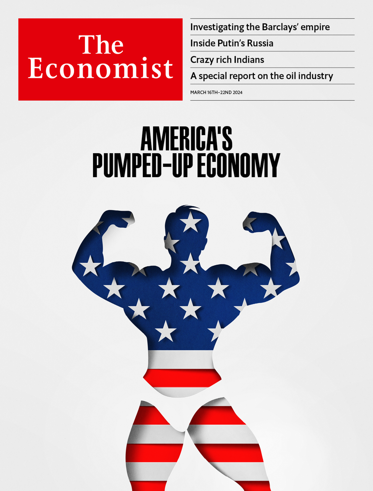
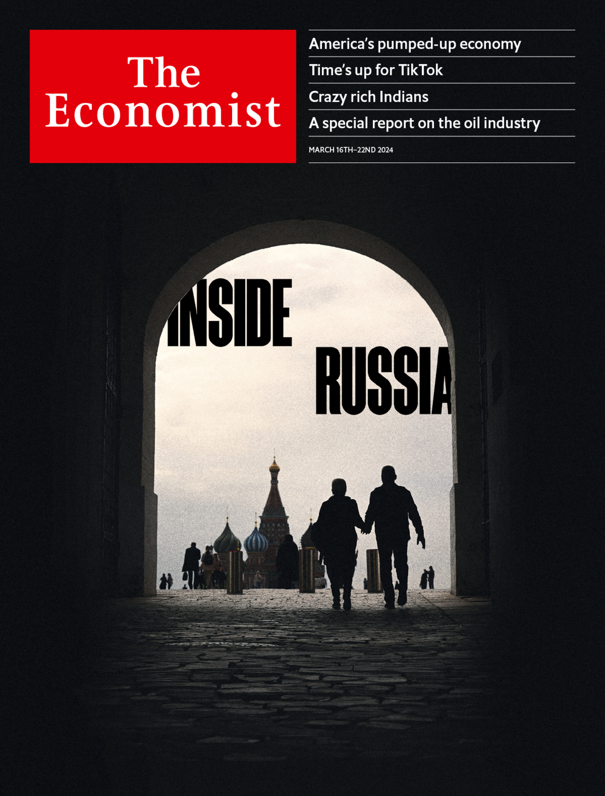

###### The world this week

# This week’s covers 

##### How we saw the world 

> Mar 14th 2024 

This week we put America’s pumped-up economy on our cover in most of the world. Not long ago it was widely thought to be on the brink of recession. Instead it ended 2023 nearly 3% larger than 12 months earlier, having enjoyed one of the boomier years of the century so far. And it continues to defy expectations. Can America’s remarkable strength persist? Threats to growth still hang over the economy, not least November’s presidential election. Neither Joe Biden nor Donald Trump seems likely to nurture the economic expansion should they return to the White House. Instead, their plans would endanger it. Both Mr Trump and Mr Biden harbour populist and protectionist instincts that will only harm America’s growth potential. The sugar-rush of stimulus helped mask the damaging effects of such policies during each president’s first term. The truth is America has thrived as its companies and workers have innovated and adapted to a rapidly changing world. If the next president does not recognise that, America’s pumped-up economy will eventually deflate.

 


 

 


In Europe, our cover looks at Russia. President Vladimir Putin is certain to be re-elected when the country votes in a sham election that ends on Sunday. That should be a wake-up call for the West. Many in the West hoped that the combination of sanctions with Mr Putin’s blunders in Ukraine might doom his regime. Yet it has survived. What should the West do? America and Europe have bet on two strategies: defending Ukraine and sanctions. Arming and financing Ukraine’s defenders remains the most cost-effective way to thwart Russian aggression, yet the West’s resolve to keep doing so is scandalously wavering. Sanctions, meanwhile, have been less effective than hoped. The West’s new Russia strategy also needs to deploy one of its most powerful weapons: universal liberal values. It was these, as well as Star Wars and dollars, that helped bring down the Soviet regime by exposing the inhumanity of its totalitarian system. In the short term there is little chance that Russia’s elite or its ordinary citizens will boot out Mr Putin’s regime. But in the long run Russia will stop being a rogue nation only if its people want it to.

 


 

 

