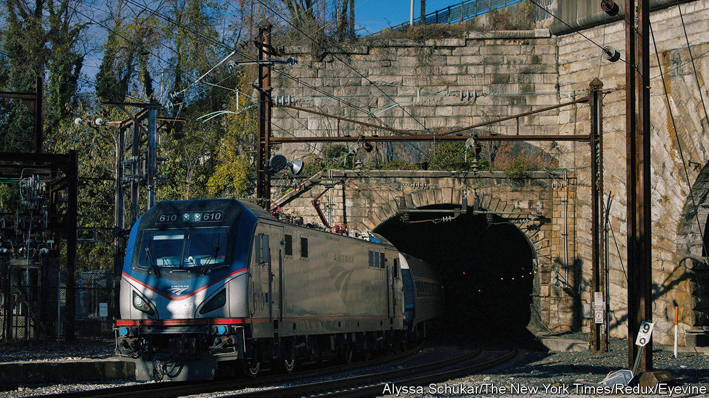

###### Choo choo choices

# Amtrak’s ridership is touching record highs 

##### But is the post-pandemic recovery sustainable? 

 

> Mar 14th 2024 

At 7pm on a Friday night, the Illini service, a train that runs from southern Illinois to Chicago, ought to be pulling into the college city of Champaign. When your correspondent was on it in early March, it stopped short after the train coming in the opposite direction broke down. For three hours, passengers were trapped roughly 200 yards south of the station. At some point a student who had been loudly complaining to the conductor quietly opened the door and walked off into the night. A little after 10pm the train finally shunted its way to the platform and the rest of the passengers alighted. The next morning your by now rather grumpy correspondent proceeded to Chicago by bus.

Such stories of travelling by train in America are sadly common. The world’s biggest economy has fewer miles of electrified railway than Iran. Only in the North East Corridor (NEC) between Boston and Washington, DC, do intercity trains run even vaguely like trains in other rich countries. Elsewhere, Mennonites, who do not use cars or fly, make up a remarkable share of passengers. And yet as bleak as it can seem, Amtrak, the national rail carrier, is in fact recovering well from the pandemic. In the latter half of last year, ridership was just 3% below its levels in 2019—previously the firm’s best-ever year. And through his infrastructure law of 2021 President Joe Biden, an Amtrak superuser as a senator, has put aside $66bn for investment in passenger-rail infrastructure. Is a new golden age of train travel down the tracks?

The biggest recovery at the moment is on the NEC, an electrified track largely-owned and maintained by Amtrak directly. In 2023 trains there carried 12.7m people, a record high, and about 43% of all Amtrak passengers in total. The trains are well used in the north-east because they connect dense city centres and are nicer than the alternatives. “It’s more enjoyable and more comfortable” than flying, says Miles Stanley, a regular passenger between Boston, New York and Washington. Ticket revenues on the corridor easily cover the cost of operating the trains, and generate a surplus used for maintenance.

Elsewhere, rail is either directly subsidised by Congress (for the long-distance lines) or by state governments (for the rest), and trains travel on tracks owned by freight companies, all too infrequently. Passenger numbers are recovering on those trains too, but far less fast than on the NEC. It does not help that ageing rolling stock means those journeys are often getting worse. Derailments are absurdly common, as are crashes at level crossings. Your correspondent was once delayed several hours on the City of New Orleans, a long-distance train, by a frozen whistle.

If Amtrak were a normal company, it would pour money into the NEC and run fewer loss-making long-distance trains. Yet as Jim Mathews, the president of the Rail Passengers Association, a lobby group for riders, is keen to point out, Amtrak is more like a government agency than a company. Its bosses are appointed by the president and each year it has to be funded by Congress. And so the firm has generally tended to spread money around the country to win political support. Already it operates in 46 of the lower 48 states, and in 251 congressional districts. “It is a little cynical,” Mr Mathews admits.

For now, there is so much money around that the firm can invest in both. On the NEC, a civil-war-era tunnel near Baltimore where trains have to slow to a crawl is being rebuilt, something that ought to have happened decades ago. On the long-distance lines, new trains are being procured. But investment spending must be re-authorised in 2026, notes Yonah Freemark, of the Urban Institute, a think-tank. Another risk is that infrastructure-act money by law can be spent only on investment, not operational costs. Last year House Republicans proposed a 64% cut to Amtrak’s day-to-day budget—which if carried out would make investment pointless. 

Some rail boosters have bigger ideas. On March 8th Seth Moulton, a congressman from Massachusetts, filed a bill proposing $205bn in investment in high-speed rail. He worries that Amtrak is “trying to recreate services from the 1930s”. Instead, he says it ought to build a brand-new fast train line, of the sort the Japanese or French have. This, he says, should be in Texas. “Showing that high-speed rail can succeed in a red state and get a lot of Republican support would change the conversation,” he says. Indeed Amtrak is working on a proposal to do just that, in partnership with a firm Mr Moulton used to work for. It’s certainly a platform. ■


