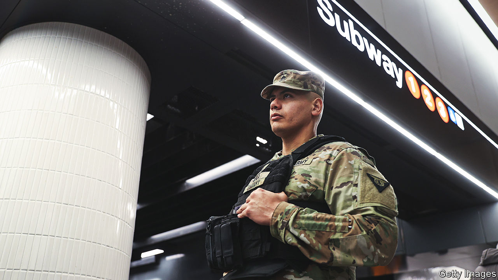

###### Tunnel troops

# Is deploying soldiers on New York’s subway as mad as it seems? 

##### Governor Kathy Hochul’s move may have as much to do with a labour dispute as with crime fighting 

 

> Mar 14th 2024 

NEW YORKERS have seen it all in the subway. They watch in appreciation as a rat carries a slice of pizza down a staircase. They feel powerless when someone in the throes of a mental-health crisis shouts and staggers on a subway platform. They are uplifted or perhaps annoyed when “Showtime” dancers backflip and hang from car handles and poles. Yet the recent arrival of armed soldiers near subway turnstiles has been unnerving. 

Last week Kathy Hochul, New York’s Democratic governor, deployed 750 members of the National Guard as well as 250 state police to assist New York City’s police (NYPD) in searching bags at some subway stations. It is part of a plan aimed at improving subway safety, along with adding more cameras and implementing a pilot scheme to treat those suffering severely from mental illness.

Violent crime in the city has declined so far this year, but crime on the subway is a different story: it rose by 47% in January, year over year. Most of that was down to more thefts. The vast majority of the system’s 4m daily riders travel without incident. However, the abundance of individuals in crisis, coupled with some high-profile attacks, has raised alarms. A conductor’s neck was recently slashed. A woman lost her feet after a man pushed her onto the tracks. A teenager fatally shot a man in a Bronx station. Eric Adams, the city’s mayor, deployed 1,000 cops to the subway, at great expense and with some success. 

Ms Hochul decided it wasn’t enough. There is a long history of political point-scoring between New York City mayors and state governors. In this case Ms Hochul may have been motivated partly by labour concerns and cost. After the attack on the conductor some employees staged what looked like a work stoppage that caused delays. The union asked for more transit police. The governor chose soldiers, who are cheaper. The backlash was immediate and came from all sides. “Our transit system is not a ‘war’ zone!” John Chell, NYPD’s chief of patrol, wrote on X. Others are worried about civil-rights violations. 

When Henry Smart of John Jay College of Criminal Justice first heard about the National Guard being activated in New York, he wondered, “did something really bad happen?”. The National Guard is a state-based military unit. Members are part of the army’s reserve and can be deployed overseas, as they were regularly during the wars in Afghanistan and Iraq, but these days they are typically activated by state governors in an emergency. During the covid-19 pandemic they assisted with testing. During blizzards they clear snow and rescue people in danger. “We are efficient and task-orientated,” says Mr Smart, a 15-year veteran of the Maryland National Guard. No better crew can fill a sandbag. But this is far from an emergency. And the National Guard is not a camouflaged crime-fighting force. It is not even permitted to make arrests.

Militarising crime fighting is seldom a good idea. “Deploying troops to the subway indicates we’ve lost a battle that we actually are winning,” says Danny Pearlstein, of Riders Alliance, an advocacy group. It tells New Yorkers that we are in a “dire state of affairs”, adds Donna Lieberman, head of the New York Civil Liberties Union when, in fact, the city remains one of the safest of its size in America. Jumaane Williams, the city’s ombudsman, wrote on X that given the political consensus against the deployment, “you would think there would be at least a rethinking.” So far Ms Hochul is holding firm, though she has at least stopped soldiers carrying long-rifles. 

Rather than looking on aghast, some other cities are regarding Ms Hochul’s decision to send in the troops with curiosity. Transit unions in Chicago and Philadelphia are calling on the National Guard to be deployed on their troubled systems. Cherelle Parker, Philadelphia’s new mayor, has promised to beef up police patrols. So far, she and other local lawmakers do not want the National Guard involved. They are right to be wary. The theatrical use of soldiers does not stop crime.■


