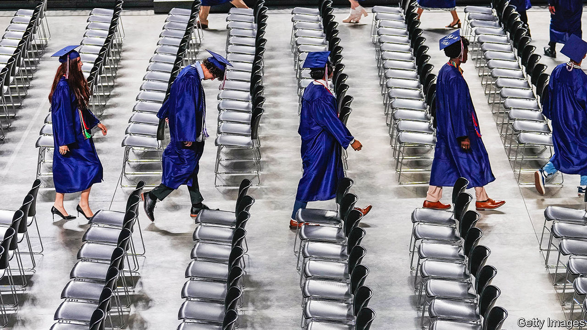
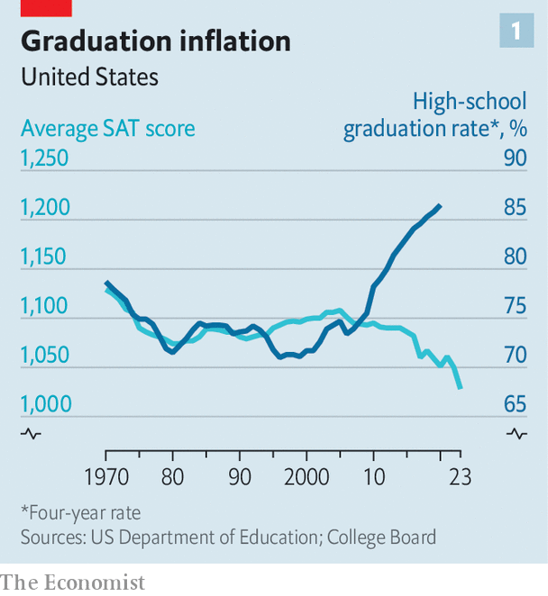
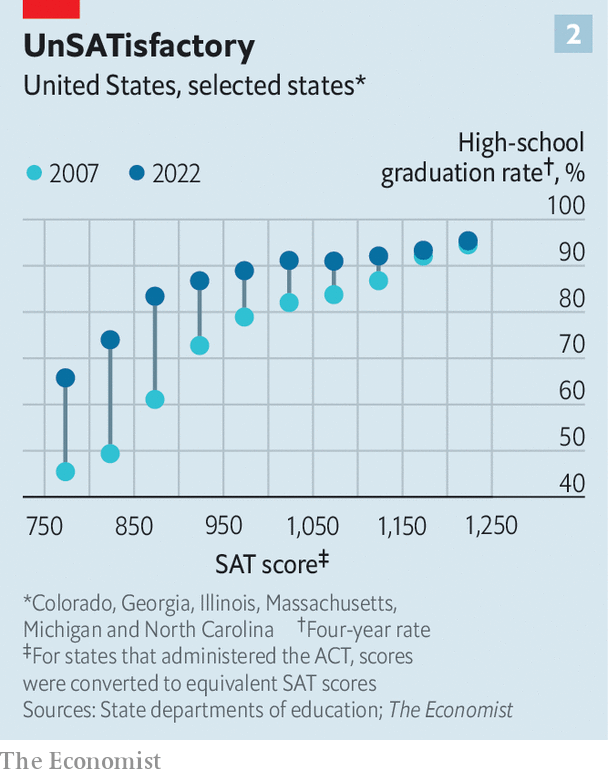

###### Soft bigotry

# New numbers show falling standards in American high schools 

##### Low-achieving pupils may suffer the most 

 

> Mar 10th 2024 

SPRINGFIELD, in MASSACHUSETTS, might seem an improbable setting for an education miracle. The city with a population of 155,000 along the Connecticut river has a median household income half the state average; violent crime is common. Yet graduation rates at the city’s high schools are surging. Between 2007 and 2022 the share of pupils at the Springfield High School of Science and Technology who earned a diploma in four years jumped from 50% to 94%; at neighbouring Roger Putnam Vocational Technical Academy it nearly doubled to 96%. 

Alas, such gains are not showing up in other academic indicators. At Springfield High scores on the SAT, a college-admissions test, have tumbled by 15% over the same period. Measures of English and maths proficiency are down, too. The pass rate on advanced-placement exams has fallen to just 12% compared with a national average of 60%.

 


The trend at Springfield High is all too common. Between 2007 and 2020 the  at public high schools in America leapt from 74% to 87%. During this period pupils notched up gains in course credits and grade-point averages. Yet SAT scores fell (see chart 1). Results from the latest Programme for International Student Assessment (PISA), an international test of 15-year-olds, show that maths and reading literacy are flat or down. An analysis by  suggests that schools are lowering academic standards in order to enable more pupils to graduate. And the trend is hurting low-performing pupils the most. 

America has fretted about academic standards at its public schools for decades. In 1983 the Department of Education released a landmark report, “A Nation At Risk”, which warned of a “rising tide of mediocrity” in the country’s schools. The response was swift. Within five years 45 states had raised graduation requirements; and more than two dozen had introduced other reforms, including more comprehensive curriculums and higher salaries for teachers. Some states also started requiring graduates to pass “minimum-competency” exams, standardised tests introduced in the 1970s that evaluated pupils’ ability to do eighth- or ninth-grade level English and maths. 

But as graduation requirements were toughened up, coursework was watered down. A survey conducted in 1996 by Public Agenda, a policy research group, found that just half of public high-school students felt that they were being challenged academically. Another survey in 2001 found that only a quarter of pupils thought that their teachers had high expectations of them. Even the federal government acknowledged again that academic standards were falling short. A report by the Department of Education found that more than a tenth of maths coursework taken by the class of 2005 consisted of primary- and middle-school-level material. Only a third of algebra 1 students and a fifth of geometry students received “rigorous” instruction. 

Grading got easier, too. The best evidence for this comes from comparisons of classroom grades with performance on state exams taken at the end of the school year. A study by Seth Gershenson of American University found that between 2005 and 2016, 36% of North Carolina public-school students who received Bs in their algebra 1 courses failed their end-of-course exams. Pupils with Cs failed 71% of the time. Another study, by Chris Clark of Georgia College &amp; State University, analysed maths courses at Georgia public high schools in 2007 and yielded similar results. “Some schools and school systems appear to be inflating course grades,” Mr Clark concluded, “while others appear to hold their students to higher standards.” 

Such evidence suggests that academic standards at American high schools are too low. But are they getting worse? To answer this,  assembled data on graduation rates and standardised test scores at 3,000 high schools across six states—Colorado, Georgia, Illinois, Massachusetts, Michigan and North Carolina—for school years from 2007 to 2022. 

Doing the maths

We found that four-year graduation rates in our sample increased during this period, even as test scores fell. Gains were greatest in high schools with the lowest test scores. In 2007 schools with scores on the sat or act, another college-admissions exam, in the bottom tenth of our sample graduated half of their pupils; in 2022 they graduated two-thirds. As low-performing schools have passed more pupils, the relationship between test scores and graduation rates has weakened (see chart 2). 

Just how far has the academic bar been lowered? To quantify this, we conducted a regression analysis of graduation rates between 2007 and 2022 that controlled for average ACT or SAT scores, dropout rates and school year. If academic standards were consistent over time, we would expect no underlying trend in graduation rates from year to year. Instead, we found that graduation rates drifted upward, even after controlling for changes in test scores and dropout rates.

 


Our analysis suggests that high schools are graduating thousands of students who, not long ago, might not have made the grade. Some states have lowered the bar more than others. In Illinois graduation rates are about one percentage point higher than we would expect based on academic performance alone; in North Carolina they are nearly eight points higher. Overall, we found that public high schools in our sample are inflating graduation rates by roughly four percentage points compared with 15 years earlier. 

Sceptics will point out that the test-taking population is significantly different today than it was 15 years ago, and that this may be making test scores look worse than they actually are. “If more and more students are sitting for these tests,” says Thomas Dee of Stanford University, “the composition changes over time in ways that probably bias scores downward.” Such “compositional effects” do not appear to explain our results, however. The share of students taking the ACT or SAT in our sample actually fell from 78% in 2007 to 68% in 2022. This would suggest that, if anything, our estimates of graduation-rate inflation may be too low, rather than too high. 

You might expect policymakers to be scrambling to shore up academic standards. In fact, they are doing the opposite. In May last year New Jersey’s board of education voted to lower the passing score on the state’s high-school graduation test, saying the current standards had “adverse impacts” on students. In November Oregon education officials scrapped its “essential skills” graduation exams in maths, reading and writing. At least four more states—Florida, Massachusetts, New Jersey and New York—are considering doing away with their own exit exams. In January Alaska’s board of education voted to lower proficiency standards for the state’s reading and maths exams. 

The trend towards weakening standards can be blamed in part on No Child Left Behind, an education-reform law passed in 2002. It required states to track the share of students graduating in four years and set annual targets for improvement. Schools that failed to hit their targets faced sanctions, including possible closure. Although such policies were well-intentioned, they had perverse outcomes. To keep graduation rates up, teachers devised creative ways of raising grades: allowing students to retake exams, removing penalties for late assignments, adjusting grading scales. “We’re doing what I call ‘grading gymnastics’,” says Eric Welch, a social-studies teacher in Fairfax County, Virginia. “There’s a lot of pressure to hit the metric, regardless of how you do it,” explains Peter VanWylen, a data consultant and former teacher in Memphis, Tennessee. “Nobody wants to lose their job and so there’s this pressure to get the number where it needs to be.”

Other concerns are also at work. “The push for educational equity, and in particular racial equity, has been used in a lot of places to push against higher standards for high-school graduation,” says Morgan Polikoff of the University of Southern California. When New Jersey debated new testing benchmarks last year, one board-of-education member argued that a higher standard would be “unfair” to black and Latino students in urban districts. Oregon’s decision to drop its graduation exam in November was based in part on a report by the education department which concluded that the test produced “inequitable outcomes” for “historically marginalised” groups. 

Must try harder

Lowering standards, it is thought, can help narrow such achievement gaps. Yet it may have the opposite effect. A recent working paper by Brooks Bowden, Viviana Rodriguez and Zach Weingarten of the Universities of Pennsylvania and Texas at San Antonio analyses how a more lenient grading policy introduced by North Carolina public high schools in 2014 affected effort and academic performance. The authors found that after schools implemented the new grading scale, which led to more As and fewer Fs, students with low test scores showed up to class less often and put in less effort. The attendance of high-scoring students did not change. Although the policy led to slightly higher graduation rates, it also contributed to wider gaps in GPAs and standardised test scores between high- and low-achieving students.

This suggests that policies that lower the bar may harm the very students they are meant to help. “I don’t think we’re helping anybody by handing out higher grades or giving out graduation certificates,” says Dr Bowden, one of the authors of the study. Better instead to set expectations high, reckons Dr Polikoff. “People rise to the expectations you set.” ■


