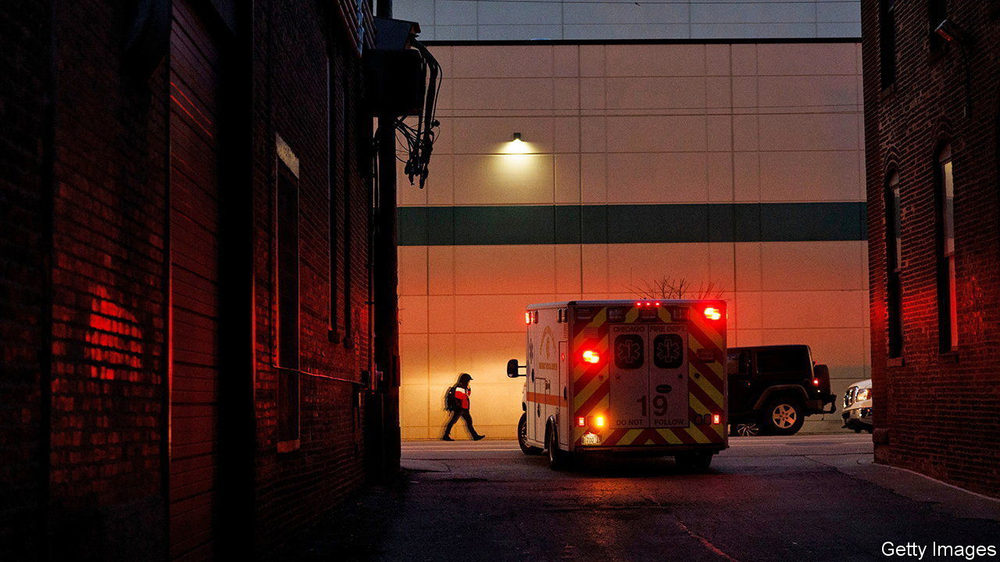

###### Number blocks

# The best dataset on American health care will be harder to access 

##### This will hold back research 

 

> Mar 14th 2024 

Prachi Sanghavi, a health-policy researcher at the University of Chicago, studies whether ambulances that provide medical care at the site of the emergency are better than basic ones that simply rush a patient to the hospital. (They are not.) She also studies whether the federal government’s rating system for nursing home quality is any good. (That’s a no, too). Her research helps Americans evaluate the country’s health-care practices. Unfortunately her work is now at risk. 

Dr Sanghavi’s research uses data provided by the Centres for Medicare and Medicaid Services (CMS), the federal health-care agency that administers America’s public-health insurance. CMS announced plans in February to change its data-sharing practices. The proposal raises the fees for data and makes access less convenient. Nearly 400 researchers, including Dr Sanghavi, from over 75 institutions across America have signed a letter in protest. They claim that the new restrictions will jeopardise ground-breaking research.

America does not have a national health-records system, so the CMS numbers are the best data available. Over a third of Americans are covered by CMS, and over 1bn medical claims a year are processed through the agency. This makes it a trove for researchers studying anything from health-care privatisation to the causes of the opioid epidemic.

The agency says it is changing the rules over concerns for data security. On the face of it, that sounds reasonable. CMS had a data breach just last year. Sensitive personal information, such as social-security numbers and mailing addresses, was compromised for over 600,000 people. Last month Change Healthcare, a health-care payment company bought by UnitedHealth Group, a large private insurer, was also targeted.

Under the current model of data-sharing, researchers can receive physical copies of the CMS data. They are then responsible for keeping the data secure, explains Alice Burns, a researcher at KFF, a health-policy think-tank. Unlike the CMS data that were hacked, the data for researchers do not contain individual names and social-security numbers. 

However, they do contain sensitive information such as health diagnoses and a person’s age, race and zip code. In some instances a determined hacker could be able to identify an individual, but it is highly unlikely, says David Maimon of Georgia State University, who studies cyber-security. The proposed policy requires researchers to switch instead to a virtual centre hosted by CMS. 

This is about balancing risk and benefit, says Haywood Talcove of LexisNexis Risk Solutions, a firm that sells fraud-prevention services. In this case the calculus seems lopsided. Since CMS has been hacked before, hoarding the data there doesn’t make it secure.

The researchers say that the benefits of the current model far outweigh the security risks. The protesting scientists claim that less-established researchers and those at poorer academic institutions could lose access. “Why wouldn’t we invite the best public-health experts in the world to look at the same data that we have?” asks Paul Mango, a former chief of staff at CMS under the Trump administration. 

All is not lost. The changes have yet to go into effect, and the agency is accepting feedback from researchers until May 15th. But for now, the researchers would like to keep the status quo. Since the vast majority of older adults are on Medicare, these numbers give “a beautiful longitudinal view of a person’s life”, says Dr Sanghavi. It’s hard to put a price on that. ■


