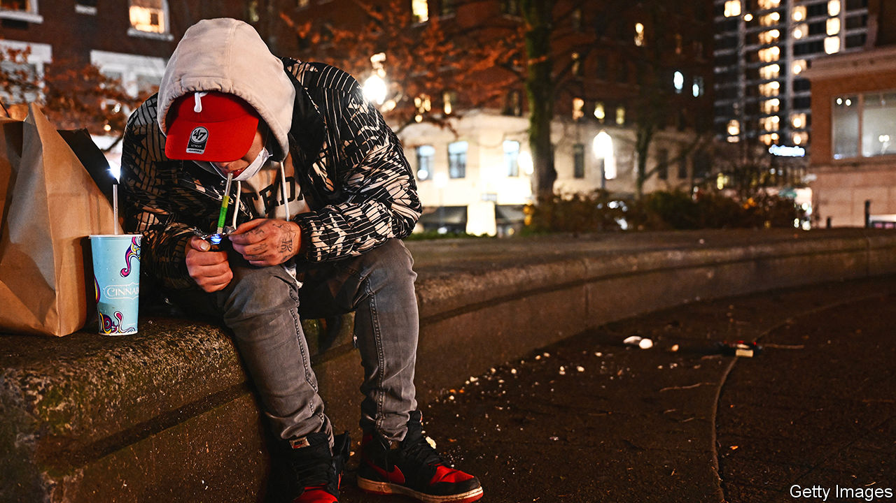

###### Moving the needle

# Time is called on Oregon’s decriminalisation experiment 

##### The replacement might be where they should have started 

 

> Mar 14th 2024 

Florists are usually cheerful places. But Gifford’s Flowers, in downtown Portland, has been going through it of late. It’s been broken into three times and employees have been attacked and even bitten, says Jim Gifford, who has been running the store for half a century. Mr Gifford blames Oregon’s decriminalisation of the possession of drugs, which, he says, has led to more “people in drug episodes” coming to his shop. “A blue city in a blue state should be leading,” the lifelong progressive Democrat says. “But also not forgetting about the people that work hard and play by the rules.”

In 2020 Oregonians voted to decriminalise the possession of small amounts of hard drugs, including fentanyl, methamphetamine and heroin. It was the first (and so far only) state in the country to do so. The change was a massive experiment in treating addiction as a public-health problem. But the state has now concluded that the experiment failed. This month, in the face of ever-increasing overdose rates and public complaints such as Mr Gifford’s, the Democratic-controlled legislature overwhelmingly passed a measure recriminalising the possession of drugs. The governor, Tina Kotek, has said she will sign it.

Overdose deaths have spiked in Oregon, increasing by 42% in the year to September 2023 (compared with a national increase of 2%). Researchers disagree on how much decriminalisation versus the spread in fentanyl is to blame, but none thinks that the state’s experiment managed to decrease deaths. Oregonians are frustrated. Open-air drug use has become particularly blatant.

The replacement law makes the possession of a small amount of drugs a misdemeanour crime punishable by up to 180 days in jail. It does provide paths to addiction care, by offering drug offenders the chance to go directly to detox facilities instead of jail (and to try it again if the first time doesn’t work). “It’s time to reset our guardrails,” Andy Mendenhall, the head of Central City Concern, an addiction-services provider in Portland, told lawmakers. He pointed to people who found choosing between prison and treatment to be a “powerful part of their pathway of recovery”. 

Praising the bill, Paige Clarkson, the district attorney in Marion County, believes that the new provisions will allow prosecutors to focus on drug dealers while prioritising treatment for addicts. “Police, sheriff’s deputies, district attorneys, we don’t want to criminalise addiction,” she says. “We want to use the criminal laws to motivate those individuals to get healthy.” Oregon’s new regime would still be quite enlightened.

But its drug experiment is likely to become a cautionary tale anyway, says Floyd Prozanski, the state senator who led the charge in enacting it. Although he still believes in the mission, Mr Prozanski recognises that advocates are going to “have to rebuild the confidence of people not only in Oregon, but around the country. And realise that when we implemented it, we did it wrong.” ■


