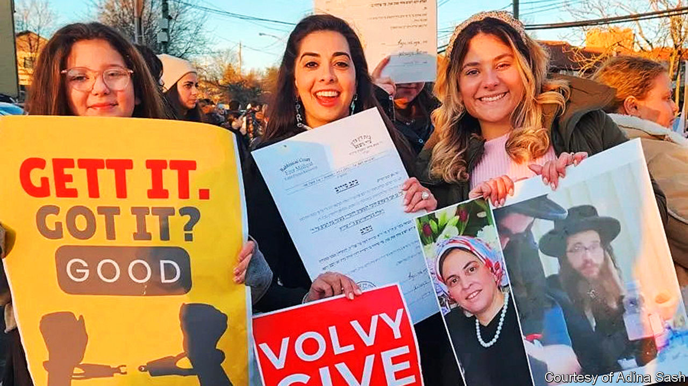

###### Unorthodox ways

# Ultra-Orthodox Jewish women are staging a sex-strike 

##### It worked in ancient Greece; it might work in New York state 

 

> Mar 14th 2024 

In Aristophanes’s play “Lysistrata”, a young Athenian woman persuades the women of warring Greek states to deny their lovers sex in protest at an ongoing war. Together they vow not to raise their “slippers to the roof” or crouch down before a man “like a lioness on all fours”. Soon bitter conflict erupts between the sexes and an angry chorus of men declares that there is no wild beast harder to tame than the woman. 

More than two millennia later women in Kiryas Joel, an ultra-Orthodox Jewish enclave an hour outside New York City, are carrying out a similar strike. According to their leader, Adina Sash, 800 women refused to sleep with their husbands last Friday night, a time when intimacy is considered especially holy. More have since joined the cause. Unlike the Greeks they are not protesting against war but rather a religious system in which men can shackle women to unwanted marriages.

Under Jewish law a divorce is not finalised until a man gives a woman a , a 12-line letter written in Aramaic that declares her no longer bound to him. Three rabbis must sign off on it. That has led to a global scandal where abusive men leverage s for money and custody of children or withhold them to force chastity and singlehood on past partners.

In Kiryas Joel, an insular place where a woman must ask permission from her rabbi to report domestic violence to the cops, 29-year-old Malky Berkowitz has begged for a  for four years. Her husband Volvy has refused despite petitions from religious authorities. She is just one of many. “Malky is the face of every woman who has fought and gone through the system like a docile, demure, obedient sheep,” says Ms Sash. Estimates of the number of “chained” women around the world, known as , range from hundreds to thousands. 

Their advocates have tried to get secular courts to recognise -refusal as abuse. In Britain a 2021 amendment to the legal code deemed the practice criminally “coercive”; one year later the first man was jailed for it for 18 months. But in America change is coming more slowly. 

Criminal-justice reformers, who police over-policing, have pushed back on victims’-rights groups that want to increase penalties and make egregious cases felonies. Meanwhile recalcitrant men are working the legal system to their advantage: according to the Organisation for the Resolution of Agunot, a non-profit group, there has been a sharp rise in the number filing nuisance lawsuits claiming that women demanding s are harassing or defaming them.

The intractability of it all made the American wives finally go for the nuclear option. Those who keep illicit smartphones tucked away in underwear drawers—internet is largely forbidden among the ultra-Orthodox—passed along the plan. The idea was simple: withhold sex to get your man to care enough to press other men to act. In a community where women are expected to shave and cover their heads for modesty and to marry near-strangers as teenagers, some are saying no to sex for the first time since they can remember. 

Many women however, including Ms Berkowitz, don’t quite know what to make of the protest. Louder voices are against it. Herschel Schacter, a prominent rabbi who runs the rabbinical school at Yeshiva University, declared the strike to be a violation of Jewish law and warned it could wreck marriages. Some young Orthodox men are calling Ms Sash a , a derogatory Yiddish term for a gentile woman. 

In the story of Aristophanes’s “Lysistrata” the carnal deprivation quickly becomes too much for the Greek men to bear. The play concludes with a lustful bunch of blokes brokering a truce between Athens and Sparta, just as the women demanded. Ms Sash hopes for her own sort of peace deal—that Ms Berkowitz be freed before the Sabbath sets in at dusk on Friday. 

Asked if she plans to use this tactic in the future, she says she does not intend to incite more “feminist terror”. The point is instead to teach the next generation of religious girls that if conventional methods of protest fail, they can find new ones. ■


