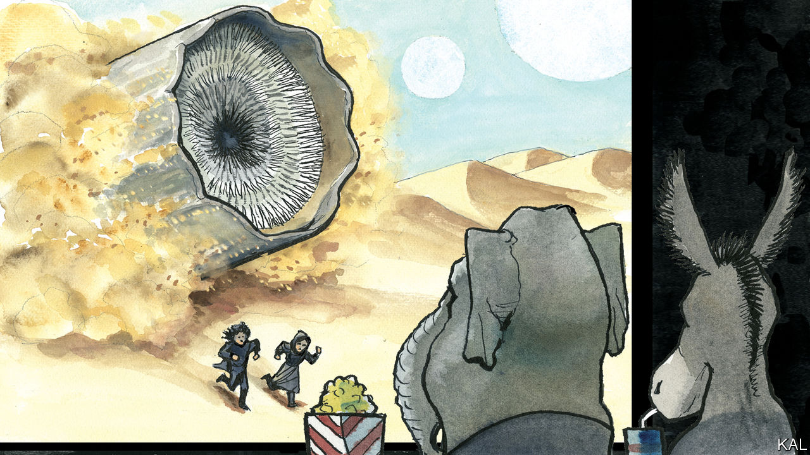

###### Lexington

# “Dune” is a warning about political heroes and their tribes 

##### Its ruthless scepticism of human nature helps explain its enduring appeal 

 

> Mar 14th 2024 

Frank Herbert, the author of the science-fiction novel “Dune” on which a new blockbuster film is based, would have been amused to learn that ecologists along the Oregon shore are ripping invasive European beachgrass out of the ground. As a young journalist in the late 1950s, Herbert derived his inspiration for a tale about a desert planet from watching ecologists plant the grass to control encroaching sand dunes. The scheme worked, maybe too well: residents of the coastal towns that the grass helped prosper now long for the beauty of the dunes and regret the unintended consequences for native flora and fauna. 

“They stopped the moving sands” was the title of the article Herbert never wound up publishing about the Oregon dunes. He admired the ecologists and their project. But as much as he prized human intelligence he feared human hubris, credulousness and other frailties. One character in “Dune” is a planetary ecologist, who, for complicated reasons—the novel has no other kind—finds himself overcome by natural processes he has been trying to manipulate, to help the native population by changing the climate. “As his planet killed him,” Herbert writes, the ecologist reflects that scientists have it all wrong, and “that the most persistent principles of the universe were accident and error.”

The persistence of “Dune” itself is a marvel. Some 20 publishers turned the manuscript down before a company known for auto-repair manuals, Chilton, released it in 1965. The editor who took the risk was fired because sales were slow at first. But popular and critical acclaim began to build, eventually making “Dune” among the best-selling and most influential of science-fiction novels, some of its imaginings, with their edges filed down, surfacing in “Star Wars”. 

No doubt the novel’s endurance owes in part to Herbert’s success, like Tolkien’s, in wrapping an epic yarn within a spectacular vision given substance by countless interlocking details. He published appendices to his novel: a glossary, a guide to the feudal houses that jostle over his imperium, a study of the galactic religions and, of course, a paper on the ecology of his desert planet, Arrakis, known as Dune. That ecology yields a substance called spice that prolongs life and also supplies psychic powers, enabling navigators to guide ships among the stars: think potable petrol with the properties of Adderall and Ozempic. It is the most precious stuff in the universe.

The young hero, Paul Atreides, arrives on Arrakis when his father, a duke, is awarded control there. It is a trap set by the emperor and a rival house. His father dead and his surviving allies scattered, Paul flees with his mother into the desert and finds haven among its fierce people, the Fremen. As the spice unlocks latent mental powers in Paul, the natives recognise him as their messiah and—spoilers!—he leads them not just to avenge his father but, via control of the spice, to seize the imperial throne. Then comes a bit of a bummer, galactic jihad. More on that in a moment. 

Herbert was thinking partly of T.E. Lawrence, oil, colonial predation and Islam, and the success of the novel may owe also to those echoes (along with the giant sandworms). But the novel’s enduring popularity suggests more timeless resonances. There are nifty gizmos in Herbert’s galaxy, but clever conceits keep them from stealing the show and making his future either too alien or, like other decades-old visions of the future, amusingly outdated. Personal force-fields have rendered projectile weapons harmless. Soldiers and nobles alike fight with swords, knives and fists. 

A more provocative gambit by Herbert was to set his tale thousands of years after the “Butlerian Jihad” or “Great Revolt”, in which humans destroyed all forms of artificial intelligence. (Herbert once worried to an interviewer that “our society has a tiger by the tail in technology.”) “Thou shalt not make a machine in the likeness of a human mind,” has become a core injunction, resulting in a race to develop the mind’s potential. Paul’s mother is a member of a female sect, the Bene Gesserit, whose own hubristic enterprise is to manipulate the imperium’s politics, and who for scores of generations have conducted a breeding programme to engender a superhuman intelligence—which, to their consternation, arrives in the form of Paul, whom they cannot control.

The new Dune movie is the second of two in which the director, Denis Villeneuve, has told the story with breathtaking imagery and, for the most part, with fidelity to the novel. The films deal elliptically with Herbert’s themes of technological, economic and ecological change to zero in on his main matter, the dangers of political and religious power and of faith itself, secular or spiritual. 

Dread Kennedys

Paul’s powers allow him to see many futures, and though he resists his role as messiah and the bloodlust he knows will come with it, he embraces that path in the end. Herbert, who died in 1986, told an interviewer in 1981 that he thought John F. Kennedy was among the most dangerous leaders of his times, “not because the man was evil, but because people didn’t question him”. In “Dune”, the bad guys are so bad, and the good guys have so many virtues and face such tragic choices, it can be hard to recognise they are not so great, either. Herbert set out to lure readers into rooting for a tyrant. He wanted to leave them wary not only of the will to dominate but of the longing to submit. 

Here the film lets the audience off the hook. A Fremen leader, strong-minded in the novel, becomes a clownish fanatic frantic to believe in Paul, in counterpoint to Paul’s Fremen lover, Chani. Contrary to the novel, she emerges as the voice of democratic resistance to Paul’s megalomania. Chani is all too easy for the audience to identify with. Of course they would resist, too. Of course they would never credulously identify with any tribe, never fall for any charismatic leader. Maybe at least some will leave the theatre asking themselves if that is really the case. ■


