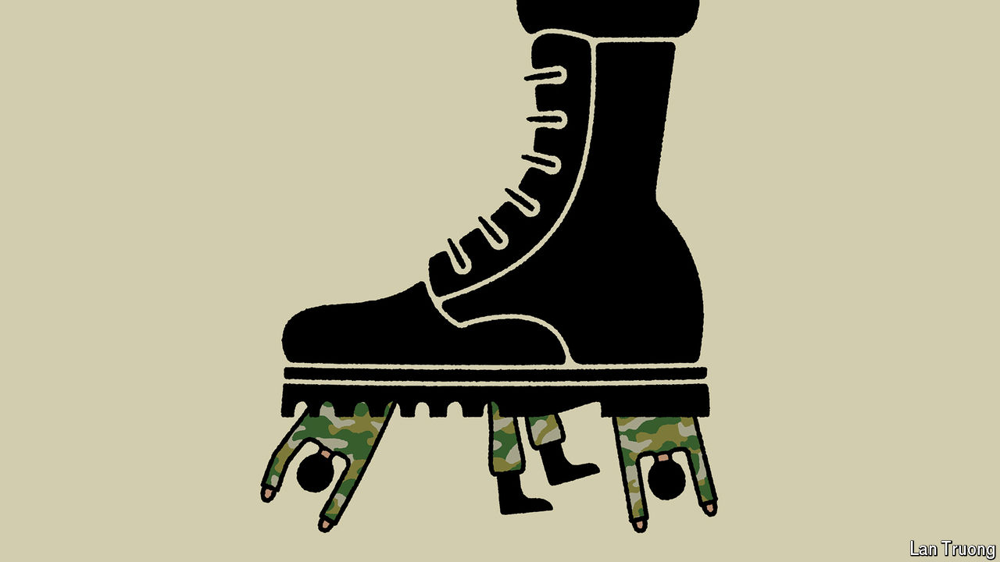

###### Banyan

# A string of setbacks for the junta in Myanmar presents an opportunity 

##### Outside powers must not waste it 

 

> Mar 21st 2024 

ON MARCH 17TH General Min Aung Hlaing, the leader of the junta that overthrew Myanmar’s democratically elected government in a coup more than three years ago, stopped at Bago, not far from the commercial capital, Yangon, to reconsecrate an ancient Buddhist pagoda. He struck the pagoda bell nine times, following an old superstition that this might avert disaster. It did him no good: that same day his forces lost yet one more town, Rathedaung, to rebel forces, this time in Rakhine state in the west. 

As the junta loses its grip on the country, its sense of crisis is palpable. Yet for Myanmar’s battered people and democracy, the pressure under which the army finds itself presents an opportunity. The ethnic and democratic forces that have been fighting the army are more united than before. With appropriate support from outside, they may be able to start laying the groundwork for a future without the generals.

The junta’s troubles mounted sharply in late October, when three militias from the ethnically diverse borderlands launched “Operation 1027”, named for the date it began. They staged lightning attacks on the junta and its allies in northern Shan state, bordering China. The Three Brotherhood Alliance, a grouping of the Arakan Army (AA), the Myanmar National Democratic Alliance Army, and the Ta’ang National Liberation Army, overran scores of outposts. In January the rebels seized Laukkai, a notorious base for Chinese mafia bosses and junta allies running online gambling dens and internet scams.

Operation 1027 inspired others. Militias have achieved successes in Kayin state in the south-east and in Chin state in the west. Rakhine state is the latest front. The AA, which represents ethnic-Rakhine Buddhists, has had astonishing military success there. A week ago it seized the main township on Ramree island in the south of the state—next to Kyaukpyu, where China has developed a deepwater port and terminals piping oil and gas to its landlocked south-west. This week AA forces reached the outskirts of Sittwe, the state capital.

The junta’s response, as ever, is indiscriminate violence. Late last month heavy shelling killed a dozen civilians in a busy Ramree market. On March 10th navy vessels shelled a coastal town near Sittwe. Army morale is low. When in February the junta announced conscription for young men and women, queues quickly formed at Thailand’s embassy. 

Many of those not trying to flee have joined “people’s defence forces” loyal to the national unity government (NUG) in exile. The junta has all but lost control of the borders, depriving it of funds from tax collection and rackets smuggling drugs, gems, timber and people. 

The junta’s humiliation is compounded by growing accommodation among a multifarious opposition. In January the NUG and three major ethnic armed groups declared shared goals to end military rule and foster a federal, democratic future. China, which had long supported the junta, is doing deals with others. It backed the Triple Brotherhood Alliance and flew Laukkai’s kingpins out in handcuffs. China will surely seek an accommodation with the AA at Kyaukpyu in order to protect its energy supplies there.

The indifference to recent developments of external powers, other than China, is concerning. A Myanmar over which China establishes dominance is in no country’s interests but China’s. Yet America is distracted. India has called for dialogue but offered little else. The ten-country South-East Asian club, ASEAN, timidly sticks to a lame “five-point consensus” that the junta does not even pretend to honour.

Instead, ASEAN and the West should do much more to foster dialogue among opposition groups, nudging them towards a consensus about how a post-junta Myanmar might be governed. Aid should be ramped up. It is encouraging that the new civilian government in next-door Thailand, which recently replaced an army-led administration, is tilting away from the junta. 

Thailand should now go further and set up a formal aid corridor, through which it and others can send food and medicine. This month Japan offered a further $37m—a good start, which ASEAN, the West and even India should copy. It is not only Burmese who have an interest in seeing their country emerge from its long nightmare.■


