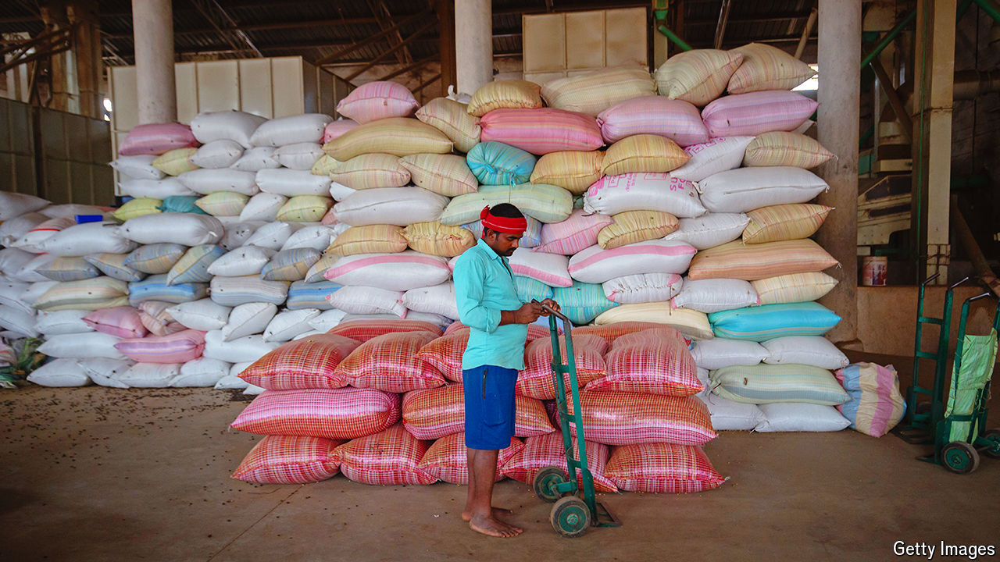

###### Immobile republic

# How to make India richer 

##### It would help if more people moved within the country 

 

> Mar 21st 2024 

Every day roughly two dozen trains set off from Delhi, India’s capital, to Bihar, an impoverished eastern state. This week more will be added to ferry the thousands of Biharis heading home to celebrate Holi, the Hindu festival of colours that falls on March 25th this year. Even so, there will be many more people hoping to travel than train seats—not just on the Delhi-Bihar routes, but also on the hundreds elsewhere in India that carry people between its pockets of prosperity and its hinterlands.

Such internal mobility is central to the country’s development. Internal migrants are an important pillar of urban economies. Big cities pull in professionals from across the country. Lower-skilled migrants work on construction sites, guard gates and clean houses. The money they send home brings relief to areas that desperately need it. Yet given enormous income disparities between Indian regions, the number of Indians who migrate is small by comparison with other large and unequal countries such as China. The country could be much richer if more did so.

Consider the case of Vijay Kumar, who works as a security guard in a posh suburb of Delhi. He earns 15,000 rupees ($181) a month, far more than he would at home. The 8,000 rupees ($96) he transfers to Rataul in Bihar is enough to feed his family and send his children to school. According to an estimate in India’s annual economic survey, domestic remittances were worth the equivalent of 1% of GDP in 2016-17. 

That number could be much larger if Indians started moving more. Reliable data on the number of migrants do not exist, in part because so much of India’s economy is informal. One survey conducted in 2021 estimates that 29% of Indians (nearly 400m people) are migrants. That includes those that move within the same state. Just 12% (160m) move between states. The overwhelming reason for both types of migration is marriage, accounting for 72% of all moves. The share of those moving for work is just 11%, including migration within states. Most of them are men: only 2% of women move for work.

By international standards migration in India is weak. One study in 2014 found that India’s internal migration levels were lower than in all but one of the 82 countries examined. More recent globally comparable data are not available, but urbanisation rates, a proxy for domestic migration, suggest that India still lags. The World Bank estimates that in 2021 35% of Indians lived in cities, a lower share than China (63%), Indonesia (57%) and other lower-middle-income countries (43%).

The other issue is that a lot of migration is “circular”, says Chinmay Tumbe of the Indian Institute of Management in Ahmedabad and author of “India Moving”. He reckons that there are 100m temporary migrants in the country, who will return home eventually. But lasting wealth is created only when families spend generations in cities. Returning migrants also add pressure to strained rural economies.

Why are Indians not more mobile? In cities most work is too precarious for migrants to put down roots. Housing is expensive and jobs do not pay enough to cover it. A quarter of Mr Kumar’s salary goes on renting “a pigeon hole and a shared toilet”. Differences in culture and language are another barrier in a country with hundreds of different languages and no lingua franca. So is the rise of nativist movements across the country. This year Bangalore, India’s tech capital and a magnet for migrants, has been embroiled in a battle over language. Municipal authorities have required businesses to display signs predominantly in Kannada, the state’s tongue, or risk losing their licences. Calls to reserve jobs for locals are getting louder.

The lack of a safety-net is another obstacle. Migrants lose welfare benefits, such as access to public health care, when they cross state borders. Welfare spending is skewed towards villagers, who enjoy generous subsidies in agriculture and can get access to a guaranteed workfare programme. Few equivalents exist in cities. 

Some signs of change are visible. After a sudden pandemic-era lockdown triggered an exodus of migrants from cities, their travails prompted the national government to improve the portability of government welfare schemes. One initiative now allows people to access subsidised grain anywhere in the country. The southern manufacturing hubs of Karnataka and Tamil Nadu are planning to provide safe accommodation to encourage more women to move there, possibly mindful of the role female workers played in China’s manufacturing boom. 

At the national level, the government could establish an inter-state migration council to help migrants and ensure their freedom of movement, suggests Mr Tumbe. Narendra Modi, the prime minister, extols the importance of national unity and national industries to make India a developed country by the time it celebrates 100 years of independence in 2047. Making it easier to move around would be one way to achieve that goal. ■


