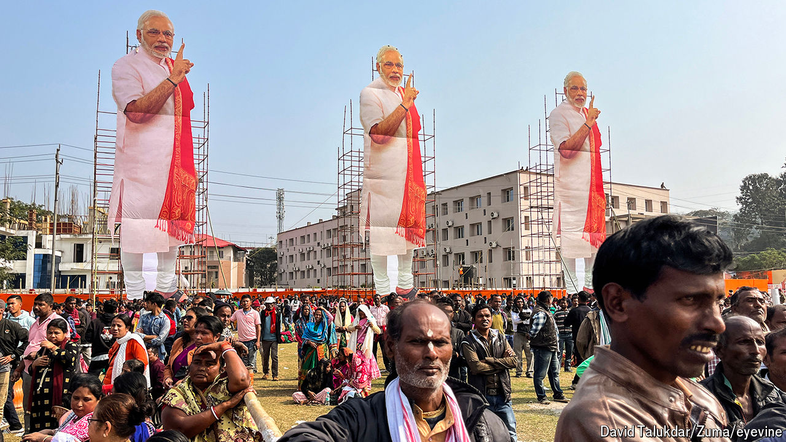

###### That’ll cost you

# India’s election could be the world’s most expensive 

##### Big Indian companies have been buying “electoral bonds”, mostly for Narendra Modi’s ruling party 

 

> Mar 21st 2024 

Ask which of this year’s many elections will be the most expensive, and most people would say America’s. They could well be wrong. India’s most recent general election, in 2019, was already the most costly at the time by some estimates, with campaign spending conservatively put at $8.5bn. America’s presidential poll the next year exceeded that. But India’s parliamentary vote this spring will be much dearer and could exceed the $10bn-16bn that is likely to be splurged on the White House race. 

India’s ballooning campaign costs have often been linked to illicit cash, sometimes from the criminal underworld. In recent days, however, a spotlight has fallen on corporate funding after Indian companies, including some of the country’s biggest, were revealed to have made political donations worth hundreds of millions of dollars via an opaque system of “electoral bonds”. Proceeds went overwhelmingly to the ruling Bharatiya Janata Party (BJP). 


When the government launched the bonds in 2018, it said they would stop the flow of “black cash” into politics by providing a legal yet anonymous channel for donations. But in a rare setback for the prime minister, Narendra Modi, the Supreme Court declared the scheme unconstitutional on February 15th. It ordered the State Bank of India (SBI), the bonds’ sole issuer, to provide details of who bought and received them by March 6th to the Election Commission, which was required to publish those details a week later. 

After a failed attempt to extend the deadline until late June, the bank complied. The Election Commission published the data on March 14th, just two days before announcing that the election would be held over six weeks starting from April 19th (with results on June 4th).

Data published so far only identify bond purchasers and recipients without showing which donation went to which party. They have caused a stir nonetheless, as about 50% of $2bn in bond proceeds since 2018 has gone to the BJP, compared with some 12% to its main national rival, the Congress party. The 25 largest buyers of bonds were all Indian companies. Some depend heavily on government contracts and approvals. Several were previously targeted by tax or investigative agencies. A handful bought bonds worth considerably more than their profits. 

The BJP denies any wrongdoing. But opposition leaders and activists accuse the government of strong-arming donors into buying bonds for the BJP while deterring them from funding opposition parties, for fear that Indian authorities could get hold of bond buyers’ data via the government-run SBI. Rahul Gandhi, a Congress parliamentarian, branded the scheme “the world’s largest extortion racket”.

One surprise from the data was the identity of the single biggest bond buyer. That was Future Gaming and Hotel Services, a lottery and gaming company based in the southern state of Tamil Nadu whose donations totalled 13.68bn rupees ($165m). Tamil Nadu’s ruling party, the Dravida Munnetra Kazhagam, says it received 37% of that total. It is among ten parties that have identified their bond donors. Neither the BJP nor Congress have done so.

Other leading bond buyers are more familiar names, such as Megha Engineering and Infrastructures, an engineering and construction firm that has won big government contracts. The top ten buyers also included Vedanta, a big mining company, and Bharti Airtel, India’s second-largest telecom carrier by subscribers. The biggest individual buyer was Lakshmi Mittal, an Indian steel magnate based in Britain. 

More details may soon emerge if the SBI complies with an additional Supreme Court notice to provide serial numbers for each bond, allowing activists to match buyers with recipients. That could be politically damaging for several parties but especially the BJP. Indian companies have long made political donations, often funding incumbents and opponents simultaneously. But Mr Modi is particularly close to a handful of Indian tycoons who have thrived in the past decade. 

The BJP says that its share of donations reflects the number of seats it won in 2019 (303 out of 543 in the lower house) and the number of states it governs (12 out of 28, versus three for Congress). It also blames Congress for the influx of illicit cash in politics after its prime minister, Indira Gandhi, banned corporate funding in 1969. Her son, Rajiv, lifted the ban in 1985 but clandestine cash payments continued, not least because opposition donors feared retribution from those in power. 

Critics say the bond scheme did not stop the flow of undeclared cash to parties, which still far exceeds what they report officially and is often used to buy votes or bribe candidates to switch sides. But even activists who challenged the scheme in court are divided on how to replace it. Some favour total transparency, calling for all donations to be made digitally while others argue that anonymous channels are essential to safeguard opposition donors. 

The Communist Party of India (Marxist), which governs the state of Kerala and was among the bond scheme’s legal challengers, advocates a German-style system of state funding for political parties. But its leader, Sitaram Yechury, says there is little support among other parties. “Nobody wants to stop corporate funding,” he says. The risk now, he warns, is that if campaign costs continue to grow “parties like ours will find it very difficult to contest”. ■


