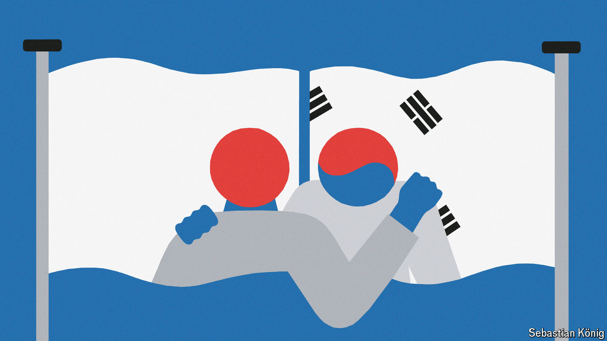
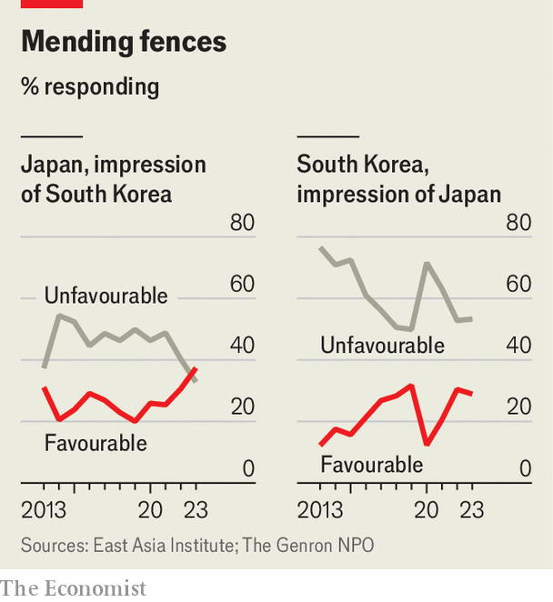

###### East Asian dramas

# Relations between Japan and South Korea are blossoming 

##### But how long can the good times last? 

 

> Mar 18th 2024 

MOTOMIYA YURI, the heroine of “Eye Love You”, a hit television series in East Asia, is a Japanese woman with the power to read minds. Her gift makes romance hard, so she gives up on love—until she meets Yoon Tae-oh, a hunky South Korean who becomes an intern at her chocolate company. He thinks in Korean, rendering Ms Motomiya’s mind-reading moot; the two begin a torrid affair. The show is the first Japanese prime-time love story to feature a Korean actor as the lead. Since its launch in January, it has amassed legions of fans in both countries.

“Eye Love You” echoes developments off screen. Since Yoon Suk-yeol, South Korea’s president, took office in 2022, relations between the two neighbours and American allies have blossomed. The question is whether the good times can last. The legacy of Japan’s colonisation of Korea between 1910 and 1945 haunts the budding romance. And political changes in both countries this year could upset its development. Kishida Fumio, Japan’s prime minister, had considered a visit to South Korea this week to meet Mr Yoon (and to watch Ohtani Shohei, a Japanese baseball star, play in Seoul). A looming parliamentary election in South Korea and a continuing financial scandal in Japan made that difficult. How the relationship evolves will have big implications for the balance of power in the Indo-Pacific.

The rapprochement began after Mr Yoon’s election. Under his predecessor, Moon Jae-in, ties had frayed amid recriminations over past Japanese atrocities. A particular bugbear was two decisions in 2018 by South Korea’s Supreme Court, which ordered Japanese companies  forced to work in their wartime factories, as well as their surviving relatives; Japan considers the matter settled by a treaty signed and payments made in 1965. With liquidation of the Japanese assets looming, Mr Yoon created a foundation to compensate the plaintiffs, using funds from South Korean firms that benefited from normalised relations. The plan was unpopular with the public, but Mr Yoon persevered.

Mr Yoon travelled to Tokyo on March 16th last year, the first official visit between the two countries in more than a decade. Mr Kishida went to Seoul two months later and paid his respects at a national cemetery where Korean independence fighters are interred. The two leaders have held five more summits since, including a , America’s president, at Camp David last summer. Security co-operation has deepened. The three nations have conducted large-scale joint drills at sea and in the air. When North Korea launches missiles, they now share data in real time.

Commercial activity and mutual exchanges are reviving. Last summer South Korea was put back on Japan’s “whitelist”, which speeds up exports, having been taken off it in 2019. In December the two countries struck a currency-swap deal, nearly eight years after their last one had expired. Business leaders in both countries are sounding optimistic notes. 

 


Public opinion appears to be shifting, at least compared with the antagonism during Mr Moon’s administration. In a joint survey conducted in late 2023 by Genron, a Japanese think-tank, and the East Asia Institute (EAI), a South Korean one, more Japanese had positive views of South Korea than had negative ones for the first time since the survey began in 2013 (see chart). Meanwhile South Koreans’ views of Japan have recovered from a low in 2020.

Yet much wariness remains. Security co-operation is still conducted via America. Japanese foreign direct investment into South Korea was $1.3bn last year, a far cry from nearly $4.5bn in 2012. South Korean views of Japan actually worsened slightly between 2022 and 2023. Many South Koreans feel Japan has not done enough to atone for the past and that Mr Yoon is giving it a free pass. Proponents of the relationship believe Mr Kishida has been too cautious about seizing the opportunity that Mr Yoon represents. 

Japanese worry that Mr Yoon’s successor may overturn his policies, much as Mr Moon did with a deal made in 2015 to settle issues related to “comfort women”, as Koreans and others forced into brothels for the benefit of Japanese soldiers during the second world war were euphemistically called. The foundation that Mr Yoon tasked with settling the forced-labour cases lacks funds and faces its own challenges in court. South Korea’s Supreme Court has ruled in favour of settlements for 15 plaintiffs. Four refused to accept the mechanism and have appealed it. As additional cases move through the courts, the number of people entitled to payments is set to grow, perhaps to more than 1000. There may yet be “serious snags in the final path to the end”, says Shin Kak-soo, a lawyer and former South Korean ambassador to Japan.

Domestic political change also threatens to knock the relationship off course. Mr Yoon’s hold over his own party will wane as the end of his term, in 2027, draws closer (South Korean leaders are limited to one term in office). It may seep away even sooner if his party fails to recapture a majority in April’s parliamentary elections. His opponents, who enjoy stirring anti-Japanese sentiment, will criticise his policy either way. Mr Kishida’s standing at home is shaky—he may not survive elections for the leadership of Japan’s ruling party in September. His successor may prove more wary of taking risks on relations with South Korea. And if Donald Trump is elected president in America in November, he is unlikely to press his allies to get along as much as Mr Biden has.

Nonetheless, there are good reasons to believe the current relationship will endure. Mr Yoon has personally committed himself to Japan in a way few South Korean leaders have. His childhood experience of the country, where he lived while his father was a visiting scholar, predisposed him to have “good feelings” towards Japan, says one former senior South Korean official.

Two larger structural forces are also at work. First is generational change. While the struggle against Japanese colonialism remains a pillar of South Korean identity, the bitter history generates less passion among today’s youth, who learn about it only through textbooks, says Lim Eun-jung of Kongju National University. The latest eai survey suggests that age is among the most important variables affecting South Koreans’ favourable views of Japan. The highest-rated film in South Korea these days is “Exhuma”, a supernatural horror with seemingly anti-Japanese overtones—a message lost on many young viewers. “I didn’t even think about anti-Japanese sentiments,” says Kim Do-hoon, a 23-year-old fan. “My blood isn’t boiling from anger.”

Second is geopolitical change. Faced with an assertive China, a threatening North Korea and a disruptive Russia, the two East Asian democracies have ever more reasons to get along. Doing so also helps strengthen both countries’ alliances with America. Even in South Korean opposition circles “the stance on Japan is changing little-by-little, and the main reason is the strategic environment,” says Wi Sung-lac, a former diplomat and adviser to progressive politicians. As the governments look ahead to next year, which will mark the 60th anniversary since they established formal relations, the “scope and depth” of their co-operation is “wider than ever”, says a senior Japanese official. It will be an opportune occasion for the two to renew their vows. ■

