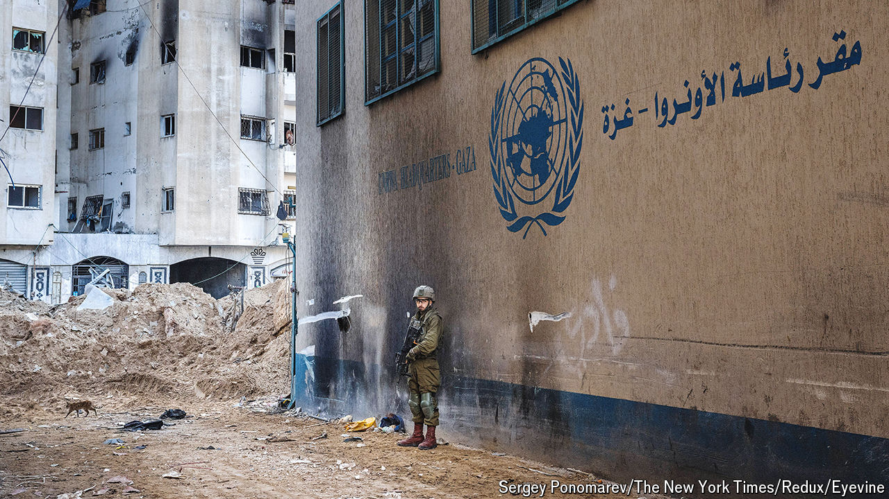
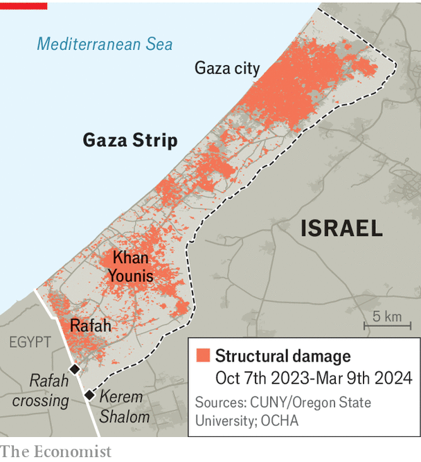
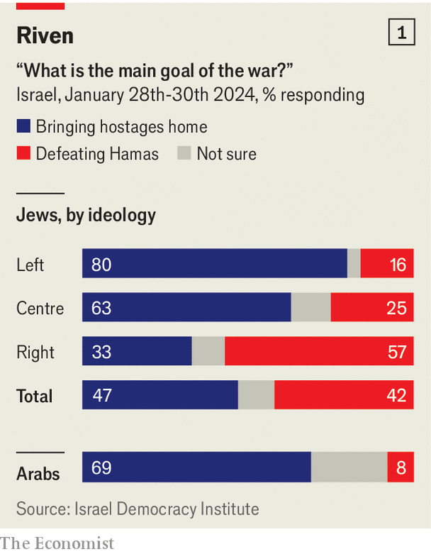
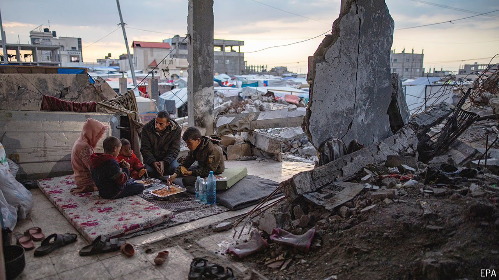
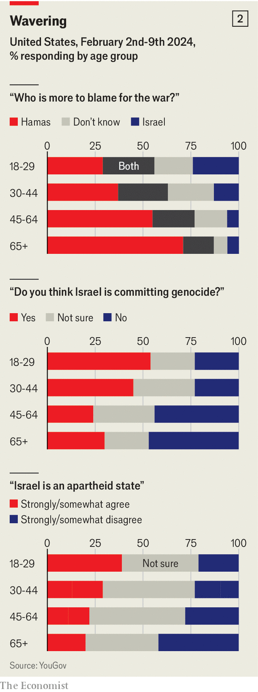
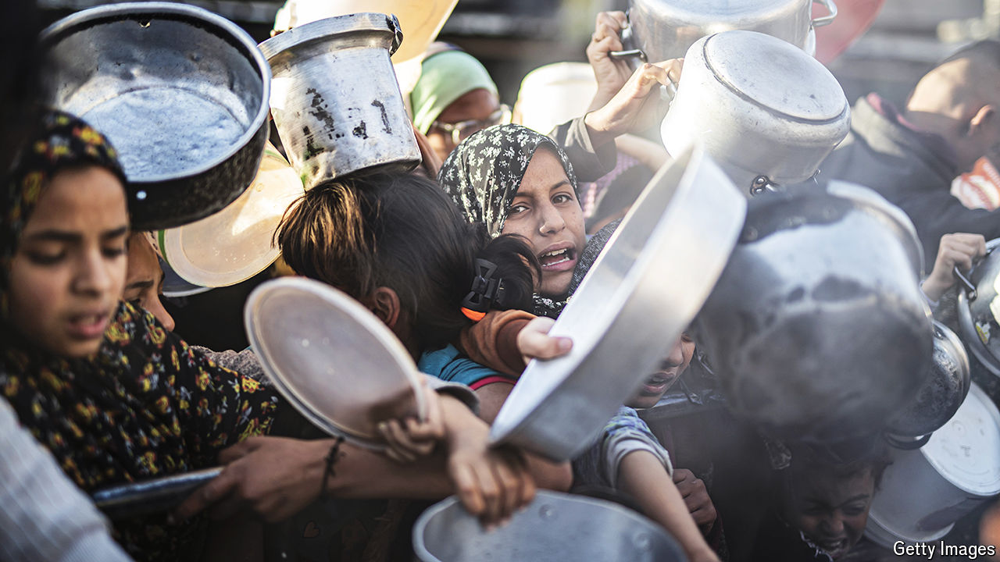

###### No winners

# The war in Gaza may topple Hamas without making Israel safer 

##### It will end up even more deeply mired in the conflict that is the main threat to its security 

 

> Mar 21st 2024 

“I WISH I could say we have a very detailed plan,” an Israeli army officer admitted to your correspondent in the chaotic days following Hamas’s brutal assault on southern Israel on October 7th. More than 1,100 people had been killed; some 240 had been dragged back to Gaza as hostages. It was clear from the outset of the war in Gaza, now six months old, that Israel’s two main goals—to eliminate Hamas and to free the hostages—were at odds. It was also clear that invading the territory, in which 2.2m people live cheek by jowl and under which Hamas had built a labyrinth of fortified tunnels to help it withstand an attack, was going to be immensely difficult. And there was always the risk that war in Gaza would spiral into a bigger conflict.

It is possible to look at this unpromising starting point and conclude that Israel’s invasion of Gaza has not gone badly—and many Israelis take just that view. After all, Hamas’s fighting capacity has been massively reduced, with little in the way of Israeli casualties. Some of the hostages have been released and negotiations continue in an attempt to free the remainder. And all the while, there has been no regional conflagration, nor even much unrest in the West Bank (the more populous of the two Palestinian territories) or among Israelis of Palestinian origin.

Pyrrhic progress

Yet others question whether Israel’s security has improved at all. Hamas’s leader in Gaza and the mastermind of the attacks of October 7th, Yahya Sinwar, remains at large. The devastation Israel has unleashed—around 20,000 civilians have perished, food and medicine are in desperately short supply and more than half the territory’s buildings have been destroyed or damaged—will make it almost impossible to institute a stable, peaceful regime after the war. And Israel’s perceived indifference to civilian suffering is eroding international sympathy and prompting allies to question their support. Could Israel, the sceptics ask, be winning the battle but losing the war?


The view that the war has been a success starts with the damage done to Hamas. Israeli officials claim that they have killed 13,000 Hamas fighters, around half of the group’s pre-war strength. Some foreign spies suggest a lower toll, of perhaps a third. Hamas itself admitted casualties of at least 6,000 in mid-February. While it is hard to know which figure is accurate, the damage is real. Most of Hamas’s brigades have been mauled. It has lost commanders, too. This week news emerged of the death of Marwan Issa, the deputy leader of its military wing, during an airstrike on Gaza in early March. Saleh al-Arouri, another senior leader of the military wing, was assassinated in Beirut in January. Israel, meanwhile, has lost around 250 soldiers during its ground invasion—the most in any war since the 1980s, but far fewer than many feared from intense urban warfare.

Hamas’s estimated arsenal of 20,000 rockets is depleted. It has fired 60% of them, to little effect, and thousands more have been destroyed. Its network of tunnels has been badly damaged, especially in northern Gaza. Short of men and materiel it will probably not pose a serious threat to Israel or even run Gaza again in years—if it ever does. Polling suggests the group’s popularity there has fallen sharply, presumably because many Gazans blame Hamas for dragging them into a hellish war it could not hope to win. Only 38% want to see Hamas retain power after the war.

At the same time, Israel has managed to free almost half of the hostages without making any big concessions to Hamas. That is no comfort to the families of the 130 or so still unaccounted for (perhaps a quarter of whom are already dead, the army estimates). But it is a better outcome than many people expected immediately after October 7th. What is more, Israel has done all this without triggering serious violence by other Palestinians, either in the West Bank or inside Israel itself. It has also maintained an equilibrium on its northern border. Hizbullah, a Lebanese Shia militant group, has kept up near-daily missile attacks on Israel, but it has stopped short of opening a full second front.

At home, the public set aside a year of political acrimony and rallied around the flag. Reservists reported for duty as required, which some had threatened not to do last year at the height of public protests about a controversial judicial overhaul, since shelved. The cross-party war cabinet formed in the wake of the attacks has held together for five months despite deep animosity between its members. The economy has suffered a predictable contraction, but the shekel has pared its initial losses. Public debt will rise from 60% of GDP last year to a projected 67% by 2025, but that is still manageable, and the central bank has a healthy cushion of $207bn in foreign reserves.

Many foreigners have expressed outrage at the war’s toll on civilians, but Israelis consider this normal. Moreover, the outrage has not translated into action. Most close Western allies, including America, Britain and Germany, have not even called for a permanent ceasefire, let alone taken any sort of punitive action against Israel. Even the six Arab states with which Israel has diplomatic relations have not done much beyond recalling their ambassadors, despite popular anger at Israel’s conduct of the war. Israelis can still board daily flights from Tel Aviv to Dubai.

 


But none of this considers the longer term. Start with security. Body counts are a poor measure of success in an asymmetric war. America learned this lesson in Vietnam, and then again in Afghanistan and Iraq. It seems unlikely that militant groups will have trouble recruiting in future amid Gaza’s ruins.

When the war ends, Gaza will be unlivable. Hundreds of thousands of people will lack homes to return to. Researchers at the City University of New York and Oregon State University estimate that at least 55% of the buildings in Gaza have suffered structural damage (see map). The economy has been obliterated: factories have been bombed; small businesses wiped out; crops and livestock destroyed. Tanks have ripped up the roads and air strikes have wrecked the power grid and water network. The UN estimates that 76% of Gaza’s schools have been damaged or destroyed. Its hospitals are in equally dire shape.

Flight risk

Educated people will try to start new lives abroad. Humbler migrants will attempt to flee, too, trying their luck on boats to Europe. Most Gazans, however, will have no choice but to endure. They will linger for months, perhaps years, in crowded shelters and tent cities, with few opportunities for work and nothing but aid on which to subsist. The enclave, already populated in large part by the descendants of refugees from what is now Israel, will become a giant displacement camp.

If Hamas tries to emerge from its tunnels when the fighting ends and reassert its writ, it is likely to fail, given its diminished strength and wilting popularity, let alone the likelihood of further conflict with Israel. Instead it may revert to its days as a guerrilla force, carrying out attacks on Israeli troops and on Palestinians deemed to be collaborators.

But the Palestinian Authority (PA), the moderate body that governs part of the West Bank, will also struggle to swoop in and take power. It can barely keep control of the territory it currently administers and has been absent from Gaza since Hamas expelled it in 2007. Mahmoud Abbas, its ageing president, is scrambling to contain support for Hamas in his own statelet: 62% of West Bankers say the militants should represent the Palestinian cause (compared with just 43% of Gazans). Fully 88% of Palestinians want Mr Abbas to resign, and he lacks a clear successor. On March 14th he named , an economist, as prime minister. He hopes that will show sceptical Western donors that he is serious about reforming the notoriously corrupt PA. But for many the underwhelming gesture merely affirmed how clueless and incapable the PA has become.

America and its Arab allies hope to reactivate thousands of idle Gazan policemen, who worked for the PA before Hamas’s takeover and have since been paid to sit at home. But the right-wing elements of Israel’s government do not like this idea and, anyway, it is unlikely to work. The Gazan police were unable to stop Hamas taking control of the enclave in 2007 and have presumably not become more effective after 17 years’ leave. Authority will probably devolve to powerful clans, which are already trying to control the flow of aid. Instead of a functioning government, Gaza may end up with warlords. But whatever emerges from the wreckage, it is unlikely to make Israelis feel secure.

For decades, Israel’s security doctrine has rested on three pillars: deterrence, early warning and decisive victory. If the first two failed, as they occasionally did, Israel fought short, sharp wars to restore deterrence. Those conflicts had limited consequences on the home front. During a previous war against Hamas in 2014, the longest until this one, the civilian death toll in Israel was a mere six people; for Palestinians, it was around 1,500.

All three pillars have now crumbled. Hamas was not deterred from carrying out an audacious attack. Israel’s vaunted intelligence services failed. So did an array of high-tech gadgets meant to monitor the border with Gaza. And the war that followed has been neither short nor decisive. In October Israel needed support from America, which sent two aircraft-carrier groups to the region to deter Hizbullah and other armed groups from opening a second front. While Hizbullah has not launched an all-out attack on Israel, it has done enough to displace 80,000 Israelis from cities and towns in the north. When the fighting in Gaza ends, they will have to decide whether to return to the north, knowing an adversary far better equipped than Hamas lurks just across the border.

The Israel Democracy Institute, a non-partisan think-tank, asks Israelis each month whether they are optimistic about “the future of national security”. Its first wartime survey, in late October, found that 46% of Israeli Jews were hopeful. By March that number had fallen to 41%. Half a year of war has made Israelis feel less safe, not more. “The self-confidence of all of Israel has changed dramatically, and will never be the same as what it was before,” says an army officer.

Part of the problem is domestic politics. Three-quarters of Israelis want Mr Netanyahu to resign (they are split on whether he should do so now, or after the war). The public holds him responsible for October 7th—not only for missing warning signs, but also for his years-old policy of strengthening Hamas to undermine the PA. He spurns talk of resignation or responsibility. His media outriders (the “poison machine”, as his critics call it) have spent months trying to shift the blame elsewhere. Mr Netanyahu himself even took a wartime swipe at the army in a since-deleted tweet.

Mr Netanyahu is deepening the divisions by pandering to his far-right coalition partners, presumably in the hope of warding off an early election. Take his wartime budget, approved by the Knesset earlier this month. It imposes deep cuts on civilian ministries but preserves a number of goodies for the religious right. There is 1.7bn shekels ($467m) for ultra-Orthodox schools, which often ignore the state curriculum, and another 200m shekels for a make-work ministry led by a far-right settler. At the same time, Israelis displaced from the north and south complain that the government has offered little help beyond paying their hotel bills.

Total confusion

Even the war itself has become divisive. Israelis are split over whether to continue fighting in pursuit of the “total victory” promised by Mr Netanyahu or to stop to facilitate a hostage deal. Just 42% of Israelis want to keep going, whereas 47% are ready to call a halt (see chart 1). The police, overseen by Itamar Ben-Gvir, a far-right cabinet member, have blasted water cannons at the families of hostages protesting against the government, while handling with kid gloves far-right activists who try to block the delivery of aid to Gaza.

 


, a former army chief who joined the unity government in October, is the favourite to succeed Mr Netanyahu in an election, although he has yet to work out how to engineer one. If he becomes prime minister he will spend much of his time dealing with the fallout from the war. Longer conscription terms and a heavier burden on reservists will be a drag on the economy. Higher defence spending and the cost of rebuilding battered towns near the borders will necessitate cuts in other areas, or higher taxes or both. His voters will be divided and traumatised—and, on top of that, he will have to contend with a paroxysm of global outrage.

Before the war, the Arab world was drifting toward normalisation with Israel. No longer. Gaza’s trauma has been a constant fixture on Arab television screens and smartphones since October—not only scenes of death and desperation, but also an endless torrent of dehumanising Israeli rhetoric about Palestinians. The authorities in Saudi Arabia have spent years trying to prepare their population for normalisation with Israel, but a survey released in December by the Washington Institute, a pro-Israeli think tank, found that 96% of Saudis thought Arab countries should sever all ties with Israel.

 


Supporters of the Abraham accords, the agreement in 2020 that saw four Arab states recognise Israel, say they can still be expanded. That would require Arab leaders to ignore near-universal opposition. Perhaps they will (they are all autocrats), but that is hardly a strong foundation for a treaty which has, anyway, lost much of its strategic rationale. The accords were not just about allowing Israelis to holiday in Dubai. They were also meant to cement a regional alliance against Iran and to foster an “outside-in” approach to resolving the Israeli-Palestinian conflict: as Arab states established ties with Israel, they would press the Palestinians to sign a peace deal, too. Both goals now seem out of reach. Gulf states have backed away from confrontation with Iran, lest it lead to attacks on their own countries. And with the Israeli right citing the atrocities of October 7th as further reason to disavow a two-state solution, which it has anyway resisted for decades, bringing Palestinians around does not seem like the main obstacle.

It is not only Arab opinion that has shifted. Even before the war, young people in the West were less pro-Israel than their elders. A survey in 2022 by the Pew Research Centre, a polling outfit, found that just 41% of Americans aged 18 to 29 had a favourable view of Israel, compared with 69% of over-65s. The war has widened that gulf. A YouGov poll in February found that 20% of Americans over 65, but 39% of 18- to 29-year-olds, consider Israel an apartheid state (see chart 2). When Gallup asked Americans last month whether they sympathise more with Israelis or Palestinians, old people picked Israel by a 40-point margin, whereas young ones chose Palestinians, 45% to 37%. Results are similar across the Atlantic: 52% of young Britons think Israel’s war is unjustified, compared with 36% of over-65s.

 


Israelis tend to dismiss this. There may be some angst on college campuses and in lefty synagogues, they argue, but it has not swayed Western officials. Unless today’s students become far more hawkish, however, Israel’s future support looks shaky. And even some of today’s politicians are unexpectedly wobbly.  of New York is perhaps the most pro-Israel Democrat in the Senate. He was one of just four Democratic senators to vote against the nuclear deal with Iran in 2015, siding with Mr Netanyahu over Barack Obama. On March 14th, though, he delivered a broadside against Mr Netanyahu from the Senate floor, saying the prime minister had “lost his way” and calling for early elections to replace him.

Mr Schumer has not given up on Israel. For now his anger, like that of some other Democrats, is aimed at Mr Netanyahu: they want a new Israeli leader, not a rupture in the alliance. Optimists in Israel hope that a change in their government will put them back in America’s good graces. Perhaps it would—but only for a time. A coalition led by Mr Gantz would probably include right-wing parties opposed to a two-state solution; it is unlikely to do much to curtail settlements, revive the peace process or advance other American interests. And it is unlikely to take power before autumn, at the earliest.

The longer Mr Netanyahu remains in power, the longer the unthinkable starts to become plausible in American politics. Withholding military aid to Israel, or imposing conditions on it, used to be ideas expressed only on the political fringe. Now they have become mainstream. Even the likes of Chris Coons, a centrist Democratic senator and confidant of Mr Biden, has discussed such notions publicly. A showdown may be coming. Mr Biden has said that an Israeli incursion into Rafah, the only city in Gaza it has not overrun, would be a “red line” because of the likelihood of lots more civilian casualties. Mr Netanyahu says flatly that Israeli troops will enter Rafah at some point.

Mr Biden may back down. He has shown no appetite for confrontation with Israel thus far. If Donald Trump succeeds him as president, there will be even less chance of a clash. He attacks Mr Biden and other Democrats as insufficiently supportive of Israel (and any Jews who vote for Democrats as hating Israel and their religion). Nonetheless, a Rubicon has been crossed in that military assistance for Israel is now subject to open debate. Take, for instance, the instructions the president gave the State Department in February, to report on whether foreign governments are committing atrocities with American weapons. This is a box-ticking exercise for now, but future politicians may not use it that way. America has also imposed sanctions on violent Israeli settlers in the West Bank; these could be broadened to ensnare politicians like Mr Ben-Gvir. By the same token, federal law bars military aid to states that commit war crimes. Should the State Department implicate Israel, America would have to curtail its support.

 


The International Court of Justice is hearing a complaint, brought by South Africa, that Israel is committing genocide in Gaza. Even if it rejects it, the International Criminal Court (which hears complaints against individuals rather than countries) may take up other cases. It started probing possible war crimes in Israel and the occupied territories in 2019. Belgium has promised it €5m ($5.4m) to investigate potential crimes in the current war. The court will presumably want something to show for these efforts. South Africa’s foreign minister said earlier this month that citizens who fight with the Israeli army in Gaza would be arrested when they return home. Liberal Israelis have long warned of a future in which their politicians and generals are no longer free to travel abroad, lest they be hauled off to The Hague. That day may not be here yet—but it is closer than it was six months ago.

The war is also reviving old political rifts. In the 1990s and early 2000s conflict with the Palestinians was a seminal issue for Israeli voters. Then the peace camp collapsed and the topic faded into the background. Over the past 15 years Israel’s elections have been referendums on Mr Netanyahu’s continued rule. In 2015 the main opposition party’s campaign slogan was “It’s us or him”. The next election may be the last such referendum. Mr Netanyahu’s popularity has evaporated, he is on trial for corruption and after the war he will face a commission of inquiry investigating October 7th and the war. It is hard to imagine even such a survivor winning another term.

Yet Mr Netanyahu’s exit, if it comes, will not end political discord. Moderate Israelis pine for a leader who will drag their politics back to the centre. They want someone to marginalise the extreme right, end draft exemptions for ultra-Orthodox Jews and strengthen democratic norms. But the maladroit Mr Gantz seems an unlikely candidate. The Palestinians will be back on the agenda, a subject the right has tended to exploit by stoking voters’ fears, with great political success.

Critics offer a long list of things Israel could have done differently since October 7th. It could have provided far more humanitarian aid to Gaza and censured chauvinist politicians with their talk of ethnic cleansing. It could have waited to retaliate and then opted for limited special-forces raids rather than wholesale aerial bombardment. It could have been open to discussing post-war arrangements with America and Arab states. Some of these complaints are valid. The hunger in Gaza is both a moral failure and a strategic liability for Israel. Others are fanciful. Few armies would eschew a blitz from above before tossing their troops into urban warfare.

Yet the biggest problem with the war is not its conduct but its likely outcome: that it will leave Israel even more deeply mired in an occupation that has warped its society and poisoned its foreign relations for decades. Israel is not solely to blame for this lamentable situation, of course. A rejectionist streak runs deep among Palestinians, even though it has brought them only misery since 1948. When the fighting stops, both Israel and Hamas will probably claim victory. In fact, no one is winning. ■

